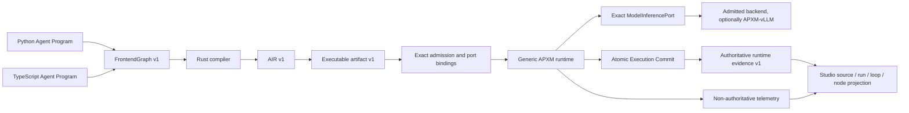

# APXM agents documentation

- Status: canonical APXM v1 index with shipped source-first frontend and
  clearly named historical evidence
- Ubiquitous language: [APXM Agent Programs](../CONTEXT.md)
- Normative target: [Agent Program composition and AIR contract](agents/agent-program-composition-and-air-contract.md)
- Reference implementation plan: [Agent Program composition and AIR full-replacement plan](agents/agent-program-composition-and-air-full-replacement-plan.md)

APXM compiles and executes Agent Programs. Python and TypeScript are equivalent
authoring frontends; neither is an execution runtime. The Rust compiler owns
FrontendGraph/AIR verification and artifact production. The generic runtime
executes admitted artifacts without assuming a conversation, named example, company
hierarchy, Skill injection, or model/tool loop.

The shipped short frontend spelling is documented in the
[source-first Agent frontend master plan](agents/simple-agent-authoring-frontend-plan.md):
`Agent`, `Context`, `Tool`, `Model`, and ordinary control flow, with focused
`Capability`, `Event`, `Hook`, and `TaskGroup` extensions. The generic
execution semantics below remain the governing boundary.

## Canonical v1 pipeline



This is one correlated execution, not a collection of convenience layers.
Source maps and artifact identities connect authored constructs to static AIS;
runtime identities connect them to Program Invocations, loop occurrences,
NodeExecutions, attempts, effects, Context transitions, usage, outputs, and
failures. Backend telemetry—including APXM-vLLM cache/scheduler metrics—may
enrich that view but cannot override authoritative execution evidence.

Agent Programs compose only through `program.new`, one-shot
`program.invoke`, and stateful `instance.invoke`. AIR v1 has a closed
five-operation effect/composition family:

1. `model.call`
2. `capability.invoke`
3. `program.new`
4. `program.invoke`
5. `await.event`

AIS separately owns the closed structural family: ordinary functions, regions,
values/blocks, branches, loops including `ais.loop`, structured task scopes,
try/catch, return, program yield, and region yield. Structural operations are
compiler-emitted, not a raw public operation builder, and `ais.loop` is not a
sixth effect/composition operation. Direct AIR authoring and pre-canonical
operation builders are not v1 APIs.

## Canonical reading order

1. [APXM Agent Programs glossary](../CONTEXT.md) — exact vocabulary for
   Program Instance/Invocation, context, Hooks, Skills, Capabilities, yield,
   return, events, and evidence.
2. [Program Execution Model theory](pxm/theory.md) — the canonical layered
   sources of truth from source through evidence and Studio.
3. [Agent Program guides](guides/README.md) — create and compose generic
   programs, build repository examples, invoke ACP agents, and select exact
   models.
4. [Source-first Agent frontend master plan](agents/simple-agent-authoring-frontend-plan.md)
   — delivered everyday API, typed FrontendGraph boundary, deterministic
   lowering, optimization, vLLM connection, and completion evidence.
5. [ADR index](adr/README.md) — accepted and superseded decisions.
6. [ADR-0008](adr/0008-agent-programs-compose-through-new-and-invoke.md) —
   composition, state, ownership, isolation, identity, and failure semantics.
7. [ADR-0009](adr/0009-air-has-five-public-semantic-operations.md) — five-op
   constitution and complete disposition of all 38 current operations.
8. [ADR-0010](adr/0010-agent-program-source-owns-context-hooks-and-conversational-loops.md)
   — explicit Program Context, Agent Facade callbacks, discovery-only Skills,
   and frontend-authored loops.
9. [ADR-0014](adr/0014-conversational-agent-and-gao-are-examples-over-generic-agent-program-apis.md)
   — examples-only conversational/Gao ownership, two closed AIS operation
   families, and generic completed-loop evidence.
10. [ADR-0011](adr/0011-agent-program-execution-is-one-end-to-end-spine.md) —
   one frontend/compiler/runtime/inference/evidence execution spine.
11. [Normative composition/AIR contract](agents/agent-program-composition-and-air-contract.md)
   — frontend, compiler, artifact, runtime, event, identity, commit, and
   evidence requirements.
12. [ADR-0013](adr/0013-core-semantics-are-closed-and-implementations-enter-through-exact-port-bindings.md)
    and the [portable core interface contract](agents/portable-core-interface-contract.md)
    — closed semantics, narrow replaceable ports, exact bindings, confinement,
    and first-party conformance.
13. [ACP interoperability and selection contract](agents/acp-and-routing-contract.md)
   — exact admitted Claude/Codex/ACP profiles and future routing boundary.
14. [Full-replacement plan](agents/agent-program-composition-and-air-full-replacement-plan.md)
   — P0-P9 delivery, conformance gates, cutover, and absence proof.

ADR-0001, ADR-0002, and ADR-0005 are superseded historical rationale. Their
callback, package-level Conversational Agent/Gao, and runtime-Turn models are
not implementation authority.

## Related target plans

- [Compiler bridge delivery](agents/compiler-bridge-delivery-plan.md) — local
  Python/Node native bridges and generated remote browser client over the same
  FrontendGraph contract.
- [Rust embedding library hardening](agents/rust-embedding-library-hardening-plan.md)
  — five focused in-process roles with injected adapters and no umbrella
  facade or hidden service.
- [Portable core interface contract](agents/portable-core-interface-contract.md)
  — exhaustive semantic types, exact descriptors/bindings, focused runtime
  ports, confinement law, and first-party equality.
- [Agent Program replacement portfolio](agents/agent-program-full-replacement-portfolio.md)
  — cross-plan dependency and cutover view.
- [Gao plan tombstone](agents/gao-conversational-agent-implementation-plan.md) —
  preserves the replaced named-specialization plan; Gao now lives only as a
  repository example over generic APIs.
- [Topology boundary](agent-topology-boundary.md) — Studio/control-plane policy
  becomes exact admission facts; runtime remains organization-agnostic.
- [ACP and exact-selection replacement](agents/acp-and-routing-full-replacement-plan.md)
  — official ACP schema, exact profiles, authority, confinement and evidence.
- [Future APXM-owned routing](agents/future-apxm-routing-plan.md) — planned
  APXM router; research precedents are not dependencies.

## Target library roles

APXM is one release family, not one monolithic package. The target exposes
five focused Rust roles:

| Role | Responsibility |
| --- | --- |
| contracts/types | Versioned values, schemas, ids, errors, and compatibility |
| AIS specification/authoring | Deterministic operation/IR schema and code generation |
| artifact encoding/admission | Canonical encoding, digests, limits, and admission |
| compiler embedding | FrontendGraph v1 to admitted artifact and diagnostics |
| runtime embedding | Generic execution kernel over explicitly injected adapters |

Python and TypeScript packages author Agent Programs. Generated SDKs call
remote services. CLI and servers are applications. None of those surfaces
silently embeds another compiler/runtime or changes semantics.

## Shipped frontend and historical evidence

The checkout ships the source-first frontend through `apxm_program` and
`@apxm/frontend`; the Rust compiler remains the only FrontendGraph-to-AIR
lowerer. The following pages are retained as explicitly labelled historical
evidence, not as authoring or compatibility surfaces:

| Evidence | What it records |
| --- | --- |
| [Prototype AIS](pxm/ais.md) | Current 38-operation taxonomy and MLIR implementation |
| [Prototype memory analysis](pxm/memory.md) | QMEM/UMEM/AAM-era memory model |
| [Prototype process model](pxm/processes.md) | Spawn/communicate/process-table behavior |
| [Prototype stack connectivity](integrations/stack-connectivity.md) | Current routes, registries, defaults and sandbox flags |
| [Prototype ACP sandbox seam](integrations/sandbox-acp-seam.md) | Current `SandboxRegistry`/profile implementation |
| [Sandbox interface investigation](integrations/sandbox-interface.md) | Superseded registry/mega-interface exploration |
| [OpenShell investigation](integrations/openshell-integration.md) | Superseded sandbox/router comparison evidence |
| [Current AIS crate](../crates/machine/ais/README.md) | Closed five-op and structural catalogue |
| [First agent](agents/first-agent.md) | Current executable source-first journey |

The live checkout catalogue is always obtained with `dekk agents ops list`.
ADR-0009 permanently accounts for the retired 38-operation prototype
inventory. Historical evidence may remain during migration, but no prototype
builder, reader, handler, alias, translator, or mixed Compatibility Set ships
in the target release.

## Current repository operation

Use Dekk for the current checkout:

```bash
dekk agents doctor
dekk agents ops list
dekk agents build-dialect
dekk agents codegen
dekk agents test
```

The retired raw-authoring prototype demos that lived under `examples/python/`
imported removed `apxm` package symbols (`GraphRecorder`, `GraphBuilder`,
`compile`, `Agent`) and could not run; P9 removed that corpus. Canonical
runnable examples now live under
[`examples/agents/`](../examples/agents/): `conversational/` is the primary
reference, with focused `coder/` and `gao/` extensions. They are authored
against `apxm_program` / `@apxm/frontend`.

Backend/operator references remain useful for the current implementation and
focused canonical adapters:

- [vLLM backend](backends/vllm.md)
- [model zoo quickstart](backends/model-zoo-quickstart.md)
- [model zoo reference](backends/model-zoo.md)
- [storage layout](backends/storage-layout.md)
- [compiler pipeline baseline](compiler/pipeline.md)

## Non-negotiable target rules

- Program source is the sole behavior authority; manifests identify inputs.
- Program Context is an explicit `agent.context` value, never a Context Delta
  API, implicit prompt, Skill injection, or authority.
- Hooks are static deterministic `before`/`after` callbacks over the portable
  Agent Facade. Error recovery is ordinary authored try/catch.
- Skill bodies are discovered through admitted Capabilities and explicitly
  selected into model context; associations never bulk-inject them.
- Every nested program is bound to its own authenticated Agent Identity, exact
  artifact, and attenuated authority.
- Program Instances are stateful, single-flight, and fail-busy. Yield retains
  continuation; return completes; `await.event` parks the same invocation.
- Runtime evidence is generic monotonic lifecycle truth.
  `LoopIterationCompleted` is emitted only with an atomically committed
  body/back-edge; Studio projects the generic fact without a `Turn` type.
- Current operation names, session loops, graph splicing, runtime paths, and
  direct AIR builders are replacement evidence—not compatibility promises.
