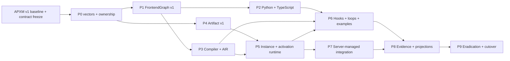

# Agent Program composition and AIR full-replacement plan

- Status: canonical APXM v1 owner plan
- Approved: 2026-07-16
- Owner: APXM `agents`
- Decisions: [ADR-0008](../adr/0008-agent-programs-compose-through-new-and-invoke.md), [ADR-0009](../adr/0009-air-has-five-public-semantic-operations.md), [ADR-0010](../adr/0010-agent-program-source-owns-context-hooks-and-conversational-loops.md), [ADR-0011](../adr/0011-agent-program-execution-is-one-end-to-end-spine.md), [ADR-0014](../adr/0014-conversational-agent-and-gao-are-examples-over-generic-agent-program-apis.md), [ADR-0017](../adr/0017-gao-is-a-studio-owned-agent-program-over-host-capabilities.md), [ADR-0003](../adr/0003-agent-program-contract-migrations-remove-old-semantics.md)
- Event/runtime authority:
  [ADR-0018](../adr/0018-event-readiness-and-local-scheduling-are-agents-semantics.md)
  under accepted workspace ADR-0027
- Managed-plane/full-removal authority:
  [Event-driven runtime full replacement](event-driven-runtime-full-replacement-plan.md)
  and the workspace full-removal master
- Normative contract: [Agent Program composition and AIR contract](agent-program-composition-and-air-contract.md)
- Frontend delivery subplan:
  [Source-first Agent frontend master plan](simple-agent-authoring-frontend-plan.md)
  (P1-P6 implemented under accepted ADR-0015; its remaining target-only
  conformance and cutover joins are governed here)
- Baseline: `agents@9e26a62adebb`

## Goal

Replace the current overlapping Agent Program, operation, loop, context, Hook,
and coordination semantics with one canonical Python/TypeScript →
FrontendGraph v1 → AIR v1 → artifact v1 → runtime → inference-backend path built around
`program.new`, `program.invoke`, `instance.invoke`, a closed five-operation
effect/composition family, and a separate closed structural AIS family.

This plan is the reference owner plan. Other APXM repositories consume its
released contracts and evidence; they do not duplicate its implementation.

## Target ownership boundary

- **Agents** owns portable Event/EventRef/occurrence/provenance and transition
  reducer semantics, activation meaning, dependency readiness, local
  scheduling/work stealing, `ActivationRunner`, and Execution Commit meaning.
- **Server** owns managed Source Contracts and accepted occurrences,
  delivery/target application, activation/effect durability and leases,
  schedules, Host gateway, retry/DLQ/recovery, and operational projections.
- **Auth, Host SDK, and Adapters** retain their authority, protocol, secret,
  provider/device dispatch, and reconciliation ownership.
- **Contracts** indexes and generates exact owner publications without owning
  or redefining their semantics.
- The **retiring OS** is current-state transformation and deletion evidence
  only. It publishes no target owner descriptor, generated client, route, or
  runtime contract and is not a target conformance participant.

Agents target code consumes no Server storage type, and Server does not decide
graph readiness, construct local NodeOccurrences, select local workers, or
redefine Agents transition reducers. The managed Composition Root adapts one
exact Server lease to an Agents storage-neutral activation claim and commits
through the fenced Execution Commit seam.

## Start gate

Implementation begins only after the APXM master plan's M0 baseline, A0 owner
descriptor, and C0b contract-development bundle gates pass for the affected
lane. The gate requires reviewed
preservation of every dirty tree, reconciled repository roots/remotes, one
owner for every v1 contract, and zero pending or deferred v1 decisions.
Producer/consumer work may prepare against frozen owner interfaces in isolated
worktrees, but it does not land until the event-driven replacement `J1` freezes
the exact owner-generation cohort and Scope Closure Manifest. Every affected
repository, schema, generator, producer, persistence/replay row, generated or
handwritten consumer, deployment member, credential, operational surface,
document, and physical-removal input has a closed disposition; discovery adds
scope and never creates an out-of-scope or deferred category.

## Scope

### Included

- `apxm.frontend-graph.v2`, `apxm.air.v2`,
  `apxm.executable-artifact.v1`, and `apxm.runtime-evidence.v1`;
- equivalent generic Python and TypeScript Agent Program composition, context,
  Hook, structured-control-flow, source-map, and compiler-bridge frontends;
- Rust-owned schema generation, verification, lowering, printer, artifact
  admission, and runtime handlers;
- Program Instance state, invocation, cancellation, structured children,
  replay, state commit, and generic checkpointing;
- two runnable repository examples using only packed generic frontend APIs:
  Conversational as the primary reference plus the focused Coder extension;
  Studio-owned Gao joins as an external generic-program conformance input;
- local embedding, CLI/application, Server-managed integration, and generated
  current-owner consumer cutover;
- deletion and absence proof for every retired operation and old semantic
  path, including all retiring OS consumers, routes, contracts,
  configurations, topology/release inputs, and target descriptors.

### Excluded

- Agent Definition draft/published product lifecycle;
- Skill catalogue hierarchy and trust decisions beyond discovery-only
  invariants;
- user identity/grant issuance, billing, retention, and Studio access UX,
  which are owned by separate APXM master-plan lanes;
- automatic deployment-placement optimization, which is not part of canonical
  v1; admission selects an exact deployment/profile;
- detached children, owner transfer, mutable program target lookup, or legacy
  artifact execution; and
- Server-owned source admission, delivery/application, managed activation and
  effect persistence/leasing, schedules, Host gateway, retry/DLQ/recovery, and
  operational-query implementation. This plan defines the exact Agents seams
  and cross-plane gates those owners consume.

## Baseline inventory to freeze

Before code changes, preserve the exact revision, dirty state, operation
catalogue, generated surfaces, and consumer matrix. At minimum inventory:

- `crates/machine/ais/src/operations/definitions.rs` and generated op specs;
- `crates/compiler/pipeline/src/air_builder/` including `frontend_graph.rs`;
- Python `apxm/agent.py`, `proxy.py`, `hooks.py`, generated operations, tests,
  examples, and execution helpers;
- TypeScript `builder.ts`, handler types/registry, generated operations, tests,
  and Gao;
- every runtime handler under `crates/runtime/engine/src/executor/handlers/`;
- scheduler graph splicing/rearm, agent scope/process table, session ledger,
  workflow spawner, and Hook registry/driver;
- artifact, event, error, output, checkpoint, capability, and invocation types;
- CLI, orchestration driver, current Server consumers, retiring OS consumers,
  Studio, and external fixture consumers as explicitly labeled current-state
  inventory; and
- docs, examples, generated declarations, release scripts, and cutover scans.

The baseline is evidence only. No target crate imports or calls a frozen legacy
handler. This inventory supplies the Agents fragment of the workspace Scope
Closure Manifest; a newly discovered consumer, durable row, route,
configuration, release input, or live resource joins the owning replacement or
deletion lane and blocks cutover until classified and closed.

## Target deliverables

1. Rust-owned Agents schema sources generate the target op and graph contracts;
   Contracts indexes the exact owner publication without acquiring semantics.
2. Python and TypeScript expose equivalent `new`/`invoke`/Agent Facade APIs.
3. The compiler accepts only FrontendGraph v1 and prints only AIR v1.
4. AIR v1 exposes the five operations fixed by ADR-0009 plus internal
   structured IR.
5. Artifact v1 statically binds programs, Hooks, models, Capabilities,
   handlers, source maps, and compatibility evidence.
6. Agents Runtime provides isolated Program Instances, immutable execution
   plans, dependency readiness, local execution, storage-neutral activation
   running, atomic Execution Commit semantics, structured children, and typed
   semantic evidence; Server supplies all managed durability and recovery.
7. Conversational Agent is a repository example; Gao is Studio-owned. Neither
   name is a frontend package, compiler/runtime, AIR, or evidence concept.
8. Every atomically committed loop body/back-edge emits generic
   `LoopIterationCompleted`; failed or rolled-back bodies emit no completion.
9. All target first-party consumers move in one Compatibility Set from one
   exact owner-generation cohort; every retiring OS consumer is deleted and no
   OS target descriptor is published.
10. Every retired builder, operation id, handler, parser, artifact, fallback,
   alias, and documentation claim is deleted or clearly frozen as historical
   evidence.

## Workstreams

### P0 — Contract vectors and ownership ledger

Deliverables:

- freeze positive/negative JSON vectors for FrontendGraph, AIR, artifact, and
  evidence v1;
- assign exactly one schema/generator owner for operations, attributes, graph,
  Hook bindings, program references, instance ids, invocation ids, and errors;
- amend normative contract section 14 so Agents owns the portable Program,
  EventRef, activation, Execution Commit, and evidence meanings while Server
  owns the managed root lifecycle/event/occurrence/delivery/activation/effect/
  evidence service schema and its generated clients;
- assign Server ownership for Source Contracts/reducers, accepted occurrences,
  delivery/application, activation/effect records and leases, schedules, Host
  gateway, retry/DLQ/recovery, and operational projections, without importing
  Server storage shapes into Agents;
- encode the 38-row keep/replace/delete ledger from ADR-0009;
- define typed `ProgramRef`, `ProgramInstanceRef`, `AgentIdentityBinding`,
  `EventRef`, `AgentFacade`, internal tagged `HookEffect`, `NodeExecution`, and
  runtime error values;
- define the Agents Program Instance/yield/return/EventRef/activation/effect
  state machines, deterministic creation/call identities, atomic commit tuple,
  and semantic evidence schema, plus the Server-owned transactional
  state/outbox records that persist and publish those exact facts; and
- define generic loop-region source maps and `LoopIterationCompleted` facts
  with static/dynamic loop ids, iteration index, causal execution ids, and
  atomic commit/replay semantics.

Gate P0:

- every semantic field has one owner and compatibility rule;
- no target vector contains a legacy op, runtime path, dynamic registration,
  HookContext/HookResult, named conversational discriminant, or `Turn` entity;
- yield/return, Agent Identity, event, Hook ABI/order, task-scope, replay
  identity, and lifecycle-fact semantics have positive and negative vectors;
- the exact owner-descriptor/generation cohort has no retiring OS target
  descriptor, schema, generated client, or consumer; and
- Python/TypeScript/runtime teams can implement without inventing a contract.

### P1 — FrontendGraph v1 and generated authoring contracts

Deliverables:

- build the Rust-owned FrontendGraph v1 schema and generator inputs;
- model typed program imports, instances, invocations, functions, regions,
  loop-carried values, resumable yield arguments, structured task scopes,
  callbacks, source annotations, Agent Identity requirements, and event refs;
- remove the generic raw-op escape hatch from the target frontends;
- generate language types and validation from Agents-owned schemas through the
  exact Contracts index/owner-local generation cohort; and
- add deterministic graph canonicalization/digest fixtures.

Gate P1:

- equivalent Python/TypeScript fixtures serialize byte-equivalent or
  canonically equivalent graphs;
- unknown semantic fields and all pre-canonical/retired operations fail validation;
- a browser-safe TypeScript frontend records the same graph without runtime or
  AIR printer dependencies.

### P2 — Python and TypeScript authoring parity

Deliverables:

- implement `Program.new`, `Program.invoke`, and `ProgramInstance.invoke`;
- implement equivalent language-neutral structured task scopes and reject raw
  coroutine/Promise scheduling as program semantics;
- implement one portable Agent Facade in both languages;
- implement static Agent/loop/Node/Model/Capability before/after Hook binding,
  deterministic ordering, and the internal tagged context/result ABI;
- implement explicit `agent.context` state flow and projections;
- implement frontend helpers for ask/think/reason/plan/reflect/verify as
  patterns over `model.call` rather than separate runtime ops;
- keep Python/TypeScript as authoring-only packages exposing generic
  `AgentProgram`, Hook, Context, composition, structured-control-flow,
  source-map, and compiler-bridge APIs; and
- add packed clean-consumer negatives proving `ConversationalAgent`, Gao,
  `TurnSpec`, `SpecialistComposition`, and equivalent subpaths are absent.

Gate P2:

- every source API has a cross-language semantic vector;
- neither frontend can register a retired op or print private AIR;
- context, child output, Capability output, and Skills never merge implicitly;
- callback code receives the Agent Facade and cannot access runtime internals;
- Python and TypeScript cannot derive different child-start behavior from raw
  coroutine/Promise semantics.

### P3 — Compiler, structural AIS, and canonical AIR

Deliverables:

- keep the five effect/composition operations under the single AIS owner;
- define a separate closed AIS-owned structural family with typed functions,
  branches, `ais.loop`, parallel joins, try/catch, return, and program/region
  yield;
- lower source control flow and state to SSA/region-carried values;
- distinguish `ProgramRef` and `ProgramInstanceRef` at verification and
  lowering;
- lower yield continuation/resume input distinctly from completing return and
  lower task scopes to joined parallel regions;
- compile static Hook bindings around their target regions;
- emit one canonical AIR v1 and source map; and
- reject every pre-canonical/retired operation before artifact production.

Gate P3:

- `dekk agents build-dialect` then `dekk agents codegen` regenerate every
  owned consumer from the new schema;
- golden AIR proves each public op and structural construct;
- no compiler pass expands `AGENT` into spawn/communicate, inserts autonomous
  loops, performs graph splicing, or accepts runtime paths;
- op inventory reports exactly five effect/composition operations and the exact
  closed structural family; `ais.loop` cannot validate as a sixth
  effect/composition operation.

### P4 — Artifact v1 and admission

Deliverables:

- define digest-bound program/handler references, typed entrypoints, Hook
  bindings, source maps, Agent Identity requirements, model/Capability
  requirements, and compatibility evidence;
- implement artifact canonicalization, signing inputs, size/resource ceilings,
  and admission diagnostics;
- remove behavior-bearing manifest loop/Hook/registration fields; and
- make old/unknown artifact versions and retired operations fail closed.

Gate P4:

- modified source, handler, reference, type, or contract fails digest/schema
  validation;
- no artifact contains a credential, grant, endpoint, path, runtime profile,
  mutable context, or dynamic registry operation;
- no target loader contains a pre-canonical translator or dual reader.

### P5 — Program Instance and invocation runtime

Deliverables:

- implement replay-safe `program.new` and typed instance ownership;
- implement one-shot and stateful `program.invoke` receiver semantics;
- enforce single-flight/fail-busy including recursive self-invocation;
- construct one immutable admitted execution plan and per-activation
  `ReadinessKernel` with typed operand publication, exact dependency release,
  structured joins/cancellation, and deterministic reference-executor parity;
- implement `LocalExecutor` scheduling/work stealing only for already-runnable
  immutable local NodeOccurrences under one activation claim; no local queue
  moves a lease, grant, secret, EventRef right, effect, or commit authority;
- implement a storage-neutral `ActivationRunner` that validates one exact
  claim/fence, executes the local runnable graph, and returns a closed
  committed/parked/cancelled/retryable/failed/commit-unknown/claim-lost result;
- define the fenced Execution Commit that atomically makes output, explicit
  Program Context, continuation/completion state, resolved children, commit
  sequence, prepared-effect facts, and semantic evidence true without owning a
  Server transaction or outbox table;
- implement next-input-at-yield resume, return/completed, and one-shot
  first-yield disposal semantics;
- preserve last committed state after failed/cancelled occurrences;
- implement structured child lineage, parent completion rule, cancellation,
  claim/fence validation, bounded cancellation outcomes, fenced
  node/model/Capability/effect/state/output commits, fan-out/depth limits, and
  separate Session Output subtrees;
- implement provider-neutral automatic checkpoints through injected runtime
  interfaces;
- implement the Agents-owned `EventRef` reservation, binding, fulfillment
  association, consumption, abandonment, expiry, cancellation, and
  deterministic-restore reducers through storage-neutral claim/commit inputs;
- end an activation segment by committing a prepared external effect before
  dispatch, so only Server managed effect work or a conformant standalone
  durability adapter can send/reconcile and publish the next activation; and
- expose typed runtime evidence without wrapping program return values.

Gate P5:

- creation replay/collision, yield/resume, return/completed, repeated invokes,
  busy/self-invoke, missing/closed instance, parent crash, child failure/cancel,
  EventRef races, activation-claim loss, and atomic Execution Commit vectors
  pass;
- lost/stale claims and bounded cancellation reject stale-fence
  node/model/Capability/effect/state/output work and preserve only
  already-started unknown-effect evidence without allowing owner success or
  blind effect repetition;
- dropping a structured task handle does not detach a child;
- two embedded Runtime Instances leak no Program Instances, ids, registries,
  state, meters, or cancellation between them;
- local worker/deque placement changes produce equivalent program semantics;
  and
- Agents target modules contain no managed Source Contract registration,
  accepted-occurrence store, delivery/application database, activation/effect
  lease service, schedule engine, Host gateway, retry/DLQ, or recovery
  implementation.

### P6 — Model, Capability, Hook, context, loop, and examples cutover

Deliverables:

- route all model operations through `model.call` and all executable actions
  through `capability.invoke`;
- prepare and commit every external effect as an activation boundary before
  Server managed effect work or a conformant standalone durability adapter
  dispatches it; a compute worker never holds commit authority through
  external I/O;
- implement the ADR-0011 typed model-adapter boundary for exact admitted Model
  Context, Tool schemas, structured output, streaming, usage, deadline,
  cancellation, retry-attempt identity, and typed failures;
- delete automatic backend/model/provider fallback chains, the hidden runtime
  model-to-tool-to-model loop, silent non-streaming-to-streaming adaptation,
  raw provider-extension escape fields, and untyped provider metadata;
- require the inference backend to return Tool requests as data and prohibit it
  from executing tools, mutating context, continuing a loop, or substituting a
  model/provider/deployment;
- move sandbox execution and diagnostic/external I/O to Capabilities;
- replace dynamic Hook registration with artifact bindings and compiled calls;
- delete runtime-controlled conversation/autonomous loops and graph splicing;
- implement discovery-only Skills behavior and explicit context updates;
- implement equivalent Python/TypeScript conversational examples using only
  packed generic APIs and ordinary structured loops;
- implement Coder under repository examples as a direct TypeScript `Agent`
  definition demonstrating read-only coding proposals; compile the
  Studio-owned Gao source bundle as an external direct `Agent` definition that
  demonstrates typed Host Capabilities, explicit Context, a Model call, and
  source-owned yield/resume; neither requires an example-local
  `ConversationalAgent` helper; and
- preserve provider-returned output/reasoning summaries without claiming
  hidden chain of thought.

Gate P6:

- a model tool request produces a model NodeExecution, a distinct Capability
  NodeExecution, and any subsequent distinct model NodeExecution;
- backend unavailability returns one typed failure and never selects another
  backend, model, provider, prompt, Tool schema, or execution path;
- equivalent admitted backends pass the same request/output/streaming/usage/
  cancellation/evidence vectors, and replica load balancing preserves one
  exact deployment digest;
- packed frontends contain no named conversational/Gao exports or subpaths;
- examples contain no direct AIR builder, compiler-private import,
  GraphBuilder/AUTONOMOUS loop, or privileged runtime branch;
- Skills are found only through admitted discovery Capabilities;
- runtime contains no hidden model/tool/reasoning/conversation loop.

### P7 — Root APIs and cross-plane consumers

Deliverables:

- consume the amended section 14 portable meanings while Server publishes and
  implements the generated managed root lifecycle/event/evidence service
  schema; the authored child API is never reused as a product API;
- implement Server-owned Source Contract registration and reduction policy,
  accepted occurrence/disposition records, delivery/target application,
  activation/effect persistence and leases, schedules, Host gateway,
  retry/DLQ/redrive/recovery, and operational queries against exact
  Agents/Auth/Host SDK/Adapter generated types;
- expose Server root create/invoke/close/cancel/query and Event
  create/query/fulfill/cancel operations with typed refs, authorization,
  idempotency, committed response obligations, and conflict behavior;
- add `program_instance_id`, `program_invocation_id`, parent lineage, exact
  artifact identity, authenticated Agent Identity binding, static callsite/
  occurrence, activation/claim/fence, idempotency, compatibility, authority,
  and trace fields;
- adapt each exact Server activation lease to the storage-neutral Agents
  `ActivationClaim`, call `ActivationRunner`, commit through the fenced
  Execution Commit seam, and settle only one closed runner result;
- cut over CLI, orchestration driver, Studio, Server, and other target
  consumers to exact current-owner generated clients; delete every retiring OS
  route, generated client, contract import, configuration, and consumer rather
  than translating or retaining it;
- ensure APXM Studio selects a published target and requests root creation,
  while Server owns root admission and runtime owns artifact admission; Studio
  never implements admission or program semantics; and
- remove paths where Studio/Server session code substitutes
  spawn+communicate or graph splicing for Program Instance invocation.

Gate P7:

- local embedding, CLI, and Server execute the same artifact and emit
  equivalent semantic evidence;
- Server-managed source admission → accepted occurrence → delivery/application
  → activation lease → `ActivationRunner` → Execution Commit → prepared-effect
  dispatch/reconciliation → next activation passes one generated-contract
  end-to-end matrix;
- root API retries resolve the same admitted instance/invocation;
- command receipts, authoritative pending states, client-side unknown
  reconciliation, idempotency conflicts, and cancel/close/commit races pass
  generated wire-contract vectors;
- event create/fulfill retries resolve one typed terminal event and conflicts
  fail explicitly;
- client and Server tests prove Agents readiness/NodeOccurrence/local-worker
  decisions are not reconstructed in the managed plane;
- clients cannot supply private placement, worker, filesystem, or internal
  protocol fields; and
- generated-client and route scans prove no target consumer imports or calls a
  retiring OS contract.

### P8 — Evidence and Studio projection contract

Deliverables:

- define and return Agents-owned monotonic instance/invocation/child/commit/
  failure/cancellation/EventRef/EventOccurrence/provenance facts and generic
  activation/region/NodeExecution/attempt records from the Execution Commit
  seam;
- have Server atomically persist the exact semantic commit/evidence with its
  managed activation/event/effect state and publish it idempotently from the
  authoritative outbox; separately record Server-owned source, delivery,
  lease, retry/DLQ, schedule, Host, and recovery operational facts;
- prove that traces, local-scheduler telemetry, or delivery records cannot
  become Program execution truth;
- implement Server-owned stable scoped evidence sequences/cursors,
  retention-gap faults, permissioned read re-authorization/audit, event wake
  outbox/reconciliation, and explicit managed state-change/resume facts;
- emit source/artifact/program/instance/invocation lineage;
- record exact allowed model request/output, Capability request/result, Hook
  execution, context refs, cost inputs, placement, and output refs;
- define per-NodeExecution Session Output folder identity;
- emit one `LoopIterationCompleted` in the atomic Execution Commit for each
  committed body/back-edge and none for failed or rolled-back bodies; and
- provide generic loop-iteration projection fixtures keyed by static loop and
  dynamic occurrence ids, with no core `Turn` schema.

Gate P8:

- every actual visit to a static node has a unique NodeExecution;
- lifecycle projections reconstruct exactly from monotonic authoritative facts
  and Server's matching state/commit outbox after crash/replay;
- loop-iteration completion identity and ordering are replay-stable, and no
  trace/region-start inference can manufacture completion;
- Server terminal-event crash recovery always applies or reconciles one
  idempotent wake through the Agents reducer, and cursor tests prove order,
  replay dedupe, watermark, permission re-check, and typed retention gaps;
- runtime retry nests an attempt while authored repetition creates a new
  occurrence;
- output folders and inspector records join without ambiguous static-node
  overwrites;
- authorization/redaction policy can omit sensitive content without changing
  execution truth.

### P9 — First-party cutover and legacy eradication

Deliverables:

- cut over every target example, fixture, CLI flow, Server consumer, Studio
  adapter, and current-owner release descriptor to generic canonical v1
  contracts from the same generation cohort;
- delete every retiring OS consumer, route, generated client, contract import,
  configuration, topology/build/release member, and descriptor. Valuable
  durable state may enter the one offline transformation corpus, but no OS
  reader, writer, translator, alias, or fallback enters the target candidate;
- remove Gao-specific compiler/runtime/OpenAPI semantics while allowing the
  Studio-owned Gao product and its generated Host/owner Capability clients;
- delete retired frontend methods, generated APIs, validators, compiler
  expansions, runtime handlers, scheduler branches, constants, events, tests,
  docs, and artifact acceptance;
- reserve retired wire ids permanently; and
- publish one target Compatibility Set with current-owner descriptors,
  target-only generated consumers, and source/live-resource absence evidence.

Mandatory deletion families include:

- `AGENT`, `QMEM`, `UMEM`, `ASK`, `THINK`, `REASON`, `PLAN`, `REFLECT`,
  `VERIFY`, `INV_CAP`, `EXC`, and `PRINT` handlers/builders in their old form;
- `FLOW_CALL`, `WORKFLOW_SPAWN`, `COMMUNICATE`, `HANDOFF`, `DELEGATE`, and
  `SPAWN_AGENT` as Agent Program composition;
- `REGISTER_CAPABILITY`, `REGISTER_HOOK`, `AUTONOMOUS`, public `CHECKPOINT`,
  `PAUSE`/`RESUME`, QMEM/UMEM `FENCE`, and old `YIELD` semantics;
- old `JUMP`, `BRANCH_ON_VALUE`, `RETURN`, `SWITCH`, `MERGE`, `WAIT_ALL`,
  `TRY_CATCH`, `ERR`, `UPDATE_GOAL`, `NOP`, `IDENTITY`, and `CONST_STR` wire
  ids/builders/validators/handlers; canonical v1 structural equivalents use distinct
  generated identities;
- old graph-splicing/rearm/session-loop paths, package-level
  `ConversationalAgent`, direct Gao builder, `Turn` contracts, raw op builder,
  HookContext/HookResult, Context Delta/Merge authoring APIs; and
- pre-canonical graph/AIR/artifact readers, aliases, fallback compiler/runtime
  or inference paths, and mixed release documentation; and
- every retiring OS route/schema/client/configuration/topology member,
  generated consumer, owner/release descriptor, runtime image, and active
  repository/build input.

Gate P9:

- repository and generated-artifact scans find no active retired op or old
  semantic contract outside named historical evidence;
- old artifacts fail admission before runtime;
- one Compatibility Set passes Python, TypeScript, compiler, artifact,
  embedding, CLI, Server-managed source-to-commit, repository-example, and
  generic Studio-projection conformance using exact current-owner generated
  contracts;
- target descriptor/client/route/configuration/topology/release scans and
  source/live-resource manifests prove the retiring OS is absent from the
  target product; and
- the candidate contains no translator, alias, fallback, dual path, or legacy
  feature switch.

## Parallel delivery graph

Parallel lanes exchange only versioned schemas, generated consumers, signed
artifacts, and conformance evidence. They never call a legacy handler as a
temporary target implementation. Owner descriptors and generators land in one
exact cohort; generated files are never patched by consumers. Retiring OS
surfaces may be inventoried for transformation/deletion, but no target lane
imports them or publishes an OS descriptor.

## Verification commands by phase

Implementation must use the repository Dekk surface. Exact package subsets may
be refined during implementation, but the minimum gates are:

| Phase | Required verification |
| --- | --- |
| P0-P1 | schema/vector validator, exact owner-descriptor/index and generation-cohort drift gates, `dekk agents codegen`, frontend parity checks |
| P2 | `dekk agents test-python-frontend`, TypeScript frontend tests, canonical graph comparison |
| P3 | `dekk agents build-dialect`, then `dekk agents codegen`, focused core/compiler tests, `dekk agents ops list` |
| P4 | artifact codec/admission tests, corruption and old-version negative vectors |
| P5-P6 | focused runtime tests, readiness/model/concurrency and reference-executor parity, embedding multi-instance tests, activation-claim/effect-fence/cancellation/replay tests |
| P7-P8 | CLI/Server and current-owner generated-contract tests; Server-managed occurrence/delivery/activation/effect/schedule/Host/retry/DLQ/recovery and end-to-end evidence tests |
| P9 | target-only full suite, release check, generated drift, secret/hygiene/artifact scans, retiring OS descriptor/client/route/configuration/topology/repository absence, retired-surface absence scan |

No gate is closed by a documentation review alone after implementation begins.

## Cutover and rollback

Before target promotion, a failed candidate is discarded and the prior complete
release remains active. The signed target candidate already contains every
source/configuration/generated-client/topology/repository deletion and no
retiring OS descriptor or dormant product path. Rehearsals use isolated target
environments and never send candidate writes to the old system.

The workspace full-removal master owns one serialized authority transition:

1. freeze exact clean owner revisions, the owner-generation cohort, the signed
   Compatibility Set, verified backups/snapshots, and rollback package;
2. apply the signed barrier that stops and revokes/fences every old ingress,
   acknowledgement/response writer, activation/effect worker, Host attachment,
   credential, and durable-state writer;
3. take the final snapshot, run the one journaled offline transformation, and
   reconcile identities, counts, frontiers, DLQ/Host sequences, and digests
   while both generations are write-fenced; and
4. activate the complete target Composition Root and all target consumers once.
   The first irreversible target write, acknowledgement, Host frame, or
   external effect is the point of no return.

Before step 4's point of no return, rollback restores the entire prior signed
release and matching snapshot with freshly fenced authority. It never enables
a pre-canonical interpreter inside v1. After that point, recovery is
forward-only. Already-fenced physical remnants are deleted only after target
health and retention gates, then proved absent; they never remain a product
fallback.

## Completion definition

This plan completes only when:

- all P0-P9 gates pass for the same source/artifact/Compatibility Set digests;
- Python and TypeScript are semantically equivalent;
- `program.new`, `program.invoke`, and `instance.invoke` pass state,
  structured-concurrency, authority, crash, and replay vectors;
- Agents Event/EventRef/provenance/reducer, activation/readiness/local
  scheduling, `ActivationRunner`, and Execution Commit semantics compose with
  Server-owned managed occurrence/delivery, activation/effect leases,
  schedules, Host gateway, retry/DLQ/recovery, and projections through exact
  generated owner contracts;
- AIR reports exactly five effect/composition operations and a separate closed
  structural AIS family including `ais.loop`;
- the conversational repository example and Studio-owned Gao conformance input
  use only packed generic frontend composition;
- Studio builds generic loop-iteration/node inspection solely from
  `LoopIterationCompleted` and related authoritative evidence;
- Auth, Host SDK, Adapters, Studio, CLI, and Server consume the same exact
  owner-publication cohort, while Contracts owns only its index/generation
  role; and
- every retired semantic path and every retiring OS product/consumer surface,
  descriptor, route, generated client, configuration, topology member, and
  active repository/build input is absent from the target release.
