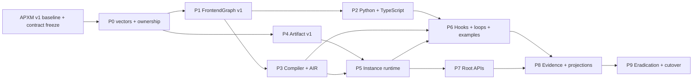

# Agent Program composition and AIR full-replacement plan

- Status: canonical APXM v1 owner plan
- Approved: 2026-07-16
- Owner: APXM `agents`
- Decisions: [ADR-0008](../adr/0008-agent-programs-compose-through-new-and-invoke.md), [ADR-0009](../adr/0009-air-has-five-public-semantic-operations.md), [ADR-0010](../adr/0010-agent-program-source-owns-context-hooks-and-conversational-loops.md), [ADR-0011](../adr/0011-agent-program-execution-is-one-end-to-end-spine.md), [ADR-0014](../adr/0014-conversational-agent-and-gao-are-examples-over-generic-agent-program-apis.md), [ADR-0003](../adr/0003-agent-program-contract-migrations-remove-old-semantics.md)
- Normative contract: [Agent Program composition and AIR contract](agent-program-composition-and-air-contract.md)
- Baseline: `agents@9e26a62adebb`

## Goal

Replace the current overlapping Agent Program, operation, loop, context, Hook,
and coordination semantics with one canonical Python/TypeScript →
FrontendGraph v1 → AIR v1 → artifact v1 → runtime → inference-backend path built around
`program.new`, `program.invoke`, `instance.invoke`, a closed five-operation
effect/composition family, and a separate closed structural AIS family.

This plan is the reference owner plan. Other APXM repositories consume its
released contracts and evidence; they do not duplicate its implementation.

## Start gate

Implementation begins only after the APXM master plan's M0 baseline, A0 owner
descriptor, and C0b contract-development bundle gates pass for the affected
lane. The gate requires reviewed
preservation of every dirty tree, reconciled repository roots/remotes, one
owner for every v1 contract, and zero pending or deferred v1 decisions.

## Scope

### Included

- `apxm.frontend-graph.v1`, `apxm.air.v1`,
  `apxm.executable-artifact.v1`, and `apxm.runtime-evidence.v1`;
- equivalent generic Python and TypeScript Agent Program composition, context,
  Hook, structured-control-flow, source-map, and compiler-bridge frontends;
- Rust-owned schema generation, verification, lowering, printer, artifact
  admission, and runtime handlers;
- Program Instance state, invocation, cancellation, structured children,
  replay, state commit, and generic checkpointing;
- runnable conversational and Gao repository examples using only packed
  generic frontend APIs;
- local embedding, CLI/application, Server, and OS consumer cutover; and
- deletion and absence proof for every retired operation and old semantic path.

### Excluded

- Agent Definition draft/published product lifecycle;
- Skill catalogue hierarchy and trust decisions beyond discovery-only
  invariants;
- user identity/grant issuance, billing, retention, and Studio access UX,
  which are owned by separate APXM master-plan lanes;
- automatic placement optimization, which is not part of canonical v1;
  admission selects an exact deployment/profile; and
- detached children, owner transfer, mutable program target lookup, or legacy
  artifact execution.

## Baseline inventory to freeze

Before code changes, preserve the exact revision, dirty state, operation
catalogue, generated surfaces, and consumer matrix. At minimum inventory:

- `crates/machine/ais/src/operations/definitions.rs` and generated op specs;
- `crates/compiler/pipeline/src/air_builder/` including `frontend_graph.rs`;
- Python `apxm/agent.py`, `proxy.py`, `hooks.py`, generated operations, tests,
  examples, and execution helpers;
- TypeScript `builder.ts`, handler types/registry, generated operations, tests,
  and Gao;
- every runtime handler under `crates/runtime/engine/src/executor/handlers/`;
- scheduler graph splicing/rearm, agent scope/process table, session ledger,
  workflow spawner, and Hook registry/driver;
- artifact, event, error, output, checkpoint, capability, and invocation types;
- CLI, orchestration driver, Server/OS, Studio, and external fixture consumers;
  and
- docs, examples, generated declarations, release scripts, and cutover scans.

The baseline is evidence only. No target crate imports or calls a frozen legacy
handler.

## Target deliverables

1. One Rust-owned schema source generates the target op and graph contracts.
2. Python and TypeScript expose equivalent `new`/`invoke`/Agent Facade APIs.
3. The compiler accepts only FrontendGraph v1 and prints only AIR v1.
4. AIR v1 exposes the five operations fixed by ADR-0009 plus internal
   structured IR.
5. Artifact v1 statically binds programs, Hooks, models, Capabilities,
   handlers, source maps, and compatibility evidence.
6. Runtime provides isolated Program Instances, atomic invocation state
   commits, structured children, generic durability, and typed evidence.
7. Conversational Agent and Gao are repository examples; no named construct is
   a package, compiler/runtime, Server, contract, or Studio concept.
8. Every atomically committed loop body/back-edge emits generic
   `LoopIterationCompleted`; failed or rolled-back bodies emit no completion.
9. All first-party consumers move in one Compatibility Set.
10. Every retired builder, operation id, handler, parser, artifact, fallback,
   alias, and documentation claim is deleted or clearly frozen as historical
   evidence.

## Workstreams

### P0 — Contract vectors and ownership ledger

Deliverables:

- freeze positive/negative JSON vectors for FrontendGraph, AIR, artifact, and
  evidence v1;
- assign exactly one schema/generator owner for operations, attributes, graph,
  Hook bindings, program references, instance ids, invocation ids, and errors;
- assign the APXM root lifecycle/event/evidence wire schema and generated-client
  owner fixed by normative contract section 14;
- encode the 38-row keep/replace/delete ledger from ADR-0009;
- define typed `ProgramRef`, `ProgramInstanceRef`, `AgentIdentityBinding`,
  `EventRef`, `AgentFacade`, internal tagged `HookEffect`, `NodeExecution`, and
  runtime error values;
- define the Program Instance/yield/return/event state machines, deterministic
  creation/call identities, atomic commit tuple, and authoritative lifecycle
  fact/outbox schema; and
- define generic loop-region source maps and `LoopIterationCompleted` facts
  with static/dynamic loop ids, iteration index, causal execution ids, and
  atomic commit/replay semantics.

Gate P0:

- every semantic field has one owner and compatibility rule;
- no target vector contains a legacy op, runtime path, dynamic registration,
  HookContext/HookResult, named conversational discriminant, or `Turn` entity;
- yield/return, Agent Identity, event, Hook ABI/order, task-scope, replay
  identity, and lifecycle-fact semantics have positive and negative vectors;
- Python/TypeScript/runtime teams can implement without inventing a contract.

### P1 — FrontendGraph v1 and generated authoring contracts

Deliverables:

- build the Rust-owned FrontendGraph v1 schema and generator inputs;
- model typed program imports, instances, invocations, functions, regions,
  loop-carried values, resumable yield arguments, structured task scopes,
  callbacks, source annotations, Agent Identity requirements, and event refs;
- remove the generic raw-op escape hatch from the target frontends;
- generate language types and validation from owner schemas; and
- add deterministic graph canonicalization/digest fixtures.

Gate P1:

- equivalent Python/TypeScript fixtures serialize byte-equivalent or
  canonically equivalent graphs;
- unknown semantic fields and all pre-canonical/retired operations fail validation;
- a browser-safe TypeScript frontend records the same graph without runtime or
  AIR printer dependencies.

### P2 — Python and TypeScript authoring parity

Deliverables:

- implement `Program.new`, `Program.invoke`, and `ProgramInstance.invoke`;
- implement equivalent language-neutral structured task scopes and reject raw
  coroutine/Promise scheduling as program semantics;
- implement one portable Agent Facade in both languages;
- implement static Agent/loop/Node/Model/Capability before/after Hook binding,
  deterministic ordering, and the internal tagged context/result ABI;
- implement explicit `agent.context` state flow and projections;
- implement frontend helpers for ask/think/reason/plan/reflect/verify as
  patterns over `model.call` rather than separate runtime ops;
- keep Python/TypeScript as authoring-only packages exposing generic
  `AgentProgram`, Hook, Context, composition, structured-control-flow,
  source-map, and compiler-bridge APIs; and
- add packed clean-consumer negatives proving `ConversationalAgent`, Gao,
  `TurnSpec`, `SpecialistComposition`, and equivalent subpaths are absent.

Gate P2:

- every source API has a cross-language semantic vector;
- neither frontend can register a retired op or print private AIR;
- context, child output, Capability output, and Skills never merge implicitly;
- callback code receives the Agent Facade and cannot access runtime internals;
- Python and TypeScript cannot derive different child-start behavior from raw
  coroutine/Promise semantics.

### P3 — Compiler, structural AIS, and canonical AIR

Deliverables:

- keep the five effect/composition operations under the single AIS owner;
- define a separate closed AIS-owned structural family with typed functions,
  branches, `ais.loop`, parallel joins, try/catch, return, and program/region
  yield;
- lower source control flow and state to SSA/region-carried values;
- distinguish `ProgramRef` and `ProgramInstanceRef` at verification and
  lowering;
- lower yield continuation/resume input distinctly from completing return and
  lower task scopes to joined parallel regions;
- compile static Hook bindings around their target regions;
- emit one canonical AIR v1 and source map; and
- reject every pre-canonical/retired operation before artifact production.

Gate P3:

- `dekk agents build-dialect` then `dekk agents codegen` regenerate every
  owned consumer from the new schema;
- golden AIR proves each public op and structural construct;
- no compiler pass expands `AGENT` into spawn/communicate, inserts autonomous
  loops, performs graph splicing, or accepts runtime paths;
- op inventory reports exactly five effect/composition operations and the exact
  closed structural family; `ais.loop` cannot validate as a sixth
  effect/composition operation.

### P4 — Artifact v1 and admission

Deliverables:

- define digest-bound program/handler references, typed entrypoints, Hook
  bindings, source maps, Agent Identity requirements, model/Capability
  requirements, and compatibility evidence;
- implement artifact canonicalization, signing inputs, size/resource ceilings,
  and admission diagnostics;
- remove behavior-bearing manifest loop/Hook/registration fields; and
- make old/unknown artifact versions and retired operations fail closed.

Gate P4:

- modified source, handler, reference, type, or contract fails digest/schema
  validation;
- no artifact contains a credential, grant, endpoint, path, runtime profile,
  mutable context, or dynamic registry operation;
- no target loader contains a pre-canonical translator or dual reader.

### P5 — Program Instance and invocation runtime

Deliverables:

- implement replay-safe `program.new` and typed instance ownership;
- implement one-shot and stateful `program.invoke` receiver semantics;
- enforce single-flight/fail-busy including recursive self-invocation;
- commit output, explicit Program Context, continuation/completion state,
  resolved children, commit sequence, and evidence outbox atomically;
- implement next-input-at-yield resume, return/completed, and one-shot
  first-yield disposal semantics;
- preserve last committed state after failed/cancelled occurrences;
- implement structured child lineage, parent completion rule, cancellation,
  ownership epochs, heartbeats/leases, bounded cancellation acknowledgment,
  fenced node/model/Capability/effect/state/output commits, fan-out/depth
  limits, and separate Session Output subtrees;
- implement provider-neutral automatic checkpoints through injected runtime
  interfaces; and
- implement the owned `EventRef` pending/fulfilled/expired/cancelled lifecycle,
  durable wait registration, authorized idempotent fulfillment, timeout,
  cancellation, crash-race, and replay through an injected event store/API;
- expose typed runtime evidence without wrapping program return values.

Gate P5:

- creation replay/collision, yield/resume, return/completed, repeated invokes,
  busy/self-invoke, missing/closed instance, parent crash, child failure/cancel,
  event races, and atomic commit/outbox vectors pass;
- permanent child-executor loss reaches bounded cancellation-unconfirmed,
  rejects stale-epoch node/model/Capability/effect/state/output work, and
  preserves only already-started unknown-effect evidence without allowing
  owner success;
- dropping a structured task handle does not detach a child;
- two embedded Runtime Instances leak no Program Instances, ids, registries,
  state, meters, or cancellation between them;
- placement changes produce equivalent program semantics.

### P6 — Model, Capability, Hook, context, loop, and examples cutover

Deliverables:

- route all model operations through `model.call` and all executable actions
  through `capability.invoke`;
- implement the ADR-0011 typed model-adapter boundary for exact admitted Model
  Context, Tool schemas, structured output, streaming, usage, deadline,
  cancellation, retry-attempt identity, and typed failures;
- delete automatic backend/model/provider fallback chains, the hidden runtime
  model-to-tool-to-model loop, silent non-streaming-to-streaming adaptation,
  raw provider-extension escape fields, and untyped provider metadata;
- require the inference backend to return Tool requests as data and prohibit it
  from executing tools, mutating context, continuing a loop, or substituting a
  model/provider/deployment;
- move sandbox execution and diagnostic/external I/O to Capabilities;
- replace dynamic Hook registration with artifact bindings and compiled calls;
- delete runtime-controlled conversation/autonomous loops and graph splicing;
- implement discovery-only Skills behavior and explicit context updates;
- implement equivalent Python/TypeScript conversational examples using only
  packed generic APIs and ordinary structured loops;
- implement Gao under repository examples as a TypeScript specialization of
  the example-local `ConversationalAgent`, using only generic Agent Facade,
  Context, `program.new`, and `program.invoke` APIs; and
- preserve provider-returned output/reasoning summaries without claiming
  hidden chain of thought.

Gate P6:

- a model tool request produces a model NodeExecution, a distinct Capability
  NodeExecution, and any subsequent distinct model NodeExecution;
- backend unavailability returns one typed failure and never selects another
  backend, model, provider, prompt, Tool schema, or execution path;
- equivalent admitted backends pass the same request/output/streaming/usage/
  cancellation/evidence vectors, and replica load balancing preserves one
  exact deployment digest;
- packed frontends contain no named conversational/Gao exports or subpaths;
- examples contain no direct AIR builder, compiler-private import,
  GraphBuilder/AUTONOMOUS loop, or privileged runtime branch;
- Skills are found only through admitted discovery Capabilities;
- runtime contains no hidden model/tool/reasoning/conversation loop.

### P7 — Root APIs and cross-plane consumers

Deliverables:

- implement section 14 of the normative owner contract as the generated APXM
  root lifecycle/event/evidence service schema;
- expose root create/invoke/close/cancel/query APIs through owning APXM
  service contracts without reusing the authored child API as a product API;
- expose root event create/query/fulfill/cancel operations with typed refs,
  authorization, idempotency, and conflict behavior;
- add `program_instance_id`, `program_invocation_id`, parent lineage, exact
  artifact identity, authenticated Agent Identity binding, static callsite/
  occurrence, idempotency, compatibility, authority, and trace fields;
- migrate CLI, orchestration driver, APXM Server/OS, and generated clients;
- ensure APXM Studio selects a published target and requests root creation,
  while Server owns root admission and runtime owns artifact admission; Studio
  never implements admission or program semantics; and
- remove paths where Studio/Server session code substitutes
  spawn+communicate or graph splicing for Program Instance invocation.

Gate P7:

- local embedding, CLI, and Server execute the same artifact and emit
  equivalent semantic evidence;
- root API retries resolve the same admitted instance/invocation;
- command receipts, authoritative pending states, client-side unknown
  reconciliation, idempotency conflicts, and cancel/close/commit races pass
  generated wire-contract vectors;
- event create/fulfill retries resolve one typed terminal event and conflicts
  fail explicitly;
- clients cannot supply private placement, worker, filesystem, or internal
  protocol fields.

### P8 — Evidence and Studio projection contract

Deliverables:

- emit the monotonic instance/invocation/child/commit/failure/cancellation/
  event/delivery facts and generic region/NodeExecution/attempt records;
- publish evidence idempotently from the authoritative commit outbox and prove
  that traces or delivery cannot become execution truth;
- implement stable scoped evidence sequences/cursors, retention-gap faults,
  permissioned read re-authorization/audit, event wake outbox/reconciliation,
  and explicit state-change/resume facts;
- emit source/artifact/program/instance/invocation lineage;
- record exact allowed model request/output, Capability request/result, Hook
  execution, context refs, cost inputs, placement, and output refs;
- define per-NodeExecution Session Output folder identity;
- emit one `LoopIterationCompleted` in the atomic Execution Commit for each
  committed body/back-edge and none for failed or rolled-back bodies; and
- provide generic loop-iteration projection fixtures keyed by static loop and
  dynamic occurrence ids, with no core `Turn` schema.

Gate P8:

- every actual visit to a static node has a unique NodeExecution;
- lifecycle projections reconstruct exactly from monotonic authoritative facts
  and the commit outbox after crash/replay;
- loop-iteration completion identity and ordering are replay-stable, and no
  trace/region-start inference can manufacture completion;
- terminal-event crash recovery always consumes or reconciles one idempotent
  wake, and cursor tests prove order, replay dedupe, watermark, permission
  re-check, and typed retention gaps;
- runtime retry nests an attempt while authored repetition creates a new
  occurrence;
- output folders and inspector records join without ambiguous static-node
  overwrites;
- authorization/redaction policy can omit sensitive content without changing
  execution truth.

### P9 — First-party migration and legacy eradication

Deliverables:

- migrate every example, fixture, CLI flow, Server/OS consumer, Studio adapter,
  and release descriptor to generic canonical v1 contracts;
- remove named Gao presets/routes/OpenAPI/client surfaces and core `Turn`
  projections from Studio;
- delete retired frontend methods, generated APIs, validators, compiler
  expansions, runtime handlers, scheduler branches, constants, events, tests,
  docs, and artifact acceptance;
- reserve retired wire ids permanently; and
- publish one target Compatibility Set with absence evidence.

Mandatory deletion families include:

- `AGENT`, `QMEM`, `UMEM`, `ASK`, `THINK`, `REASON`, `PLAN`, `REFLECT`,
  `VERIFY`, `INV_CAP`, `EXC`, and `PRINT` handlers/builders in their old form;
- `FLOW_CALL`, `WORKFLOW_SPAWN`, `COMMUNICATE`, `HANDOFF`, `DELEGATE`, and
  `SPAWN_AGENT` as Agent Program composition;
- `REGISTER_CAPABILITY`, `REGISTER_HOOK`, `AUTONOMOUS`, public `CHECKPOINT`,
  `PAUSE`/`RESUME`, QMEM/UMEM `FENCE`, and old `YIELD` semantics;
- old `JUMP`, `BRANCH_ON_VALUE`, `RETURN`, `SWITCH`, `MERGE`, `WAIT_ALL`,
  `TRY_CATCH`, `ERR`, `UPDATE_GOAL`, `NOP`, `IDENTITY`, and `CONST_STR` wire
  ids/builders/validators/handlers; canonical v1 structural equivalents use distinct
  generated identities;
- old graph-splicing/rearm/session-loop paths, package-level
  `ConversationalAgent`, direct Gao builder, `Turn` contracts, raw op builder,
  HookContext/HookResult, Context Delta/Merge authoring APIs; and
- pre-canonical graph/AIR/artifact readers, aliases, fallback compiler/runtime
  or inference paths, and
  mixed release documentation.

Gate P9:

- repository and generated-artifact scans find no active retired op or old
  semantic contract outside named historical evidence;
- old artifacts fail admission before runtime;
- one Compatibility Set passes Python, TypeScript, compiler, artifact,
  embedding, CLI, Server, OS, repository-example, and generic Studio-projection
  conformance;
- the candidate contains no translator, alias, fallback, dual path, or legacy
  feature switch.

## Parallel delivery graph

Parallel lanes exchange only versioned schemas, generated consumers, signed
artifacts, and conformance evidence. They never call a legacy handler as a
temporary target implementation.

## Verification commands by phase

Implementation must use the repository Dekk surface. Exact package subsets may
be refined during implementation, but the minimum gates are:

| Phase | Required verification |
| --- | --- |
| P0-P1 | schema/vector validator, `dekk agents codegen`, frontend parity checks |
| P2 | `dekk agents test-python-frontend`, TypeScript frontend tests, canonical graph comparison |
| P3 | `dekk agents build-dialect`, then `dekk agents codegen`, focused core/compiler tests, `dekk agents ops list` |
| P4 | artifact codec/admission tests, corruption and old-version negative vectors |
| P5-P6 | focused runtime tests, embedding multi-instance tests, cancellation/crash/replay tests |
| P7-P8 | CLI/Server/OS contract and end-to-end evidence tests |
| P9 | target-only full suite, release check, generated drift, secret/hygiene/artifact scans, retired-surface absence scan |

No gate is closed by a documentation review alone after implementation begins.

## Cutover and rollback

Before target promotion, a failed candidate is discarded and the prior complete
release remains active. Rehearsals use isolated target environments and never
send candidate writes to the old system.

At promotion:

1. stop affected intake;
2. verify the exact Compatibility Set and evidence digests;
3. transform required durable state once into canonical v1 identities/schemas;
4. publish all first-party consumers together;
5. reject old artifacts and clients; and
6. delete/retire old paths in the same release boundary.

Rollback before the point of no return restores the entire prior signed release
and matching snapshot. It never enables a pre-canonical interpreter inside v1. After
irreversible target effects/state, recovery is forward-only.

## Completion definition

This plan completes only when:

- all P0-P9 gates pass for the same source/artifact/Compatibility Set digests;
- Python and TypeScript are semantically equivalent;
- `program.new`, `program.invoke`, and `instance.invoke` pass state,
  structured-concurrency, authority, crash, and replay vectors;
- AIR reports exactly five effect/composition operations and a separate closed
  structural AIS family including `ais.loop`;
- conversational and Gao repository examples use only packed generic frontend
  composition;
- Studio builds generic loop-iteration/node inspection solely from
  `LoopIterationCompleted` and related authoritative evidence; and
- every retired semantic path is absent from the target release.
