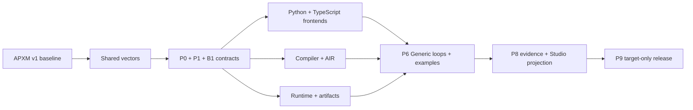

# APXM Agent Program Full-Replacement Portfolio

- Status: canonical APXM v1 portfolio
- Approved: 2026-07-16
- Decision: [ADR-0003](../adr/0003-agent-program-contract-migrations-remove-old-semantics.md)
- Event/runtime authority:
  [ADR-0018](../adr/0018-event-readiness-and-local-scheduling-are-agents-semantics.md)
  under accepted workspace ADR-0027
- Managed-plane cutover:
  [Event-driven runtime full replacement](event-driven-runtime-full-replacement-plan.md)
  under the workspace full-removal master
- Baseline: `agents@9e26a62adebb`

## Goal

Coordinate the APXM-owned Agent Program work as parallel target-only plans,
then cut over one Python/TypeScript/compiler/artifact/runtime Compatibility Set
without legacy operations, composition, Hook, Context, named conversational,
or Gao core/package semantics. Studio-owned Gao remains a product Agent Program
without introducing named Agents execution semantics.

## Owning plans

| Plan | Owner | Parallel work | Synchronization gate |
| --- | --- | --- | --- |
| [Agent Program composition and AIR full replacement](agent-program-composition-and-air-full-replacement-plan.md) | APXM contracts, frontends, AIS, compiler, artifact, runtime, examples, cross-plane consumers | `program.new`/`program.invoke`, two closed AIS families, Agent Facade, explicit context, structured loops, generic iteration evidence, Program Instances, deletion | P0-P9 |
| [Rust embedding library hardening](rust-embedding-library-hardening-plan.md) | APXM contracts, AIS, artifact, compiler, runtime, adapter owners | Public role vectors, acyclic dependencies, injected runtime interfaces, adapters, profiles, clean consumers | RLIB-1-RLIB-9 |
| [Compiler bridge delivery](compiler-bridge-delivery-plan.md) | APXM graph contracts, compiler, Python/Node bridges, compile service/client | FrontendGraph v2 vectors, pure frontends, native bridges, remote boundary, build tools | B1-B9; B1 consumes P0-P1 and B2 consumes RLIB-1-RLIB-4 |

Coordinator ADR-0001 owns the canonical v1 release family, shared version line,
private coordinates, Compatibility Set, platform matrix, and promotion. The
Rust embedding plan owns repository-local public library/adapter boundaries;
the compiler bridge plan owns graph and compiler delivery. Lanes start only
after their APXM master-plan baseline and input-contract gates pass.

## Parallel lanes

After P0 versioned schema vectors exist:

1. Rust contract and artifact types are implemented by their owning crates.
2. Python and TypeScript frontend APIs and generated types are implemented in
   parallel against the same vectors.
3. Compiler/AIR structured state flow and Hook bindings are implemented against
   the Rust-owned contract.
4. Agents Runtime Program Instance, invocation, activation/readiness, local
   execution, Execution Commit, and semantic evidence behavior is implemented
   against the same contract while Server implements managed occurrence,
   delivery, activation/effect durability, leases, schedules, Host gateway,
   retry/DLQ/recovery, and operational projections.
5. Conversational repository examples and the external Studio-owned Gao
   conformance input are prepared against packed generic frontend APIs while
   generic loop-iteration projection fixtures are built.

Lanes exchange schemas, generated code, FrontendGraph DTOs, artifacts, and
conformance vectors. They do not call or retain the old semantic engine.
Agents owns portable Event/EventRef/occurrence/provenance, activation,
readiness/local scheduling, `ActivationRunner`, and Execution Commit meaning;
Server owns the managed persistence, leasing, delivery, and recovery path
listed above.
Contracts indexes and generates exact owner publications without acquiring
their semantics. Auth, Host SDK, and Adapters retain their authority and
protocol ownership. The retiring OS contributes only current-state
transformation and deletion evidence; it publishes no target descriptor and
has no target consumer.

## Integration sequence

P9 is not a compatibility phase. It updates every included first-party
target consumer, rejects old semantic versions, deletes old dispatch and
direct-loop paths, deletes every retiring OS route/client/configuration and
target-topology reference, and emits one candidate Compatibility Set. That
candidate contains only current owner descriptors and generated contracts;
the retiring OS is absent before promotion.

## Target-only release gate

The APXM candidate must prove:

- equivalent Python and TypeScript programs produce equivalent semantic graph,
  AIR, artifact, and lifecycle evidence;
- `program.new`, `program.invoke`, and `instance.invoke` obey one state and
  structured-concurrency contract;
- AIR contains exactly five effect/composition operations and a separate
  closed structural family including `ais.loop`;
- one Agent Facade callback and explicit Program Context implementation execute;
- conversational examples and the external Studio-owned Gao conformance input
  use only packed generic frontend APIs;
- named package exports/product surfaces, direct Gao core branches, unversioned
  Hook types, broad decision union, duplicate dispatch, alias fields/events,
  and old artifact acceptance are absent;
- committed loop iterations emit replay-stable `LoopIterationCompleted`, while
  failed or rolled-back bodies emit none;
- local embedding, CLI/application, and Server-managed execution use the same
  Agents semantic contracts and current-owner generated bindings;
- Server-managed occurrence acceptance, delivery/target application,
  activation leasing, schedules, Host gateway, `ActivationRunner` integration,
  prepared-effect work, Execution Commit, retry/DLQ/recovery, and operational
  projection pass one source-to-commit conformance path;
- Contracts generation is byte-identical for the exact owner-publication
  cohort, and Auth, Host SDK, Adapters, Studio, and CLI consume those exact
  generated contracts without semantic copies;
- target contract, package, image, configuration, topology, release, and
  conformance scans contain no retiring OS consumer or OS target descriptor;
- old/unknown versions fail before runtime execution;
- release and repository scans find no legacy semantic feature switch.

## Rollback

Before target promotion, discard a failed candidate and retain its evidence.
The shared serialized authority window fences every old ingress/writer, takes
the final snapshot, runs the one offline state transformation, and activates
the complete target once. Before that activation's point of no return,
rollback restores one complete prior APXM/product release and matching
snapshot. No runtime contains both semantic generations. After the first
irreversible target write/effect, recovery is forward-only; already-fenced
physical remnants are removed later under the workspace physical-absence
gate, never retained as a product fallback.

## Completion definition

This portfolio completes when P9 passes for the same source and artifact
digests, every included first-party consumer uses the target contracts, old
semantic paths and all retiring OS product/consumer surfaces are deleted,
unknown/old artifacts are rejected, and the APXM Compatibility Set contains
one coherent frontend/compiler/artifact/runtime generation plus the exact
Server-managed and current-owner generated consumers.
