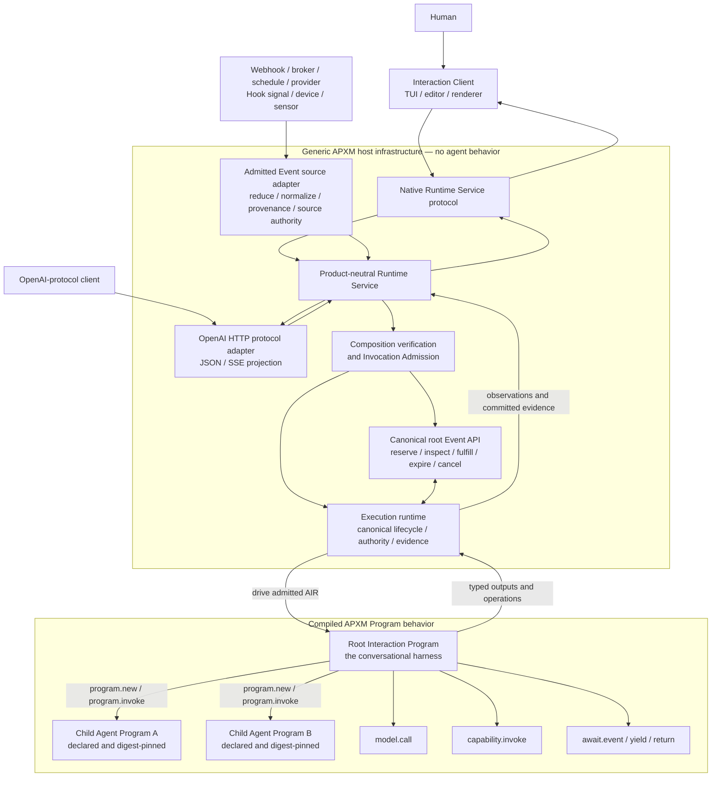
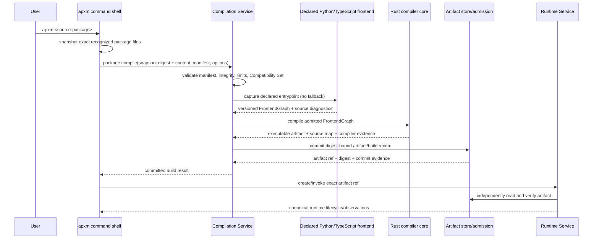
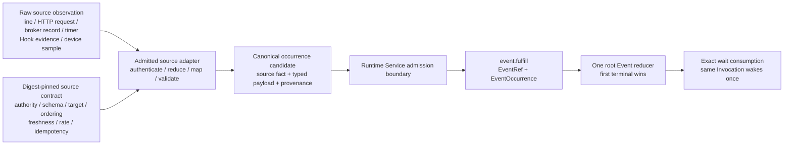
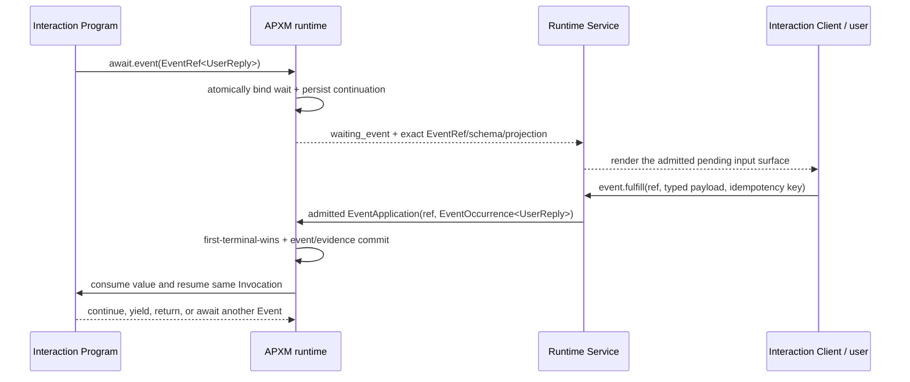

# CLI shell, Compilation Service, Runtime Service, OpenAI protocol API, and program-owned harness migration

## Status

This is an implementation-ready proposal and full-replacement migration plan.
It is not yet an accepted architecture decision and does not describe shipped
behavior. The first implementation step is to promote the architectural
decisions in this document into an accepted ADR.

The migration is intentionally end-to-end and zero-legacy. APXM must not ship an interactive
path that bypasses canonical compilation, admission, execution, continuation,
permission, cancellation, or evidence semantics. It must also not retain the
retired `chat`, `watch`, or `rollout` product flows as aliases, readers,
forwarders, importers, hidden commands, deprecated shells, or rejecting stubs.
No released state contains both old and new infrastructure.

### Zero-legacy cutover rule

“Full replacement” means deletion, not backward compatibility:

- no old CLI parser variant, flag, route, DTO, protocol method, config key,
  session/archive reader, record importer, adapter, alias, warning-only stub,
  feature flag, environment switch, or fallback survives the cutover;
- no old source package, compiled artifact, client/session record, transcript,
  rollout archive, or server-chat payload is translated into a new one;
- no version downgrade, schema coercion, dual read/write, shadow execution, or
  automatic retry through an old implementation is permitted;
- data left by removed versions is inert. The new release may report a generic
  unsupported-format diagnostic from the new schema/version decoder, but it
  contains no old schema decoder and offers no migration/import command;
- users rebuild supported source packages through the new Compilation Service
  and start new Program Instances. Unsupported old artifacts and records are
  rejected rather than converted or replayed; and
- transitional equivalence fixtures may exist only inside the unreleased
  implementation branch. They are removed before the single cutover release
  and never constitute a public compatibility period.

The OpenAI-shaped HTTP surface is not legacy support. It is a new, explicitly
versioned external protocol adapter over the canonical Runtime Service. It has
no code, DTO, route, state, or argument compatibility with retired `apxm chat`
or server-chat infrastructure. The APXM **Compatibility Set** is likewise an
exact contract/admission identity: mismatches fail closed without downgrade or
translation; the name does not authorize backward-compatibility behavior.

## Goal

Give APXM a first-class terminal interaction experience comparable in quality
to Crush while preserving APXM's defining property: all agent behavior,
including conversational loops, context updates, model/tool dispatch, retries,
composition, yields, and event waits, is authored and compiled as an Agent
Program.

The terminal UI is a client of that program. It is not an agent runtime and it
does not contain a hidden agent loop.

The target has build and interaction surfaces over two deliberately separate
service contracts:

```text
apxm build <agent-package>           Compilation Service client; artifact only
apxm <agent-package>                 exact build, then interactive Runtime client
apxm --artifact <artifact-ref>       interactive Runtime client; no source build
apxm run <agent-package> ...         exact build, then headless Runtime client
apxm run --artifact <artifact-ref>   headless Runtime client; no source build
POST /v1/chat/completions            OpenAI HTTP protocol adapter
event.fulfill via native/HTTP API    admitted external Event occurrence
```

Repository development continues to enter through matching `dekk agents`
commands.

## Vision alignment: the harness is the Program

The “chat harness” is not a CLI mode, service handler, SDK loop, or special
runtime agent. It is the root **Interaction Program** selected by the user or
serving alias. That ordinary compiled APXM Program has complete control over
agent behavior: conversation flow, Context, model and Capability sequencing,
child Program creation and invocation, retry and error policy, typed waits,
and when to yield or return.

From the product-experience perspective, the new interaction-specific host
surface provides presentation and transport. APXM still provides its generic
compiler, admission, runtime, lifecycle, authority, and evidence machinery as
defined by the
[portable core interface contract](../agents/portable-core-interface-contract.md)
and [Program composition/AIR contract](../agents/agent-program-composition-and-air-contract.md),
but none of that infrastructure supplies a chat policy or agent loop.

Source compilation is a separate plane. The executable `apxm` may orchestrate
an explicit compilation request followed by an explicit runtime request for
ergonomic reasons, but the Interaction Client itself never imports, embeds, or
selects an authoring frontend or compiler. The Runtime Service accepts only a
verified executable artifact/reference and cannot accept source,
`FrontendGraph`, or compiler options.

```mermaid
flowchart LR
    Source[Agent source package<br/>manifest selects python or typescript] --> Shell[Thin apxm command shell]
    Shell --> BuildClient[Compilation client]
    BuildClient --> BuildProtocol[Compilation Service protocol]

    subgraph BuildPlane[Compilation plane — no runtime execution]
        BuildService[Compilation Service<br/>package validation / exact toolchain composition]
        Frontend[Declared authoring frontend<br/>Python or TypeScript]
        Graph[apxm.frontend-graph]
        Compiler[Rust compiler core<br/>verify / CFG+SSA / AIR+AIS / artifact]

        BuildService --> Frontend
        Frontend --> Graph
        Graph --> Compiler
    end

    BuildProtocol --> BuildService
    Compiler --> Artifact[(Digest-bound executable artifact)]
    Artifact --> ArtifactStore[Artifact boundary / content store]

    Shell --> UI[Interaction Client<br/>TUI or headless]
    UI --> RuntimeProtocol[Runtime Service protocol]

    subgraph RunPlane[Runtime plane — no source or compiler]
        RuntimeService[Runtime Service<br/>composition / admission / projections]
        Runtime[Runtime kernel and execution]
        RuntimeService --> Runtime
    end

    RuntimeProtocol --> RuntimeService
    ArtifactStore -->|verified artifact ref + bytes| RuntimeService
```



The artifact boundary is mandatory even when both services are supervised
local child processes. `apxm <agent-package>` means “submit this exact package
snapshot to the Compilation Service, receive one digest-bound executable
artifact, then invoke that artifact through the Runtime Service.” It never
means “let the runtime import source” or “let the TUI execute a frontend.”



The arrows from the root Program to child Programs are the subagent boundary.
The root Program decides whether, when, and with what typed Context/input each
child is created and invoked, and how results affect subsequent behavior. The
runtime executes those authored `program.new` and `program.invoke` operations
under exact admission; the UI cannot spawn a child by passing an arbitrary
path, provider name, or `ProgramRef` as chat input.

### Behavior ownership test

| User-visible behavior | Canonical owner |
| --- | --- |
| Conversation loop, memory, and Context transitions | Root Interaction Program |
| Child-agent selection, creation, invocation, retry, and result composition | Root Interaction Program using declared child Programs |
| Model/Capability sequencing and tool-result handling | Root or child Agent Program |
| Whether and where execution waits for external input | Root or child Agent Program through `await.event` |
| EventRef lifecycle, occurrence application, exact wake, and consumption | APXM runtime |
| Terminal, HTTP/CloudEvents, webhook, broker, schedule, provider, Hook-signal, device, or sensor normalization | Admitted Event source/ingress adapter |
| Program Instance, Invocation, Event, continuation, cancellation, and outcome lifecycle | APXM runtime |
| Admission, grants, permission enforcement, and evidence commit | APXM runtime and exact Port owners |
| Input editing, terminal history, dialogs, rendering, and accessibility | Interaction Client |
| OpenAI request/response DTO and SSE interoperability | OpenAI protocol adapter |

Every interactive feature must pass this test before implementation: if it can
change what the agent decides or does, its controlling branch must be visible
in Agent Program source and compiled AIR. If it only changes how admitted
input, observations, approvals, or committed output are presented, it belongs
to the client or external protocol edge.

## Decision summary

1. APXM will expose a product-neutral Runtime Service contract.
2. The APXM CLI will be a client of that contract and will not construct or
  drive the execution runtime directly.
3. The local default will be a supervised Runtime Service child process over
  bidirectional stdio. A persistent local service over a Unix socket will be
   optional.
4. Loopback HTTP serving is part of this migration. Non-loopback exposure will
   ship only after authentication, transport security, tenant boundaries,
   admission issuer trust, abuse limits, and operational ownership have an
   accepted security contract and conformance suite.
5. All agentic or conversational harness behavior will be an ordinary compiled
  APXM Program. The Runtime Service and terminal renderer are host
   infrastructure, not Agent Programs.
6. Program Instance, Program Invocation, NodeExecution, Event, continuation,
   cancellation, outcome, and evidence lifecycle types are canonical runtime
   types and are explicitly in scope. The service projects them; it does not
   replace them with transport- or chat-specific state machines.
7. APXM will complete one canonical typed root Event API for reservation,
   inspection, exact wait binding, admitted occurrence fulfillment, expiry,
   cancellation, consumption, and wake/resume. External user, webhook, queue,
   schedule, provider, explicitly bridged Hook, device, and sensor inputs enter
   through admitted source adapters; none creates a parallel event state
   machine.
8. The native service protocol will expose generic Program Instance, Program
   Invocation, approval, cancellation, observation, continuation, content, and
   evidence operations plus the canonical external-event ingress projection.
   It will define no canonical `Chat`, `Conversation`, `Thread`, `Turn`, or
   `Message` runtime entity.
9. APXM will provide an inbound OpenAI HTTP protocol adapter with
   `/v1/models`, `/v1/chat/completions`, streaming, and a deliberately bounded
   `/v1/responses` projection. OpenAI DTOs map to published APXM Program
   serving aliases and never become runtime truth or a hidden agent loop.
10. Existing direct CLI execution paths will migrate to the Runtime Service.
  There will be one CLI execution spine, not embedded and service variants
   with different behavior.
11. No AIS operation is added. The behavior composes from `model.call`,
  `capability.invoke`, `program.new`, `program.invoke`, `await.event`, and
   compiler-owned structural control flow.
12. The retired `Chat` CLI option is removed completely during cutover. It is
  not renamed, aliased, forwarded, hidden, deprecated indefinitely, or kept
   as a rejecting stub. Removing `apxm chat` does not remove the independently
   designed OpenAI HTTP protocol adapter.
13. There is one source-neutral `EventOccurrence<T>` contract and one Event
   lifecycle for human input, HTTP/webhook input, broker messages, schedules,
   providers, explicitly bridged Hook signals, devices, and sensors. Source
   kinds are provenance and adapter profiles, never runtime Event variants.
14. Hook lifecycle execution and Program Event delivery remain distinct.
   A Hook-originated signal becomes an Event only through an explicit,
   admission-verified bridge; an ordinary Hook callback, provisional Hook
   observation, or committed `HookExecuted` fact does not implicitly fulfill
   an EventRef.
15. CloudEvents and W3C Web of Things are edge interoperability profiles, not
   APXM's semantic kernel. Their identifiers, schemas, timestamps, and source
   metadata can map into the canonical occurrence envelope, but they cannot
   replace EventRef ownership, authority, generation, terminal, consumption,
   or exact-wake semantics.
16. APXM will expose a separate product-neutral Compilation Service contract.
   The thin CLI shell may call it before the Runtime Service, but compiler and
   runtime services have distinct protocols, Composition Roots, dependency
   ceilings, process lifecycles, failure domains, and conformance suites.
17. Python and TypeScript remain the complete v1 Agent authoring frontend set.
   The package manifest selects exactly one; the CLI and Runtime Service do not
   prefer, infer, or fall back between them. Both must produce semantically
   equivalent FrontendGraph/AIR for equivalent source behavior.
18. There is no Rust Agent authoring frontend in this migration. Rust owns the
   compiler core, FrontendGraph verification/lowering, AIR/AIS selection,
   artifact production, and native Python/Node bridge implementations. Those
   Rust components are not an author-facing source frontend.
19. The public source-package convenience path always crosses the artifact
   boundary. Compilation failure, incompatible frontend/toolchain identity, or
   artifact commit uncertainty prevents Runtime Service invocation; the
   runtime never compiles as fallback.


## Normative vocabulary and separation of concerns

The word *harness* is currently ambiguous. This migration removes that ambiguity.


| Term                          | Owner                             | Responsibilities                                                                                                                                      | Must not own                                                                                  |
| ----------------------------- | --------------------------------- | ----------------------------------------------------------------------------------------------------------------------------------------------------- | --------------------------------------------------------------------------------------------- |
| **Interaction Program**       | Agent Program source and artifact | Conversation loop, context, model/tool sequencing, child Programs, retry/error control flow, `yield`, typed event waits                               | Terminal keys, screen layout, process lifetime, transport, credentials, admission             |
| **`apxm` command shell** | CLI application boundary | Parse commands, resolve explicit local inputs, call the Compilation Client and/or Interaction Client, propagate typed outcomes | Frontend capture, compiler lowering, runtime construction, behavior, artifact truth, or hidden fallback |
| **Compilation Client** | CLI/build client library | Snapshot an exact declared package, submit compilation requests, render diagnostics, return artifact refs | Language AST analysis, FrontendGraph construction, AIR lowering, artifact admission, or runtime calls |
| **Compilation Service** | Compiler Composition Root | Validate package/build request, select the manifest-declared frontend adapter, bind exact drivers/toolchain, call compiler core, commit artifact/build evidence | Runtime execution, Program Instances, interaction state, provider calls, or frontend choice by fallback |
| **Authoring frontend** | Installable Python `apxm_program` or TypeScript `@apxm/frontend` package | Parse/bind native source into the shared typed `FrontendGraph` contract with source diagnostics | AIR/AIS selection, artifact production, runtime execution, CLI rendering, network/service discovery, or language fallback |
| **Rust compiler core** | Focused compiler embedding role | Verify FrontendGraph, build CFG/SSA, select AIR/AIS, optimize deterministically, produce artifact/source map/diagnostics | Source-language UX, interpreter discovery, runtime construction/execution, provider/network/storage policy, or CLI state |
| **Executable artifact boundary** | Artifact encoding/admission and content store | Immutable digest-bound executable program, schemas, source map/provenance, exact contract-set and entrypoint metadata | Mutable source tree, ambient frontend/toolchain choice, UI session state, or runtime continuation |
| **Interaction Client**        | `apxm` TUI/headless client        | Input editing, rendering, session picker, approval presentation, stdout/stderr behavior, protocol reconnect                                           | Model/tool loop, context mutation, implicit retry, authority decisions, execution truth       |
| **Runtime Service**           | Product-neutral Composition Root  | Verify exact composition and Invocation Admission, construct ports, create/invoke/resume/cancel instances, publish live observations, commit evidence | Conversation policy, prompt assembly, tool selection, UI state, product control plane         |
| **Runtime Service Protocol**  | APXM runtime contract             | Typed requests, responses, server-initiated approval requests, notifications, correlation, version handshake                                          | AIR semantics, transport-specific policy, presentation layout                                 |
| **Canonical runtime lifecycle** | Runtime contracts, kernel, execution, and evidence | Program Instance, Program Invocation, NodeExecution, Event, continuation, cancellation, outcome, reconciliation, and committed evidence | Conversation labels, transport connection state, UI state, or external-protocol DTO state |
| **Canonical root Event API** | Runtime contracts, kernel, execution, and evidence | Typed Event reservation, bind, admitted occurrence application, terminal transition, consumption, and exact Invocation wake | HTTP/broker/device parsing, UI rendering, arbitrary raw payload delivery, or transport retry policy |
| **Event source contract** | Deployment composition and admitted source adapter | Exact source identity, target-selection rule, schema mapping, filtering/reduction, ordering, freshness, rate, authority, and idempotency profile | Runtime Event state, continuation access, implicit Program selection, or unbounded raw-signal injection |
| **Event source/ingress adapter** | Runtime Service edge or admitted external owner | Authenticate source, normalize payload, attach provenance, enforce source contract, and submit an admitted occurrence | Event lifecycle truth, direct continuation mutation, Program selection, or implicit Context injection |
| **Hook lifecycle** | Compiled Program Hook bindings and runtime Hook executor | Statically bound `before`/`after` callbacks for agent, loop, node, model, and Capability scopes; committed Hook evidence | Dynamic Event listeners, EventRef mutation, source routing, or an implicit Hook-to-Event bus |
| **Native transport adapter**  | Runtime Service                   | stdio JSONL, local Unix-socket framing, and any secured native network framing                                                                         | Semantic fallback, request reinterpretation, or undeclared authentication policy              |
| **OpenAI protocol adapter** | Runtime Service edge | HTTP request validation, APXM serving-alias resolution, bounded OpenAI projection, SSE framing, protocol errors | Runtime lifecycle truth, prompt/tool loops, grants, admission overrides, provider selection, or retired APXM route translation |
| **Client interaction record** | Interaction Client                | References needed to reopen the UI: artifact, entrypoint, Program Instance, invocations, evidence cursors, presentation preferences                   | Program Context, canonical continuation, authority, execution status truth                    |
| **Execution Commit/evidence** | Runtime                           | Authoritative state, continuation, output refs, effects, usage, and lifecycle facts                                                                   | Provisional token rendering or client-only state                                              |


After this migration, documentation must use *Interaction Program* for the
behavior-bearing harness and *Interaction Client* for the CLI/TUI. A casual
use of “CLI harness” may describe the whole user experience, but no contract or
type may use that phrase without naming which layer it belongs to.

Likewise, *frontend* means one of the two source-language authoring packages;
it never means the Rust compiler, native bridge, CLI, Runtime Service, or TUI.
*Build* means source package to committed executable artifact. *Run* means an
admitted artifact to Program Instance/Invocation lifecycle. No command or
service may collapse those verbs into one semantic operation even when the
command shell sequences them for convenience.

## Non-negotiable invariants

### Build/run plane separation

- The Compilation Service depends inward on package contracts, exact frontend
  adapters/source port, the Rust compiler embedding role, artifact encoding,
  and build evidence. It cannot depend on runtime kernel/execution, Runtime
  Service protocol, inference/provider backends, Program continuations, or
  interaction-client state.
- The Runtime Service depends inward on artifact admission, runtime
  kernel/execution, exact Port implementations, continuation/evidence, and its
  public protocol. It cannot depend on Python, Node, either frontend package,
  FrontendGraph capture, compiler crates/toolchains, source packages, or build
  caches.
- The Interaction Client depends only on Runtime Service protocol types plus
  presentation libraries. It cannot depend on compiler, source-port,
  FrontendGraph/AIR lowering, runtime kernel/execution, or concrete backends.
- The Compilation Client depends only on package/build contracts and the
  Compilation Service protocol. It cannot import a frontend, native compiler
  bridge, compiler core, Runtime Service, or runtime implementation.
- The thin `apxm` command shell may depend on both client libraries to sequence
  `build -> invoke`. That application-level sequencing grants neither client
  access to the other plane and creates no shared semantic state machine.
- Compilation returns a committed artifact ref/digest or diagnostics. Runtime
  invocation begins only after the client can identify and the Runtime Service
  can independently verify that committed artifact.
- A matching exact package snapshot may produce a cache hit, but the
  Compilation Service owns that decision and returns the same artifact/build
  evidence. The CLI never decides that a stale artifact is “close enough.”

### Frontend and compiler ownership

- The manifest's closed `frontend = "python" | "typescript"` value selects one
  exact source adapter. File extension confirms the declaration; it never
  selects or overrides it.
- There is no implicit preferred language, source probing, Python-to-TypeScript
  fallback, local-to-remote fallback, or frontend chosen from installed tools.
- Python and TypeScript own language-native AST, symbols/types, BoundAgentTree,
  and deterministic FrontendGraph emission. Neither emits AIR, executes the
  Program, shells out to `apxm`, or starts a service implicitly.
- Rust owns the shared compiler from admitted FrontendGraph through artifact.
  PyO3/Node-API native crates are compiler bridges consumed by their matching
  language packages, not a Rust authoring frontend.
- A future Rust Agent authoring frontend requires a separate accepted ADR and
  coordinated expansion of the closed manifest, source-language, source-map,
  frontend-surface, FrontendGraph, bridge, packaging, parity, and conformance
  contracts. This migration reserves no `rust` selector or placeholder stub.


### Program ownership

- A conversational agent is an ordinary `Agent<I, O, C>` with an authored
loop and explicit Context.
- A project-specific orchestration harness is also an ordinary Agent Program.
It may statically compose other Agent Programs through `program.new` and
`program.invoke`.
- The CLI cannot dynamically inject an unadmitted Program, Model, Capability,
prompt, tool loop, or context transition into a running instance.
- A universal harness cannot accept an arbitrary `ProgramRef` as user data.
`ProgramRef` remains a statically imported, digest-pinned program reference.
- The runtime has no `Turn` type. A UI may label one yielded interaction as a
turn, but that label is a projection of Program Invocation and loop evidence.


### Lifecycle ownership

- The runtime owns the canonical state machines. Today those include
  `InstanceState`, `InvocationState`, `EventState`, `ModelOutcome`,
  `NodeLifecycle`, `Continuation`, `RunOutcome`, and evidence-backed
  `LifecycleView`, together with `ProgramInstance`, `Invocation`, and their
  typed identities. Current owners are
  [`runtime_evidence.rs`](../../crates/machine/program/src/runtime_evidence.rs),
  [`readiness.rs`](../../crates/runtime/execution/src/readiness.rs),
  [`resume.rs`](../../crates/runtime/execution/src/resume.rs),
  [`instance.rs`](../../crates/runtime/kernel/src/instance.rs), and
  [`reconcile.rs`](../../crates/runtime/kernel/src/reconcile.rs).
- The Runtime Service protocol publishes closed projections of those types.
  It must not independently infer success from a token stream, connection
  close, Chat Completions `finish_reason`, or client record.
- Transport lifecycle such as connected, initialized, subscribed,
  backpressured, disconnected, and reconnected belongs to the service
  protocol. It never changes Program state by itself.
- OpenAI protocol lifecycle such as request, chunk, response, and
  `finish_reason` belongs only to the OpenAI protocol adapter. It is derived
  from canonical runtime observations and terminal evidence.
- Editor, dialog, rendering, and optimistic-display state belongs only to the
  Interaction Client.
- `Conversation`, `Thread`, `Turn`, and `Message` records are allowed as
  external-protocol or presentation DTOs when a public protocol requires them.
  They must never replace, rename, or become the source of truth for the
  canonical runtime lifecycle.


### Interaction ingress is a closed distinction

The UI must route input according to the canonical runtime state and an
explicit Program-declared interaction surface. It must never guess that every
line of text is an Event or every Event starts a new Invocation.

| Situation | Canonical operation | Lifecycle consequence |
| --- | --- | --- |
| New input before the first call or after committed `yield` | `program_invocation.start(input: I)` | Opens the next Invocation on the ready Program Instance |
| Input awaited inside an active Invocation | Apply one admitted typed occurrence to the exact `EventRef<T>` | Keeps the same Invocation; `waiting_event` resumes to `running` |
| Runtime Capability permission is `Ask` | `approval.resolve` | Resolves authority; does not become Program input or Event fulfillment |
| Caller requests termination | `program_invocation.cancel` or `program_instance.close` | Enters the canonical cancellation/close state machine |
| Model chunks, progress, lifecycle, and evidence | `observation.subscribe` / `evidence.read` | Outbound observation only; cannot mutate execution |

If the Program Instance is not ready for `I`, has no exact pending
`EventRef<T>` exposed to that caller, and has no pending approval, unsolicited
input is rejected with a typed state error. It is never buffered into Context,
attached to a later invocation, or interpreted as steering by convention.

### Universal Event-source convergence

- A physical or protocol input is not a Program Event merely because an
  adapter observed it. The source adapter first authenticates it, applies the
  admitted source contract, reduces/filters if required, normalizes it, and
  constructs one candidate `EventOccurrence<T>` for the root Event API.
- Once the root Event API accepts an occurrence, no source adapter, client,
  renderer, or transport may silently coalesce or discard it. Backpressure,
  stale data, sequence gaps, duplicate delivery, and conflicting delivery are
  closed typed outcomes.
- One occurrence may be mapped to multiple EventRefs only by an explicit,
  digest-pinned fan-out rule. Each application has its own target identity and
  idempotency result; there is no implicit publish/subscribe behavior inside
  the Event reducer.
- A Hook callback is lifecycle behavior, not an Event source by default. A
  Hook can originate an Event only through a declared signaling Capability or
  through an admitted adapter over committed Hook evidence. Both paths use the
  same source-neutral occurrence and root Event API as every other source.
- Raw sensor samples, transport acknowledgements, runtime dependency wakes,
  local scheduler wakeups, telemetry, and provisional observations do not
  automatically become Program Events. A declared source contract decides
  which external occurrence is meaningful to the Program.


### Execution authority

- The Runtime Service must use the same verified Deployment Composition,
exact Port bindings, Invocation Admission, execution driver, and Execution
Commit path as every other APXM Composition Root.
- A service or client disconnect is not cancellation. Only an explicit,
admitted cancellation that wins the runtime state transition is
cancellation.
- The client cannot mint a Capability Grant or turn `Ask` into `Allow`.
It returns a user's decision to the approval broker; the permission layer
validates scope and records the effective decision before the effect.
- Selecting a different model applies only to a later Invocation Admission.
It never mutates an in-flight exact model binding.


### Truth and observation

- Token chunks, progress, heartbeats, and UI cards are provisional live
observations.
- A completed model message is not proof that the Program Invocation
committed.
- The authoritative terminal event references the Execution Commit and
canonical evidence.
- Every request and event carries typed Program Instance, Program Invocation,
NodeExecution where applicable, request, and monotonic stream correlation.
- Slow clients may cause cosmetic events to be coalesced, but approval
requests, state transitions, cancellation outcomes, and terminal events
cannot be dropped.


### Typed input and output

- APXM does not assume `String -> String` entrypoints.
- Raw typed JSON is the universal fallback.
- A text composer is enabled only by an explicit interaction projection whose
input and output paths validate against the entrypoint schema.
- Presentation metadata is non-behavioral. It cannot name a provider,
endpoint, Runtime Profile, permission decision, or execution policy.


## Existing APXM foundations

The migration builds on existing semantics rather than creating a parallel
runtime:

- [ADR-0006](../adr/0006-authoring-frontends-use-explicit-compiler-bridges.md)
already fixes Python and TypeScript as pure authoring frontends over one
versioned FrontendGraph contract and explicit native/remote compiler bridges.
- [ADR-0007](../adr/0007-rust-embedding-uses-focused-libraries-and-injected-adapters.md)
already separates compiler and runtime embedding roles and prohibits either
focused role from depending on the CLI or the other execution plane.
- [ADR-0015](../adr/0015-source-first-agent-frontend-vocabulary.md)
already assigns native AST/binding and FrontendGraph emission to equivalent
Python/TypeScript frontends while Rust alone owns verification, CFG/SSA,
AIR/AIS selection, and artifact production.
- The current [`apxm-source-port`](../../crates/compiler/source-port/src/lib.rs)
defines a Server-callable source-bundle compile boundary with a closed
`Python | Typescript` selector and conformance fixtures for both languages.
The Python and Node native bridge crates call the same Rust lowering in
[`native/python`](../../crates/compiler/frontend/native/python/src/lib.rs) and
[`native/typescript`](../../crates/compiler/frontend/native/typescript/src/lib.rs).
- [ADR-0010](../adr/0010-agent-program-source-owns-context-hooks-and-conversational-loops.md)
already requires conversational loops to be authored program structure and
rejects a hidden runtime `Turn` loop.
- [ADR-0018](../adr/0018-event-readiness-and-local-scheduling-are-agents-semantics.md)
already assigns portable `EventRef<T>`, admitted occurrence, terminal-state,
consumption, readiness, and exact-wake semantics to Agents while leaving
protocol-specific source ingestion and managed delivery operations outside the
semantic kernel. Its status explicitly says production implementation is not
complete.
- The conversational Python and TypeScript reference programs already use
generic `Agent`, `Context`, `Hook`, `Model`, `Tool`, structured loops, and
`agent.yield_()`; see the
[Python example](../../examples/agents/conversational/python/agent.py) and
[TypeScript example](../../examples/agents/conversational/src/conversational-agent.ts).
- `apxm-execution` already exposes single-shot, resumable, resume, and typed
event-resume execution paths in
[`driver.rs`](../../crates/runtime/execution/src/driver.rs).
- Continuations already retain exact model and Capability admission state and
commit through the Execution Commit port; the owned record is in
[`resume.rs`](../../crates/runtime/execution/src/resume.rs).
- `apxm-inference` already defines ordered stream events and cooperative
cancellation in
[`stream.rs`](../../crates/runtime/inference/src/stream.rs).
- The permission vocabulary already contains `Ask`, although the current
driver has no approval broker; see
[`permission.rs`](../../crates/machine/contracts/src/types/capability/permission.rs)
and the current refusal path in
[`driver.rs`](../../crates/runtime/execution/src/driver.rs).
- The current canonical local Composition Root verifies exact artifact,
release, provenance, and Invocation Admission inputs in
[`canonical_execute.rs`](../../crates/tools/cli/src/commands/canonical_execute.rs).


## Current inconsistencies to remove

This migration is complete only when all of these are resolved:

The current-code anchors for this inventory are the
[CLI crate dependency manifest](../../crates/tools/cli/Cargo.toml),
[CLI command enum](../../crates/tools/cli/src/commands/cli.rs),
[CLI dispatch](../../crates/tools/cli/src/main.rs),
[package build implementation](../../crates/tools/cli/src/commands/agent.rs),
[Python-only canonical compile command](../../crates/tools/cli/src/commands/compile_service_canonical.rs),
[cross-language source compile port](../../crates/compiler/source-port/src/lib.rs),
[canonical CLI Composition Root](../../crates/tools/cli/src/commands/canonical_execute.rs),
[execution driver](../../crates/runtime/execution/src/driver.rs),
[kernel runtime ports](../../crates/runtime/kernel/src/runtime_ports.rs),
[execution session ledger](../../crates/runtime/execution/src/session_ledger.rs),
[inference stream contract](../../crates/runtime/inference/src/stream.rs),
[Python Event capture](../../crates/compiler/frontend/python/apxm_program/_capture.py),
[TypeScript Event capture](../../crates/compiler/frontend/typescript/src/capture.ts),
and [FrontendGraph-to-AIR lowering](../../crates/machine/program/src/lower.rs).

1. Canonical local execution declares buffered inference even though the
  inference layer has a stream contract.
2. The driver converts unresolved `Ask` into refusal because no approval
  broker exists.
3. The inference stream helper accumulates events into a final result instead
  of publishing them to a live observer.
4. `CanonicalRuntime` and its Composition Root wiring live inside the CLI
  command module.
5. Hidden `Chat`, `Watch`, and `Rollout` command shapes remain in the CLI only
  to reject their retired product behavior.
6. `execute-canonical` drives the runtime directly and prints only the final
  buffered result.
7. Session terminology mixes generic Session Output, legacy UI sessions, and
  resumable Program Instances.
8. Some runtime documentation describes conversational resume only through
  `await.event`, while the canonical conversational example uses authored
   `yield` boundaries for successive inputs.
9. The artifact exposes entrypoint type references, but the availability and
  ownership of complete input/output schemas for a generic terminal composer
   must be confirmed.
10. The CLI README rejects ownership of a product chat REPL, correctly, but
  does not yet distinguish that rejected product surface from a
    product-neutral Interaction Client.
11. The shipped `EventPort` exposes only `await_event`, `EventRef` is currently
  an opaque non-empty string, and public `resume_event` accepts a raw delivered
  value. The complete ADR-0018 reservation, typed occurrence, provenance,
  authorization, idempotency, terminal transition, consumption, and exact-wake
  interface is not yet implemented.
12. The resumable execution path currently records a parked `await.event` as
  `InvocationCommitted`/`CommittedYield`. That conflicts with the owner
  contract: `await.event` parks the same Invocation in `WaitingEvent` and is
  not an Invocation output/commit boundary.
13. Current frontend capture/lowering resolves a static Event declaration name
  directly into an AIR `event_ref` string operand. The target contract instead
  requires an authored Event type/source declaration and a distinct
  runtime-minted, generation-scoped EventRef value for each exact occurrence.
14. The current Hook contract has static `before`/`after` bindings for agent,
  loop, node, model, and Capability scopes and commits `HookExecuted` evidence,
  but there is no canonical, admission-verified Hook-signal-to-Event bridge.
  Treating callback invocation, a live Hook observation, or an event-name
  string as delivery would create a second, unauthoritative event system.
15. There is not yet one implemented source descriptor/envelope and conformance
  profile spanning human, HTTP/CloudEvents, webhook, broker, schedule,
  provider, Hook, device, and sensor origins. In particular, the runtime does
  not yet freeze sequence, clock quality, freshness, reduction, gap, fan-out,
  and idempotency semantics for IoT-class sources.
16. The `apxm-cli` crate currently depends directly on compiler/program,
  runtime kernel/execution, inference, concrete backends, and registry crates.
  It therefore acts as an authoring/compiler/runtime application rather than a
  thin shell over focused Compilation and Runtime Service clients.
17. `compile-service-canonical` supports only `frontend = "python"`, even
  though the accepted manifest/FrontendGraph contracts and `apxm-source-port`
  close the supported set over both Python and TypeScript. TypeScript packages
  therefore have a tested frontend but no equivalent canonical package compile
  path through the public CLI.
18. `agent build` currently synchronizes package metadata, compiles some
  TypeScript handler manifests through CLI-owned tooling, and writes an
  integrity hash chain; it does not produce the executable artifact implied by
  the ordinary meaning of “build.” Meanwhile compilation is a separate hidden-
  sounding command. This is an ambiguous public lifecycle.
19. The target `apxm <agent-package>` and `apxm run <agent-package>` flows did
  not previously specify where source capture/compilation occurs or require an
  artifact commit between build and execution. Without that boundary the
  Interaction Client or Runtime Service could accidentally absorb a frontend.
20. Frontend binding/code-generation ownership currently lives under
  `crates/tools/cli/src/frontend/` and CLI `codegen` commands. Contract codegen
  is compiler/development tooling, not Interaction Client behavior, and must
  leave the production CLI dependency cone.
21. Current source-package compilation and source-port inputs are not yet one
  frozen package-level contract: the source port accepts one submitted source
  text while real packages contain imports, prompts, handler sources,
  manifests, schemas, and integrity data. The Compilation Service needs one
  exact snapshot/bundle contract rather than ambient directory/import lookup.

There will be no adapter, reader, importer, alias, or rejecting shell that
routes retired CLI/chat/server/session/rollout semantics into the new services.
The old shapes are deleted before the single cutover release. The independently
specified OpenAI HTTP edge maps published Program serving aliases directly to
the canonical Runtime Service and shares no legacy APXM code or contract.

### Mandatory deletion of the old `Chat` option

Removing the old option is part of the migration's definition of done. The
cutover must delete:

- `Commands::Chat` from the Clap command enum;
- the `Commands::Chat { .. }` dispatch and rejection arms in driver and
no-driver builds;
- its `--agent`, `--air`, `--server`, `--session-id`,
`--capability-grant-id`, `--import`, `--backend`, `--model`, and `--owner`
fields;
- any old server-chat routes, request/response records, session adapters,
fixtures, snapshots, help text, examples, and documentation reachable from
that option;
- tests that preserve the old option merely to assert that it is rejected.

The replacement is the generic `apxm <agent-package>` and
`apxm run <agent-package>` thin-shell composition: exact Compilation Service
build to an artifact, then interactive or headless Runtime Service client.
Explicit artifact forms skip only the build. None is an alias for
`apxm chat`, and none accepts the old chat-specific argument model.

The canonical-only reachability suite must positively fail if `Chat`,
`apxm chat`, its retired flags, or its old route vocabulary reappears in an
executable CLI surface. Historical ADR prose may retain the term only when it
is clearly identified as historical or rejected.

## Reference investigation

All requested references inform the target. None is copied wholesale.

### llama.cpp

The [llama.cpp CLI](https://github.com/ggml-org/llama.cpp/blob/master/tools/cli/README.md)
demonstrates the minimum viable interaction loop: direct terminal entry,
multiline input, chat templates, reverse prompts, timing visibility, terminal
color negotiation, and context checkpoints. Its current CLI can connect to a
specified server or start one when none is supplied. The
[llama.cpp server](https://github.com/ggml-org/llama.cpp/blob/master/tools/server/README.md)
demonstrates both the value of separating long-lived inference resources from
the terminal process and the ecosystem value of OpenAI-protocol Chat
Completions, Responses, and Embeddings routes.

APXM adopts the low-friction CLI/server ergonomics and the external-protocol-edge
pattern, not llama.cpp's model-level conversation semantics. APXM's native
client invokes a compiled Program through the Runtime Service protocol. An
OpenAI-protocol request reaches that same Program execution spine through a
bounded adapter; it does not invoke an inference backend directly.

OpenAI's current [migration guidance](https://developers.openai.com/api/docs/guides/migrate-to-responses)
says Chat Completions remains supported while recommending Responses for new
projects. Responses also incorporates an agentic tool loop. That makes both
interfaces relevant at APXM's external protocol edge, but neither may become the
runtime model: any loop, tool dispatch, context transition, or retry still has
to exist in the admitted APXM Program. The
[Chat Completions request schema](https://developers.openai.com/api/reference/resources/chat/subresources/completions/methods/create)
therefore informs an adapter contract, not APXM's canonical execution
contract.

### Codex

The [Codex CLI](https://learn.chatgpt.com/docs/codex/cli) pairs an interactive
terminal with a noninteractive execution mode. The official
[Codex App Server documentation](https://learn.chatgpt.com/docs/app-server)
shows why a bidirectional client protocol matters: rich clients need streamed
events, history, approvals, interruption, reconnect, and server-initiated
requests. It supports stdio, Unix-socket, and experimental WebSocket
transports.

APXM adopts the client/protocol separation and approval request pattern. It
does not adopt Codex Thread/Turn/Item semantics; the protocol uses APXM Program
Instance, Program Invocation, NodeExecution, continuation, and evidence
identities.

### DeepSeek Harness

The [DeepSeek Harness architecture](https://github.com/deepseek-ai/deepseek-harness/blob/master/docs/architecture.md)
distinguishes durable session facts from live agent and capability events. It
also demonstrates that headless and interactive surfaces benefit from a shared
event model.

APXM adopts the durable-fact versus live-observation distinction. It does not
adopt an “everything is a plugin” semantic core or a runtime-owned Turn/step
loop; APXM's operation family remains closed and the loop remains source-owned.

### Gemini CLI

The [Gemini CLI repository](https://github.com/google-gemini/gemini-cli)
separates its terminal package from a core package responsible for
orchestration, tools, policy, and confirmation flow. It also includes a
programmatic SDK and an experimental Agent-to-Agent server.

APXM adopts the UI/core package separation and explicit confirmation channel.
It does not put orchestration into a generic core loop: orchestration remains
compiled Agent Program behavior. Filesystem restore/checkpoint UX is also kept
separate from APXM Program continuations.

### Crush

[Crush](https://github.com/charmbracelet/crush) is the interaction-quality
reference: project-scoped sessions, resume, model selection, rich tool cards,
permission dialogs, editor ergonomics, terminal portability, and a headless
`run` surface. Its current command implementation supports both in-process and
client/server workspaces, while its headless runner consumes correlated events
and treats an explicit run-complete event as terminal.

APXM adopts that interaction quality, per-run correlation discipline, and the
shared interactive/headless event path. APXM goes further on consistency:
every execution-facing CLI mode uses the Runtime Service contract, while every
source-package build uses the separate Compilation Service contract, so the
TUI cannot acquire a private embedded compiler or execution path.

### CloudEvents and Web of Things

The CNCF [CloudEvents specification](https://github.com/cloudevents/spec/blob/main/cloudevents/spec.md)
defines a vendor-neutral event envelope with required `id`, `source`, `type`,
and `specversion` attributes, optional schema/content/time metadata, and
protocol bindings including
[HTTP](https://github.com/cloudevents/spec/blob/main/cloudevents/bindings/http-protocol-binding.md).
It is the right interoperability profile for HTTP, broker, webhook, and some
provider adapters. APXM maps CloudEvents `source + id` into admitted source
identity/idempotency inputs, `type` and `dataschema` into the declared Event
type/schema mapping, and `subject`/`time` into provenance. The original
envelope may be retained by content reference for audit. CloudEvents alone
does not identify the target EventRef or define APXM ownership, authority,
generation, first-terminal-wins, continuation consumption, or exact wake.

The W3C [Web of Things Thing Description 1.1](https://www.w3.org/TR/wot-thing-description11/)
models asynchronous device notifications as EventAffordances with data,
subscription, and cancellation schemas. It is useful for describing an IoT
adapter's device-facing source contract. APXM does not place Thing
Descriptions, MQTT topics, sensor drivers, or physical real-time control in
the runtime kernel. The adapter reduces and normalizes device observations,
then submits the same canonical admitted `EventOccurrence<T>` used by every
other source.

These standards strengthen edge interoperability without becoming another
semantic owner. CloudEvents conformance, WoT metadata, a proprietary webhook,
and a terminal keystroke all stop at the same admission boundary.

## Should APXM add a Rust Agent authoring frontend or choose TypeScript?

Not for this migration. The correct architectural answer is neither “the CLI
uses Rust source” nor “the CLI always uses TypeScript.” The CLI uses the
Compilation Service; the Compilation Service uses the one frontend explicitly
declared by the source package.

Current accepted contracts and implementation establish:

| Question | Decision |
| --- | --- |
| Is Rust the compiler implementation language? | Yes. Rust verifies FrontendGraph, constructs CFG/SSA, selects AIR/AIS, and produces the executable artifact. |
| Are the PyO3 and Node-API crates Rust frontends? | No. They are thin native compiler bridges for the Python and TypeScript authoring packages. |
| Is there a Rust Agent source syntax/frontend today? | No. The closed manifest, source-language, source-map, source-port, and FrontendGraph selector set is Python and TypeScript. |
| Should the Interaction Client select a frontend? | No. It never sees source. The Compilation Service verifies the package's exact manifest selection. |
| Should APXM standardize on TypeScript for all harnesses? | No. Harness behavior is portable Agent Program semantics. A package may use Python or TypeScript and must pass shared semantic conformance. |
| May a first-party harness be authored in TypeScript? | Yes, as an ordinary source package compiled before runtime. Its language creates no Runtime Service or CLI privilege. |
| May a first-party harness be authored in Python? | Yes, under the identical rule. Published artifacts retain source/compiler provenance but execute through the same runtime. |

The primary conversational reference already maintains equivalent Python and
TypeScript source, while the package manifest currently selects Python; the
Coder example selects TypeScript. The migration preserves that proof of
cross-language viability rather than making either language an architectural
default. A release may choose one source package for one shipped reference
artifact, but that is artifact provenance—not a CLI or runtime mode.

A future Rust frontend is possible only as a deliberate expansion of the
authoring contract. It would need native Rust AST/type binding into the same
BoundAgentTree semantics, FrontendGraph parity, package/manifest and source-map
schema updates, bridge/distribution design, diagnostics, examples, and the full
cross-frontend conformance suite. Adding a `rust` enum value without that work
would be an inconsistency, so this plan explicitly forbids the placeholder.

## Should APXM expose the runtime as a server?

Yes, with four qualifications:

1. It is a product-neutral **Runtime Service**, not a chat server, deployment
  control plane, model zoo, or managed multi-tenant product.
2. The native CLI path remains local-first: supervised stdio by default and an
   optional Unix socket.
3. An OpenAI HTTP protocol edge is part of this migration. It binds loopback by
   default; non-loopback serving is gated on the security and operations ADR,
   implementation, and conformance work in Phase 10.
4. Runtime serving is not compilation serving. A separate product-neutral
   Compilation Service owns source-package/frontends/compiler composition.
   The two services share only versioned contracts and the committed artifact
   boundary; neither imports or calls the other's semantic implementation.


### Options considered


| Option                                                                                                    | Advantages                                                                                                               | Problems                                                                                                                               | Decision                      |
| --------------------------------------------------------------------------------------------------------- | ------------------------------------------------------------------------------------------------------------------------ | -------------------------------------------------------------------------------------------------------------------------------------- | ----------------------------- |
| CLI constructs runtime in-process                                                                         | Lowest startup complexity; easy debugging                                                                                | Couples UI and runtime; weak reconnect; runtime dies with TUI; future clients duplicate integration; likely interactive/headless drift | Reject as the public CLI path |
| CLI always requires a pre-existing network daemon                                                         | Clean process boundary; multi-client                                                                                     | Poor first-run UX; immediately requires auth/TLS/daemon lifecycle; risks becoming a product control plane                              | Reject for local default      |
| One Runtime Service contract; CLI starts a stdio child by default and can connect to a local Unix service | One protocol and event model; simple default; process isolation; reconnect/persistent option; reusable by future clients | Requires protocol/version design and process supervision                                                                               | Adopt                         |
| One combined compiler/runtime daemon | One process and discovery endpoint | Joins toolchains/interpreters/source authority to runtime credentials, providers, continuations, and execution state; destroys dependency and failure isolation | Reject |
| Separate Compilation and Runtime Service contracts, each locally supervised | Exact build/run boundary; compiler can restart without touching executions; runtime contains no source toolchain; clients remain focused | Two handshakes and explicit artifact handoff | Adopt |


### Canonical local topology

The source-package convenience path first uses a separately supervised
Compilation Service:

```text
source package snapshot
        │ Compilation Service Protocol (stdio by default)
        ▼
apxm compiler serve
  validate package → select declared Python/TypeScript frontend
  → FrontendGraph → Rust compiler → commit artifact + build evidence
        │
        ▼
digest-bound executable artifact ref
```

Only after that artifact exists does the interaction path begin:

```text
┌──────────────────────────────────────────────────────────────┐
│ apxm Interaction Client                                     │
│ TUI or headless renderer; no Agent Program behavior         │
└─────────────────────────┬────────────────────────────────────┘
                          │ Runtime Service Protocol
                          │ stdio JSONL by default
┌─────────────────────────▼────────────────────────────────────┐
│ apxm runtime serve                                          │
│ product-neutral Composition Root and service handler        │
│                                                              │
│ verify composition → verify admission → invoke root Program │
└─────────────────────────┬────────────────────────────────────┘
                          │ exact runtime ports
┌─────────────────────────▼────────────────────────────────────┐
│ APXM execution driver                                       │
│ Program Instance / Invocation / continuation / evidence     │
└─────────────────────────┬────────────────────────────────────┘
                          │ program.new / program.invoke
┌─────────────────────────▼────────────────────────────────────┐
│ Interaction Program                                         │
│ authored loop, Context, Model, Capabilities, child Programs │
└──────────────────────────────────────────────────────────────┘
```

The Compilation Service may disappear after artifact commit; it owns no
Program Instance or runtime continuation. The Runtime Service process may
disappear and restart without becoming the
owner of Program truth. Durable Program Instance state and continuations remain
behind the Execution Commit port. The service rehydrates them through the
Composition Root's exact state implementation.

### Transport and exposure policy

Native Compilation Service transports:

- `stdio://`: default, supervised child process, bounded request/progress/
  diagnostic/result framing;
- a persistent local compiler daemon and remote compilation transport are not
  required for the initial CLI migration. If later added, they use the same
  Compilation Service contract and the explicit authorization model required
  by ADR-0006; they never reuse Runtime Service methods or credentials.

Native Runtime Service transports:

- `stdio://`: default, supervised child process, newline-delimited messages;
- `unix://`: opt-in persistent local service, filesystem-scoped access.

HTTP serving transports:

- `http://127.0.0.1:<port>`: opt-in loopback HTTP with `/v1/models`,
  `/v1/chat/completions`, `/v1/responses`, and SSE where the selected
  OpenAI protocol operation supports streaming;
- the same loopback listener may expose the separately owned canonical Event
  reserve/inspect/list/fulfill/expire/cancel HTTP projection for terminal,
  webhook, queue, schedule, provider, and device source adapters. Exact paths
  are frozen in Phase 1 and do not reuse OpenAI DTOs.

Non-loopback serving is not an accidental configuration extension. Phase 10
must design and implement its production profile, including:

- authenticated client identity and authorization;
- TLS and secure secret handling;
- exact serving-alias and admission-issuer trust;
- tenant/resource boundaries where multi-principal serving is enabled;
- request, stream, concurrency, rate, deadline, and payload limits;
- audit evidence, error redaction, readiness, draining, and shutdown.

Conveniences deferred until demanded by a concrete deployment profile:

- remote process discovery;
- SSH convenience;
- native-protocol WebSocket exposure;
- managed control-plane discovery and multi-tenant routing.

No adapter may enable non-loopback binding and assume a caller-supplied
firewall is the security boundary.

## Canonical package-build and artifact handoff

The public convenience flow is a composition of two completed operations, not
one cross-plane lifecycle:



The package snapshot contract is frozen in Phase 1. It contains the validated
manifest, declared entrypoint/frontend, every recognized source/resource/
schema/handler input and digest, dependency/lock identity required by the
frontend, compiler options, Compatibility Set, and caller correlation. Paths
are normalized package-relative metadata; the service does not discover
undeclared files, current-directory imports, `PATH` tools, ambient module
search paths, or credentials from source.

The Compilation Service returns exactly one of:

- committed artifact ref/digest plus build/source/compiler evidence;
- an identical cache hit for the exact complete build key;
- closed package/frontend/compiler diagnostics and no artifact;
- commit/reconciliation uncertainty requiring artifact inspection before any
  retry can start runtime execution.

The complete build key includes package snapshot digest, manifest and
dependency-lock digests, frontend package/bridge identity, compiler contract
and implementation digest, options, target Compatibility Set, and any admitted
handler-bundler identity. A filename, modification time, last-used artifact,
or UI session is never a build key.

`apxm --artifact <ref>` and `apxm run --artifact <ref>` skip the Compilation
Service intentionally and ask the Runtime Service to admit the exact artifact.
`apxm <source-package>` always submits the exact build request; a cache hit is
the service's evidence-backed result, not a CLI shortcut. A build failure or
uncertain artifact commit never starts or resumes a Program Instance.

## Program-owned interaction patterns


### Pattern A: the conversational Program is the root

The current reference shape remains canonical:

```python
@Agent(input=ConversationInput, output=ConversationOutput,
       context=ConversationContext)
async def Support(agent, incoming):
    while incoming["message"]:
        response = await SupportModel(...)
        while response["kind"] == "tool_request":
            result = await SearchWeb(response["tool_request"]["arguments"])
            response = await SupportModel(..., tool_result=result)
        agent.context = next_context(...)
        incoming = await agent.yield_(response["reply"])
```

One CLI submission starts the next Program Invocation on the same Program
Instance. A successful `yield` commits output, context, and continuation. The
next submission invokes that ready instance with the next typed input.

### Pattern B: a project harness composes target Programs

When a project needs an orchestrator around one or more agents, that harness is
another Agent Program:

```python
@Agent(input=HarnessInput, output=HarnessOutput, context=HarnessContext)
async def ProjectHarness(agent, incoming):
    worker = Worker.new(context=WorkerContext(...))
    while incoming["command"]:
        result = await worker.invoke({"request": incoming["command"]})
        agent.context = record_result(agent.context, result)
        incoming = await agent.yield_({"result": result})
```

The imported `Worker` is statically declared and digest-pinned. The CLI cannot
send a filesystem path or arbitrary Program id in `HarnessInput` and cause the
runtime to resolve a different child dynamically.

This is the supported meaning of “subspawn an agent” under the
[Program composition contract](../agents/agent-program-composition-and-air-contract.md):
the root Interaction Program authors `program.new` and `program.invoke` for
declared child Agent Programs. It may create multiple admitted child instances,
choose among its declared children using ordinary Program control flow, pass
typed input and Context, handle failures, and compose their results. The
Runtime Service only executes and reports that graph; it does not decide which
child to run or add a second orchestration loop.

### Pattern C: the Program explicitly awaits external input

The target source shape is conceptually:

```python
@Agent(input=LiveTaskInput, output=LiveTaskOutput, context=LiveTaskContext)
async def LiveTask(agent, incoming):
    reply = await incoming["user_reply_event"].wait()
    agent.context = apply_reply(agent.context, reply)
    return await ContinueWork({"reply": reply})
```

`LiveTaskInput.user_reply_event` is a typed runtime-minted
`EventRef<UserReply>`, not an author-chosen string. The final friendly syntax is
frozen in Phase 1 and implemented with Python/TypeScript parity in Phase 5.
The client or another admitted source may reserve and fulfill that exact ref,
but only the Program decides to wait for it and what the delivered value means.

### Yield, event wait, and approval are different

- `agent.yield_(output)` commits one invocation boundary and makes the Program
Instance ready for the next typed invocation input.
- `await event.wait(...)` parks the same Program Invocation until its admitted
typed durable event occurs.
- An `await.event` timeout is an admitted expiry policy whose winning expiry
  transition is committed through the root Event API; a client-side timer or
  disconnected socket cannot declare the Event expired.
- Cancelling an EventRef prevents/terminates that awaited occurrence according
  to the Event contract. Cancelling a Program Invocation is a separate control
  transition and may propagate Event cancellation only through its admitted
  ownership/cancellation policy.
- An approval request pauses at the runtime authority boundary. It is not an
authored `await.event` and does not become Program input unless the Program
explicitly models a separate business approval Capability or Event.
- Steering an active invocation is not a generic client mutation. A Program
that needs live steering must author a typed Event wait or other explicit
interaction point.


## Canonical external-event ingress and wake

This migration completes the portable Event semantics already accepted by
[ADR-0018](../adr/0018-event-readiness-and-local-scheduling-are-agents-semantics.md)
and the
[portable core Event Port contract](../agents/portable-core-interface-contract.md#85-durable-event-port).
It does not add another AIS operation: Agent Programs continue to consume
external events only through `await.event`.

### Canonical source pipeline and identities

The universal interface begins only after source-specific observation. It has
one direction and no source shortcut:



The identities deliberately describe different things:

- `EventTypeRef<T>` identifies the Program-visible payload contract.
- `EventRef<T>` identifies one runtime-minted, generation-scoped destination
  and terminal lifecycle. It is not a topic, URL, Hook name, device id, or
  CloudEvents `source`.
- `EventOccurrence<T>` identifies one admitted source fact and payload.
- `EventApplication<T>` is the attempted application of that occurrence to an
  exact EventRef under a caller, source contract, and idempotency claim.
- A source contract is a digest-pinned admission object that defines who may
  construct an occurrence, how source data maps to an Event type and target,
  and any reduction, ordering, freshness, rate, or fan-out rules.

This split permits one source occurrence to fan out explicitly without making
the runtime reducer a broker. The adapter creates one separately idempotent
application per authorized target EventRef. It also prevents a reused source
identifier from becoming authority to wake any continuation.

### Canonical runtime types

Phase 1 freezes one owner for closed, typed records equivalent to:

- `EventTypeRef<T>` plus payload-schema digest;
- generation-scoped, unforgeable `EventRef<T>`;
- `EventOccurrence<T>` containing an occurrence id, Event type/schema, typed
  payload or content reference, content digest, source-contract and source-
  descriptor references/digests, namespaced source kind, authenticated source
  identity, source record id/sequence, observed/emitted/received times, clock
  domain/quality/uncertainty where known, causation/correlation/trace refs, and
  source idempotency key;
- `EventApplication<T>` containing the exact target EventRef/generation,
  occurrence reference/digest, applying principal, admitted source binding,
  target idempotency key, and admission/authority evidence references;
- exact wait binding containing Program Instance, Program Invocation,
  NodeExecution, static `await.event` callsite, logical occurrence, ownership
  generation, expiry/cancellation policy, and expected payload schema;
- terminal outcome `fulfilled | expired | cancelled`;
- closed application results for accepted-first-terminal, identical-idempotent
  retry, conflicting retry/value, already terminal, schema mismatch, wrong
  owner/callsite/generation, unauthorized source, expired grant, stale claim,
  backpressure, and commit/reconciliation uncertainty.

Illustrative Phase 1 shape, with exact names still to be frozen:

```text
EventOccurrence<T> {
  contract_version
  occurrence_ref
  event_type_ref + payload_schema_digest
  payload: inline T | content_ref
  content_digest
  source_contract_ref + mapping_digest
  source_descriptor_ref + descriptor_digest + namespaced_kind
  authenticated_source_ref + source_record_id + source_sequence?
  emitted_at? + observed_at? + received_at
  clock_domain? + clock_quality? + clock_uncertainty?
  causation_ref? + correlation_ref? + trace_ref?
  source_idempotency_key
}

EventApplication<T> {
  application_ref
  target: EventRef<T> + generation
  occurrence_ref + occurrence_digest
  applying_principal_ref + source_binding_ref
  target_idempotency_key
  admission_ref + authority_evidence_ref
}
```

Core occurrence fields are closed and versioned; source-specific metadata is
carried by an immutable descriptor/content reference governed by the admitted
source contract. Adding a new source such as a lab instrument, filesystem
watcher, satellite feed, GPIO edge, or future protocol does not add a new
Event state, reducer branch, AIS operation, or wake path.

Binding is metadata on the pending EventRef lifecycle, not a second event state
machine. The canonical Event state remains:

```text
pending ──► fulfilled
   ├──────► expired
   └──────► cancelled
```

### Canonical root Event API

The transport-neutral runtime interface owns these semantic operations:

```text
event.reserve      reserve one typed, generation-scoped EventRef
event.inspect      read canonical state, binding, schema, and terminal evidence
event.bind_wait    atomically bind an await occurrence; runtime-internal
event.fulfill      apply one admitted EventOccurrence to an exact EventRef
event.expire       apply an admitted expiry transition
event.cancel       apply an admitted cancellation transition
event.consume_wake consume one winning terminal value and wake the exact wait;
                   runtime-internal
```

Names are illustrative until Phase 1 freezes the owner contract. Public Rust
constructors must not reduce `EventRef<T>` to a caller-chosen non-empty string.
`resume_event` becomes an internal activation/runner operation that consumes a
proven terminal application and exact continuation claim; it is not a public
ingress API accepting an arbitrary `Value`.

`event.reserve` is a root-host operation, not a sixth Agent Program operation.
A Program receives a typed EventRef through admitted typed input or an admitted
Capability result, then uses only `await.event` to consume it.

The implementation must guarantee:

- registration is durably committed before the wait is externally visible;
- an admitted occurrence that arrives before or races binding is retained and
  consumed exactly once;
- the first admitted terminal transition wins, an identical retry is
  idempotent, and a conflicting retry fails closed;
- payload schema, EventRef generation, owner, callsite, logical occurrence,
  source authority, expiry, and idempotency are verified before transition;
- Event terminal state, Invocation wake, continuation consumption, Context,
  outputs/effects, and evidence use the canonical commit/activation protocol;
- crash before/after occurrence acceptance, wake, or Invocation commit cannot
  duplicate fulfillment, resume, or external effects;
- Event fulfillment resumes the same `ProgramInvocationRef`; it cannot start a
  new Invocation or write Program Context directly.

### Source adapters and service projection

Terminal input, HTTP/CloudEvents requests, webhooks, queues, schedules,
providers, explicitly bridged Hook signals, devices, and sensors do not call
runtime continuation functions. Their admitted source adapters authenticate
the producer, normalize and schema-check the payload, attach closed
provenance, enforce source-specific ordering/rate/backpressure rules, and
submit one occurrence to the root Event API.

The product-neutral Runtime Service may provide a conformant standalone Event
store/activation adapter. It does not absorb managed connector registration,
broker retry/DLQ, multi-tenant queue operations, provider secret custody, or
source-specific parsing into the semantic kernel. A managed Server may own
those operations while still submitting the same canonical admitted
occurrence and consuming the same runtime result.

Source profiles constrain adapters without fragmenting Event semantics:

| Source profile | Adapter-owned work before Event admission | Canonical result |
| --- | --- | --- |
| Human/terminal | Caller auth, typed form/text projection, stale-widget rejection | One typed occurrence for one authorized EventRef |
| HTTP/webhook/CloudEvents | Signature/auth, replay defense, media/schema mapping, request limits | Same occurrence; original envelope may be retained by content ref |
| Broker/queue/stream | Record identity, partition/offset, ordering/gap policy, delivery retry | Same occurrence; transport ack is not Event terminal truth |
| Schedule/timer | Admitted clock/deadline policy, schedule identity and generation | Same occurrence or `event.expire` when the policy owns expiry |
| Provider/external system | Provider verification, secret custody, callback correlation | Same occurrence; provider DTO is not runtime state |
| Hook signal | Explicit declared bridge from Hook behavior or committed Hook evidence | Same occurrence with Hook execution causation/provenance |
| Device/sensor/IoT | Device auth, decode/calibration, filtering/window/threshold, sequence/freshness | Same occurrence; raw samples remain outside the Event reducer |

### Hook signals without a second Hook/Event system

The current Hook contract is static: compiled bindings select `before` or
`after` callbacks at agent, loop, node, model, or Capability scope. The
[Program composition/AIR contract](../agents/agent-program-composition-and-air-contract.md)
and [ADR-0010](../adr/0010-agent-program-source-owns-context-hooks-and-conversational-loops.md)
do not define dynamic registration by event name or an Event-specific Hook
scope. Runtime Hook execution commits `HookExecuted` evidence, but that fact is
not itself Event fulfillment.

Exactly two explicit bridge forms are allowed:

1. **Authored signaling:** a statically bound Hook invokes a declared,
   admitted signaling Capability with a typed payload and exact target/source
   binding. The Capability adapter constructs the candidate occurrence and
   submits it through normal source admission. Its behavior, authority, and
   causal edge are visible in Program composition and evidence.
2. **Committed-evidence signaling:** a digest-pinned source binding consumes a
   committed `HookExecuted` evidence/outbox fact, maps the declared Hook id,
   scope, phase, execution identity, and permitted content into an occurrence,
   and submits it through the same admission path. A live/provisional callback
   notification cannot trigger this bridge. Idempotency is derived from the
   Hook execution identity, target EventRef/generation, and mapping digest.

The inverse direction does not create a dynamic listener either. If authored
behavior needs Hook logic around `await.event`, it attaches ordinary static
Node `before`/`after` Hooks to that callsite. Phase 1 freezes whether `after`
runs after terminal-value consumption or after resumed node completion and
tests that ordering against crash/replay. Event-to-Hook or Hook-to-Event cycles
must be explicit in admitted composition, bounded by authority/rate/depth
policy, and broken by idempotency; the infrastructure never invents a cycle.

### Device and sensor semantics

An IoT adapter distinguishes three levels:

```text
raw sample/frame  ->  admitted reduction decision  ->  EventOccurrence<T>
device protocol       filter/window/threshold          canonical source fact
```

Raw high-rate data may be filtered, sampled, debounced, aggregated, windowed,
or thresholded before Event admission exactly as the source contract declares.
After admission, an occurrence is durable semantic input and cannot be
silently sampled away. The IoT source descriptor records, where applicable,
device identity/configuration digest, boot or clock epoch, sequence/frame,
observed and received time, clock quality/uncertainty, calibration or frame
reference, freshness deadline, content digest, and any detected gap. Missing,
stale, out-of-order, duplicate, or discontinuous input has a typed admitted
policy/result rather than transport-dependent guesswork.

Physical safety loops and hard-real-time control remain device-local as
required by ADR-0018. APXM Programs may react to admitted device Events, but a
Runtime Service, TUI, network round trip, model call, or Program continuation
must never be positioned as a hard-real-time safety controller.

### User-input event flow



The service exposes a pending user-input surface only when the Event binding,
caller authority, payload schema, and optional interaction projection permit
that caller to fulfill it. Otherwise the Event may still be fulfilled by its
admitted non-human source, but the terminal UI does not invent a text box for
it.

## Compilation Service protocol shape

The Compilation Service protocol is versioned independently from the Runtime
Service protocol. Its initial closed method families are:

```text
initialize
package.compile
build.inspect
build.cancel
artifact.inspect
content.read
```

`initialize` exchanges the compilation-protocol digest, Compatibility Set,
accepted package/FrontendGraph/compiler/artifact contract digests, supported
frontend selectors with exact implementation identities, limits, and
observation features. “Supported” does not mean “fallback candidate”: a request
names exactly one manifest-declared frontend, and absence fails closed.

`package.compile` accepts one immutable package snapshot/content reference,
snapshot and manifest digests, declared frontend and entrypoint, dependency
lock/build options, compiler target/contract, idempotency key, and caller
correlation. Authenticated identity and service composition determine exact
frontend package, interpreter driver, native bridge, compiler implementation,
artifact store, and handler bundler. Submitted source cannot choose them.

Compilation notifications contain bounded progress and structured source/
package/compiler diagnostics. The only successful terminal result contains a
committed build ref, executable artifact ref/digest, source-map/provenance refs,
compiler/frontend identities, and artifact-commit evidence. There are no
Program Instance, Invocation, Event, approval, model, Capability, continuation,
or runtime observation methods in this protocol.

`artifact.inspect` confirms the build output and its commit status; it does not
admit or run the artifact. `content.read` is separately authorized and bounded.
Runtime artifact read/admission uses the artifact contract/store directly, not
a hidden call back into the Compilation Service.


## Runtime Service protocol shape

The exact schema will be frozen in Phase 1. The protocol must be transport
neutral and generated from one owner schema.

### Handshake

The client first sends `initialize` containing:

- protocol contract id and digest;
- client name and version;
- supported presentation capabilities;
- supported typed Event input renderers and Event application result versions;
- requested observation features;
- opaque client correlation.

The service returns:

- exact protocol contract id and digest;
- APXM Compatibility Set and Runtime Profile identities;
- exact root Event contract id/digest and enabled service projections;
- supported transport and observation features;
- limits and maximum message size;
- service instance identity used only for connection diagnostics.

An incompatible digest fails before any artifact or invocation request. The
Runtime Service handshake advertises no frontend, source-package, compiler, or
build-cache capability.

### Client requests

The initial method families are:

```text
artifact.inspect
program_instance.create
program_instance.inspect
program_instance.list
program_instance.close
program_invocation.start
program_invocation.inspect
program_invocation.cancel
event.reserve
event.inspect
event.list
event.fulfill
event.expire
event.cancel
observation.subscribe
observation.unsubscribe
approval.resolve
content.read
evidence.read
```

Method names are illustrative until the protocol-owner schema is accepted.
They deliberately avoid `chat`, `conversation`, `thread`, `turn`, `message`,
and `tool.execute` as lifecycle methods.

`program_invocation.start` accepts a typed input value plus exact artifact,
entrypoint, Program Instance, admission, deadline, and caller-correlation
references. It does not accept a provider URL, unverified model override,
Capability handler, or ambient permission toggle.

`event.reserve` requires an admitted Event type/schema, owner/source scope,
expiry/cancellation policy, and caller authority. The runtime mints the
generation-scoped EventRef; the caller cannot choose or reuse its identity.

`event.fulfill` accepts an exact EventRef plus a canonical occurrence candidate:
typed payload/content reference, source-contract and descriptor references,
source record identity/sequence/timestamps, content digest, source and target
idempotency keys, and caller correlation. The service derives authenticated
identity, admission, target authority, and the final `EventApplication` from
the connection and exact source binding rather than trusting caller-asserted
fields. It returns the canonical application result; it does not report
success merely because a transport message was accepted.

`event.list` is an authorized projection scoped to a Program Instance or
Invocation. It exists for reconnect and UI discovery; it is not a provider
queue, source registry, or alternate persistence owner.

`event.expire` and `event.cancel` require their own admitted authority. Phase 1
freezes how those non-fulfillment terminal outcomes propagate through
`await.event` as typed control/failure outcomes; neither may fabricate a value
of payload type `T`.

### Service requests to the client

`Approvals are bidirectional requests rather than ordinary notifications:

```text
approval.request {
  request_ref,
  program_instance_ref,
  program_invocation_ref,
  node_execution_ref,
  capability_ref,
  requested_effect,
  current_permission_decision,
  allowed_response_scopes,
  deadline
}
```

The client returns only a permitted user response. The runtime permission
owner computes and records the effective decision. Disconnect, timeout, an
unknown response, or a wider-than-requested scope fails closed.

### Notifications

Notifications are separated into:

- live observations: provisional model content refs, progress, heartbeats,
capability proposals, attempts, and usage estimates;
- canonical lifecycle observations: an explicitly tagged `InstanceState`,
  `InvocationState`, `EventState`, `NodeLifecycle`, or `ModelOutcome` variant;
  a transport may change casing but cannot merge, omit, or invent semantic
  variants;
- Event observations: reservation/binding availability, pending input surface,
  occurrence application result, terminal state, consumption, and exact
  Invocation wake; payload visibility remains separately authorized;
- authoritative terminal notification: Execution Commit and evidence refs;
- service diagnostics: transport readiness, backpressure, reconnect cursor,
and protocol errors that do not redefine Program state.

Every stream has a monotonic transport sequence and a resume cursor. Runtime
evidence retains its own authoritative sequence; the two must not be
conflated.

## OpenAI HTTP protocol serving adapter

### Decision

The endpoint makes sense and is part of the migration, but only as a new
inbound external-protocol adapter over the canonical Runtime Service. It is
distinct from the existing outbound OpenAI-protocol backend adapter, which calls provider
`/chat/completions` routes for `model.call`; current outbound ownership is in
[`wire.rs`](../../crates/runtime/backends/src/llm/wire.rs) and the
[OpenAI backend](../../crates/runtime/backends/src/llm/backends/openai/backend.rs):

```text
OpenAI-protocol client
        │ HTTP + JSON/SSE
        ▼
OpenAI protocol adapter
  validate request → resolve APXM serving alias → project typed input/output
        │ canonical service operation
        ▼
Runtime Service handler
  verify composition/admission → create/invoke Program → commit evidence
        │
        ▼
admitted Interaction Program
  authored loop, context, model calls, capabilities, child Programs
```

The native protocol remains the complete interface for lifecycle inspection,
approvals, cancellation races, reconnect cursors, durable event resumption,
and evidence. The OpenAI API is intentionally a narrower projection
for existing SDKs and tools. Neither path may call the execution driver or an
inference backend around the Runtime Service.

### Serving aliases and admission

- The OpenAI `model` field resolves a published **APXM serving alias**, not an
  inference provider model name. The alias binds an exact Program artifact,
  entrypoint, Interaction Projection, Deployment Composition, Runtime Profile,
  and admission policy.
- `/v1/models` lists only serving aliases the authenticated caller may invoke.
  It must not leak backend inventory or permit a client to select an
  unadmitted provider/model binding.
- The default Chat Completions invocation policy is one new Program Instance
  per HTTP request because the standard request carries its own message list
  and no APXM instance identity. Stateful continuation requires a separate,
  explicit APXM extension profile; it is never inferred from transcript text,
  `user`, connection reuse, or an idempotency key.
- A Responses `previous_response_id` may resume the exact Program Instance
  referenced by a prior committed OpenAI-protocol response only after the
  projection contract defines that mapping. It cannot reconstruct state from
  response text or name an uncommitted/foreign invocation.
- Request fields such as sampling controls, response formats, metadata, and
  tools are accepted only when the serving alias declares an exact typed
  projection and the admitted Program contract permits them. Otherwise the
  adapter returns a stable unsupported-field error rather than silently
  ignoring or overriding authored behavior.

### Messages, tools, approvals, and authority

- `messages` is OpenAI-protocol input data. A declared Interaction Projection
  maps it into the root Program's typed input. The adapter never assembles a
  hidden prompt or injects a transcript into Program Context.
- A Chat/Responses input item does not implicitly fulfill a pending EventRef.
  OpenAI input starts an admitted Invocation unless an explicit APXM
  extension profile names and authorizes the exact EventRef occurrence.
- OpenAI `tools` and `tool_choice` do not create APXM Capabilities, grants, or
  runtime tool dispatch. They are rejected unless an authored Program and its
  projection explicitly model client-managed tool calls as typed input/output.
  Internal `capability.invoke` activity is not automatically exposed as an
  OpenAI tool call.
- Chat Completions has no bidirectional approval-resolution protocol. A serving
  alias must therefore use a pre-resolved noninteractive permission policy or
  terminate with a typed OpenAI protocol error if execution reaches unresolved
  `Ask`. The native Runtime Service protocol remains the interface for live
  human approval.
- If an OpenAI-served Program waits for an Event owned by another
  admitted source, the HTTP/SSE request may remain pending within its admitted
  deadline. If the selected OpenAI projection profile cannot represent the wait,
  it returns an explicit suspended/unsupported mapping; it never emits
  `finish_reason: stop` or treats a later message as an implicit fulfillment.
- OpenAI-edge credentials authenticate the caller; they are not Capability
  Grants and cannot weaken Invocation Admission.

### Streaming and lifecycle projection

- SSE content chunks are provisional observations. The adapter emits a normal
  successful terminal frame only after the Program Invocation has an
  authoritative committed outcome.
- An HTTP or SSE disconnect detaches that observation stream; it does not by
  itself cancel execution. Any deadline-triggered cancellation must be an
  explicit admitted Runtime Service operation with its own canonical outcome.
- Retry and idempotency behavior must key off a validated caller, serving
  alias, request digest, and committed invocation reference so a transport
  retry cannot silently create a duplicate effectful invocation.
- Failure, refusal, cancellation, cancellation-unconfirmed, disconnect, and
  unknown effect outcome must not be collapsed into `finish_reason: stop`.
  The protocol contract defines deterministic HTTP/SSE error mappings and
  tests every terminal runtime state.
- `finish_reason`, response status, output messages/items, and usage are
  derived from canonical runtime outcomes and committed evidence. Estimated
  live usage may be streamed only when marked provisional by the selected API
  schema.
- A Program may project a committed output into assistant content or an
  explicitly declared client-managed tool call. Arbitrary APXM events,
  Capability arguments, approvals, and evidence are never serialized into
  provider-shaped fields by guesswork.
- APXM identities and evidence references may be returned through documented
  optional response metadata or headers, but standard clients must not need
  them to parse a protocol-conformant response.

### Endpoint scope

The migration ships and freezes conformance for:

- `GET /v1/models`;
- `POST /v1/chat/completions`, buffered and streaming;
- `POST /v1/responses`, buffered and streaming, for the subset that maps
  exactly to a published Interaction Program projection;
- stable OpenAI-shaped authentication, validation, rate-limit, and error
  envelopes where applicable.

Responses fields that imply hosted built-in tools, hidden conversation state,
or an adapter-owned agentic loop are supported only after an APXM Program and
Capability projection gives them exact APXM semantics. Until then they receive
explicit unsupported-feature errors. This is a protocol projection limit, not
permission to implement behavior in the adapter.

## Client session projection

Crush-quality session UX is required, but APXM must not create a second source
of Program state.

The client may persist a versioned projection under `.apxm/client/` containing:

- interaction record id;
- project/package and artifact digest;
- optional committed build ref and source-snapshot digest for provenance/
  display only;
- entrypoint;
- Program Instance ref;
- ordered Program Invocation refs;
- authorized pending EventRef projections last observed for reconnect;
- last committed evidence and observation cursors;
- selected renderer and editor preferences;
- optional cached presentation fragments.

It must not persist:

- a replacement Program Context;
- a client-authored continuation;
- bearer Capability Grants or plaintext credentials;
- an inferred successful state;
- transcript text that the runtime will later inject into Program Context;
- an in-flight model or Capability result as committed truth.
- an Event payload or terminal transition as runtime truth.
- a mutable source tree, compiler cache entry, or instruction to rebuild/swap
  the artifact while resuming an existing Program Instance.

`apxm resume --last` reopens this projection, inspects the authoritative
Program Instance, reconciles evidence, then accepts new input only if the
instance lifecycle permits it.

## Typed terminal interaction

The Interaction Client supports three progressively richer renderers:

1. **JSON renderer**: works for every serializable APXM input/output type.
2. **Schema form renderer**: builds fields from the artifact's complete type
  schema when available.
3. **Conversational renderer**: uses explicit, validated text/input/output
  projections declared as non-behavioral artifact metadata.

The same JSON/form/text rendering machinery may render an authorized pending
`EventRef<T>`, but only from its canonical payload schema and an optional
Event interaction projection. The client first inspects whether the Program
Instance accepts next Invocation input or the active Invocation exposes a
fulfillable Event; it never decides the ingress kind from the widget used.

Phase 1 must inventory whether the executable artifact contains complete
schemas or only type references. If complete schemas are absent, the migration
adds one canonical schema owner and generates equivalent Python and TypeScript
metadata. No renderer guesses field names.

Example interaction projection:

```text
InteractionProjection {
  projection_id
  entrypoint_ref
  input_schema_ref
  output_schema_ref
  composer_kind: json | form | text
  text_input_path?
  text_output_path?
  attachment_paths?
}

EventInteractionProjection {
  projection_id
  event_type_ref
  payload_schema_ref
  composer_kind: json | form | text
  text_payload_path?
  prompt_content_ref?
}
```

This record is illustrative. Its final owner and schema are a Phase 1 design
gate. It is descriptive presentation metadata and cannot change execution.

## CLI target experience

### Build

```console
apxm build ./agent-package
apxm build ./agent-package --json
apxm build inspect <build-ref>
```

`apxm build` calls the Compilation Service and prints the committed executable
artifact ref/digest. It replaces the ambiguous integrity-only meaning of the
current `apxm agent build`; package synchronization/linting and executable
artifact compilation receive distinct command names frozen in Phase 1.


### Interactive

```console
apxm ./examples/agents/conversational
apxm --artifact <artifact-ref>
apxm --entrypoint ConversationalExample ./agent-package
apxm resume --last
apxm resume <interaction-record-id>
apxm --connect unix:///path/to/apxm.sock ./agent-package
```

Initial commands:

```text
/help           show commands and key bindings
/status         exact artifact, instance, invocation, admission, and state
/new            create a newly admitted root Program Instance
/sessions       select a client interaction record
/resume         reconcile and reopen a prior record
/permissions    show effective policy and pending approval requests
/events         show authorized pending/terminal Events and input surfaces
/model          select a candidate for the next Invocation Admission only
/inspect        open evidence and NodeExecution details
/cancel         request cancellation of the active Program Invocation
/exit           detach the client; do not imply cancellation
```


### Headless

```console
apxm run ./agent-package --input-json '{"message":"hello"}'
apxm run ./agent-package --input @request.json
apxm run ./agent-package --json --input @request.json
apxm run --artifact <artifact-ref> --input @request.json
apxm event list --instance <program-instance-ref>
apxm event inspect <event-ref>
apxm event fulfill <event-ref> --input @event.json --idempotency-key <key>
```

Human mode writes progress to stderr and the final typed Program output to
stdout. Machine mode emits the frozen protocol event schema as NDJSON and has
an explicit terminal record. Headless Event commands submit admitted
occurrences through the Runtime Service; they never call a continuation API.

### Runtime Service

```console
apxm compiler serve --listen stdio://
apxm runtime serve --listen stdio://
apxm runtime serve --listen unix:///path/to/apxm.sock
apxm runtime serve --listen http://127.0.0.1:8080 --api events,openai
apxm runtime status --connect unix:///path/to/apxm.sock
```

`apxm compiler serve` and `apxm runtime serve` are thin-shell commands that
launch/connect to separately built companion service binaries from the exact
installed release manifest; they are not implementation modules linked into
the shell. The compiler process has frontend/toolchain/artifact-write authority
and no runtime ports; the runtime process has artifact-read/admission and
execution authority and no source/frontend/compiler dependencies. The shell
does not search `PATH` or substitute one companion for the other.

The HTTP listener composes independently owned Event-ingress and OpenAI
protocol adapters over the same Runtime Service. The OpenAI routes serve
published APXM Program aliases; the Event routes accept admitted occurrences.
Neither is the retired `apxm chat` command, reuses its flags/schemas, exposes
inference backends directly, or calls a continuation implementation.

## Target crate boundaries

The final crate names are confirmed in Phase 0, but ownership must follow this
dependency direction:

```text
AUTHORING / COMPILATION PLANE              EXECUTION / INTERACTION PLANE

Python apxm_program   TS @apxm/frontend    runtime kernel/execution/evidence
       │                    │              lifecycle + Event + exact wake
       └────────┬───────────┘                         ▲
                ▼                                     │
        frontend/source-port                 apxm-runtime-service
       exact declared adapter                 Composition Root
                │                                     ▲
                ▼                                     │
         Rust compiler core               apxm-runtime-protocol
    FrontendGraph → AIR/AIS → artifact       ▲        ▲        ▲
                │                            │        │        │
                ▼                    interaction  event-http  openai-compat
       artifact encoding/store              client    edge       edge
                ▲                            ▲
                │                            │
      apxm-compilation-service               │
        Composition Root                     │
                ▲                            │
                │                            │
      apxm-compilation-protocol              │
                ▲                            │
                │                            │
      apxm-compilation-client                │
                └──────────────┬─────────────┘
                               ▼
                       thin apxm command shell

The only cross-plane program value is a committed digest-bound artifact/ref
through artifact encoding/admission and the configured content store.
```

The diagram shows semantic dependency direction; adapters/protocol clients may
depend only toward their stated contract owners. In particular, the
Compilation Service and Runtime Service do not depend on each other, and the
thin shell does not expose either implementation crate to the other client.

The Python/TypeScript frontend packages and compiler native bridges remain
installable compilation components. They are not dependencies of
`apxm-interaction-client`, `apxm-runtime-protocol`, `apxm-runtime-service`, or
runtime crates. The source port/Compilation Service selects exactly one
declared frontend under explicit composition.

Compiler-contract codegen currently hosted by `apxm-cli` moves into a focused
compiler-development tool crate/binary invoked through Dekk. Production CLI
and Interaction Client builds contain no schema generator or frontend binding
generator.

`apxm-execution` owns execution-internal observer and approval-broker traits.
It does not depend on the service protocol or the CLI. `apxm-runtime-service`
maps internal observations into public protocol records.

The canonical Event type/reducer/root-Port family lives below the Runtime
Service. Terminal, HTTP/CloudEvents, webhook, broker, schedule, provider,
Hook-signal, device, and sensor source adapters live at or outside the service
edge and depend inward on the admitted occurrence/application contract.
Runtime/kernel/execution crates must not depend on their protocol DTOs,
connector libraries, credentials, or retry policies, and source adapters must
not depend on continuation representation or internal wake APIs.

The OpenAI protocol crate depends on the Runtime Service handler API and the
canonical lifecycle projections it needs; the Runtime Service must not depend
on OpenAI DTOs. The repository's existing outbound OpenAI backend adapter
remains under runtime backends and shares no request-routing authority with the
new inbound serving adapter.

The canonical local Composition Root moves out of
`crates/tools/cli/src/commands/canonical_execute.rs` into the Runtime Service
layer. CLI commands must not import execution-driver entrypoints directly.
The package/compiler Composition Root and source-language selection move out of
`crates/tools/cli/src/commands/{agent,compile_service_canonical}.rs` into the
Compilation Service. CLI commands must not import source-port, frontend bridge,
FrontendGraph lowering, compiler, or artifact-construction entrypoints.

## Full-replacement migration plan


### Phase 0 — Accept the architecture and freeze vocabulary

Work:

- Promote the decision summary, boundaries, server topology, and
program-owned harness rule into a new accepted ADR.
- Define the exact meaning of Interaction Program, Interaction Client,
`apxm` command shell, Compilation Client, Compilation Service, authoring
frontend, Rust compiler core, executable artifact boundary, Runtime Service,
live observation, client interaction record, Program Instance, Program
Invocation, Session Output, yield, event wait, and approval request.
- Freeze the build/run ownership and dependency matrix: source package to
  artifact is Compilation Service; verified artifact to lifecycle is Runtime
  Service; the shell may sequence their clients but neither service or client
  crosses the artifact boundary.
- Record Python and TypeScript as the complete v1 frontend selector set and
  Rust as compiler implementation/bridge language, not an Agent authoring
  frontend. Record that adding Rust authoring is a future ADR, not a migration
  placeholder.
- Freeze the closed interaction-ingress classification: next Invocation input,
Event occurrence, approval resolution, cancellation/close control, and
outbound observation.
- Freeze the source-neutral pipeline from raw observation to admitted
  occurrence to exact Event application. Record that source kinds and
  protocols are descriptors/profiles and never runtime Event variants.
- Freeze the distinct identities and ownership of Event type, EventRef,
  source occurrence, target application, source contract, and wait binding.
- Accept the Hook/Event boundary: static Hook lifecycle remains unchanged;
  only declared signaling-Capability and committed-Hook-evidence bridges may
  originate an Event, and neither may bypass source admission.
- Accept CloudEvents as an optional edge mapping and W3C WoT metadata as an
  optional IoT adapter input, while explicitly rejecting either as APXM
  runtime semantics.
- Freeze the IoT boundary between raw sample reduction and an admitted Event,
  including the hard-real-time exclusion inherited from ADR-0018.
- Record exactly how this migration implements accepted ADR-0018 without
moving managed source ingestion, connector operations, or queue durability
into the portable runtime kernel.
- Freeze the lifecycle ownership matrix: canonical runtime state, native
protocol projection, OpenAI request/stream state, transport state, and
UI state.
- Record the inbound OpenAI protocol adapter and existing outbound
provider adapter as opposite-direction components with no shared execution
authority.
- Audit current docs and source comments for conflicting `chat`, `Turn`,
`session`, harness, resume, and server terminology.
- Produce a zero-legacy deletion inventory covering commands, flags, routes,
  DTOs, schemas, config/env keys, feature flags, readers/writers, archives,
  fixtures, dependencies, docs, and data formats. Every entry names its deletion
  phase; none names an adapter or migration path.
- Confirm that the change composes from the existing five public AIS
operations. Do not invoke AIS op design unless this audit disproves that
assumption.
- Freeze the dependency direction and proposed crate ownership.
- Audit `apxm-cli` dependencies and every compiler/frontend/codegen/runtime
  import; assign each to the thin shell, Compilation Client/Service,
  compiler-development tooling, Interaction Client, or Runtime Service.

Deliverables:

- accepted ADR;
- terminology table;
- build/run plane diagram, dependency matrix, artifact handoff sequence, and
  frontend-language decision;
- lifecycle type inventory with one canonical owner for every state and
transition;
- external-event gap inventory covering the current minimal `EventPort`, raw
  `resume_event` delivery, and `await.event`/`CommittedYield` contradiction;
- Event source taxonomy and threat/authority matrix covering human, HTTP,
  CloudEvents/webhook, broker, schedule, provider, Hook, device, and sensor
  sources, including filtering, fan-out, sequence, freshness, and gap policy;
- Hook/Event bridge decision and ordering diagram;
- OpenAI protocol API decision and security boundary;
- inconsistency inventory with an owner and removal phase for every item;
- zero-legacy deletion manifest and canonical-only negative reachability rules;
- no code changes beyond documentation.

Verification:

```console
dekk agents doctor
dekk agents ops list
```

Exit gate: one accepted architecture, no unresolved question about whether a
behavior belongs to Program source, runtime Event semantics, source adapter,
authoring frontend, compiler core, Compilation Service, artifact boundary,
Runtime Service, protocol, external protocol edge, or client.

### Phase 1 — Freeze the Compilation, Event, artifact-handoff, and Runtime protocols

Work:

- Freeze the independent Compilation Service handshake, requests, progress,
  diagnostics, terminal build result, cancellation, idempotency, cache,
  artifact-commit/reconciliation, content, and error contracts. Its schema
  contains no runtime lifecycle method or type.
- Declare only the new protocol versions. Unknown/old versions fail closed;
  neither protocol publishes downgrade negotiation, legacy variant unions,
  deprecated fields, alternate method names, coercion, or old-schema readers.
- Freeze the package snapshot/bundle contract for Python and TypeScript real
  packages: manifest, entrypoint, recognized source/import/resource/schema/
  handler content, dependency lock, normalized relative paths, per-content and
  complete snapshot digests, exact Compatibility Set identity, limits, and
  provenance.
- Freeze the exact complete build key and committed artifact handoff. Runtime
  protocol methods accept only an artifact ref/digest plus admission inputs,
  never source, FrontendGraph, AIR text, frontend selector, compiler option, or
  build ref as executable truth.
- Freeze Python/TypeScript frontend implementation and driver descriptors as
  Compilation Service composition, not caller-controlled request fields beyond
  the manifest selector. Add no `rust` selector.
- Add the single owner schema for handshake, requests, responses,
server-initiated requests, notifications, errors, and terminal outcomes for
the separately owned Runtime Service protocol.
- Freeze the canonical Event type family, root Event API, source-provenance
  envelope, wait binding, occurrence-application results, and exact wake claim
  in the Agents-owned runtime contract layer.
- Freeze `EventOccurrence<T>` separately from `EventApplication<T>` so source
  identity cannot be confused with target EventRef authority and explicit
  fan-out has one idempotent application per target.
- Freeze the versioned source-contract/source-descriptor schema, including
  namespaced source kind, mapping digest, source identity and record/sequence,
  observed/emitted/received times, clock quality, causation/correlation,
  freshness, content digest/reference, and idempotency inputs. The Event
  reducer must not branch on source kind.
- Freeze typed outcomes for filtering/reduction rejection before admission,
  stale/out-of-order/gap/backpressure at the ingress boundary, and accepted
  occurrence application at the Event boundary. Do not report a pre-admission
  drop as a fulfilled or terminal Event.
- Freeze the CloudEvents mapping profile and IoT source-descriptor profile as
  adapter contracts, not dependencies of runtime/kernel/execution crates.
- Freeze both Hook-signal bridges, their admission/evidence/idempotency rules,
  and the precise static Node Hook ordering around an `await.event` callsite.
  Do not add dynamic Hook registration or a `HookScope::Event` variant.
- Freeze the source-first distinction between an authored Event type/source
  declaration and an SSA/runtime EventRef value. `await.event` consumes only a
  typed EventRef supplied through Invocation input, an admitted Capability
  result, or their restored continuation lineage; a declaration id or
  arbitrary string is never itself the EventRef. A host that reserves a ref
  passes it through the Program's declared typed input contract.
- Freeze native protocol projections for `event.reserve`, `event.inspect`,
  authorized pending-event discovery, `event.fulfill`, `event.expire`, and
  `event.cancel`; public protocol methods cannot expose `event.bind_wait`,
  `event.consume_wake`, continuation bytes, or raw `resume_event`.
- Freeze the canonical Event HTTP route/JSON/authentication/idempotency/error
  projection separately from native framing and OpenAI DTOs, while keeping all
  three mapped to the same root Event application result.
- Generate or hand-author closed Rust types according to existing contract
ownership rules; do not duplicate wire names in transports.
- Define correlation, ordering, cursor, reconnect, maximum-size,
backpressure, and unknown-field behavior.
- Define stdout/stderr and NDJSON stability for headless clients.
- Inventory artifact input/output schemas and decide the owner of optional
interaction projection metadata.
- Add protocol conformance vectors for success, failure, approval, refusal,
cancellation, cancellation-unconfirmed, yield, `await.event`, disconnect,
reconnect, and incompatible versions.
- Add Compilation Service conformance vectors for equivalent Python/
  TypeScript package builds, invalid selector/extension, unavailable declared
  frontend, no fallback, package/import escape, dependency-lock drift,
  diagnostic parity, exact cache hit, conflicting idempotency, cancellation,
  crash before/after artifact commit, reconciliation, and proof that runtime is
  never contacted on a non-committed result.
- Add Event vectors for reserve/bind, pre-fulfillment, bind/fulfill races,
  identical retry, conflicting retry/value, schema/owner/callsite/generation
  mismatch, unauthorized source, expiry, cancellation, crash at every commit
  boundary, consumption, exact wake, replay, and reconciliation uncertainty.
- Add cross-source vectors proving an equivalent typed occurrence from human,
  CloudEvents, broker, schedule, Hook, and IoT fixtures reaches the same
  reducer and wake path; add explicit fan-out, sequence-gap, stale/freshness,
  and Hook-evidence replay vectors.
- Freeze a one-to-one state mapping in which structural `yield` commits
  `CommittedYield`, while `await.event` keeps the same Invocation in
  `WaitingEvent` until exact wake returns it to `Running`.
- Map every public lifecycle record to its canonical runtime source type and
  reject any protocol-only transition that would fabricate Program state.

Likely affected:

- workspace `Cargo.toml`;
- new `crates/compiler/service-protocol/`;
- new `crates/runtime/service-protocol/`;
- package snapshot/build result/artifact handoff schemas under their canonical
  contract owners;
- canonical Event owner schemas/types under existing machine/runtime contract
  ownership;
- Event HTTP projection schemas and independent conformance fixtures;
- contract schemas and fixtures under their existing owner directories;
- Python/TypeScript generated records only if interaction-schema metadata is
added to the artifact contract.

Public API impact: additive Compilation and Runtime Service protocols plus a
deliberate breaking replacement of the incomplete public
`EventRef`/`EventPort`/`resume_event`
surface. Possibly additive non-behavioral artifact metadata. No AIR/AIS
operation change.

Verification:

```console
dekk agents test -p apxm-runtime-protocol
dekk agents test -p apxm-compilation-protocol
dekk agents test-source-port
dekk agents test -p apxm-runtime-kernel
dekk agents check
```

Exit gate: two independent in-memory peers pass every Compilation and Runtime
native protocol vector; the build result crosses one committed artifact
boundary with no source/runtime shortcut; the Event contract vectors have one
owner and no raw delivery escape hatch;
unknown semantic variants and mismatched digests fail closed.

### Phase 2 — Complete the canonical runtime Event implementation

Work:

- Implement the Phase 1 Event type family, generation/scoping rules,
  provenance, wait binding, terminal reducers, application results, and exact
  consumption/wake claim.
- Implement occurrence identity separately from target application identity;
  make explicit fan-out a set of independently authorized/idempotent EventRef
  applications outside the reducer transaction for any single EventRef.
- Replace the minimal `EventRef(String)` constructor and `EventPort::await_event`
  surface with the canonical admitted root Event Port; delete the incomplete
  public surface rather than wrapping it as transitional behavior.
- Make AIR/runtime verification reject static declaration ids, raw strings,
  wrong-generation refs, and any EventRef value without a proven reservation
  lineage at `await.event`.
- Split structural-yield checkpoint/commit from Event-wait park/commit.
  Structural `yield` commits `InvocationCommitted`/`CommittedYield`; Event wait
  atomically records `EventAwaitRegistered` and `InvocationParked` with
  `WaitingEvent`, without `InvocationCommitted` or an output boundary.
- Make Event terminal transition and exact wake restore the same
  `ProgramInvocationRef`, record `EventTerminal` and `InvocationResumed`, and
  transition `WaitingEvent -> Running` before later yield/return/failure.
- Replace caller-facing raw `resume_event(..., Value)` with an internal runner
  entrypoint that requires a proven terminal Event application, exact
  continuation/activation claim, ownership generation, and commit fence.
- Add a conformant standalone Event implementation for local execution and
  deterministic tests. Keep managed source connectors, broker operations,
  retry/DLQ, leases, and multi-tenant delivery behind admitted external
  bindings as required by ADR-0018.
- Reconstruct pending/terminal Event and waiting Invocation state from durable
  evidence after process crash; transport delivery records cannot override it.
- Prove at the type and dependency levels that the reducer accepts the closed
  canonical occurrence/application records and has no CloudEvents, broker,
  Hook, device, sensor, HTTP, MQTT, or terminal-specific branch or dependency.

Likely affected:

- `crates/runtime/kernel/src/runtime_ports.rs` and kernel lifecycle reducers;
- `crates/runtime/execution/src/{driver,resume,ports}.rs`;
- `crates/machine/program/src/runtime_evidence.rs` and its owner schema;
- Execution Commit/event binding implementations;
- runtime, evidence, continuation, crash/replay, and race tests.

Public API impact: intentional breaking completion of the canonical Event API;
no new AIS operation and no conversation-specific event variant.

Verification:

```console
dekk agents test -p apxm-runtime-kernel
dekk agents test -p apxm-execution
dekk agents test -p apxm-program
dekk agents check
```

Exit gate: all Event contract vectors pass; `await.event` never records
`CommittedYield`; no external caller can inject a raw continuation value; and
one admitted terminal Event wakes the exact same Invocation at most once.

### Phase 3 — Extract separate canonical Compilation and Runtime Services

Work:

- Add the Compilation Service Composition Root and handler over the Phase 1
  package/build protocol. It binds the exact package validator, Python and
  TypeScript source adapters, interpreter drivers/native bridges, compiler
  core, handler bundler, artifact writer/store, limits, and build evidence.
- Replace the Python-only CLI compile implementation with the existing
  cross-language source-port/compiler boundary, extended to the frozen
  package-snapshot contract. Python and TypeScript follow the same service
  handler and terminal artifact-commit path.
- Move package compilation, executable build-key/cache decisions, frontend
  selection, handler compilation, and artifact construction out of
  `apxm-cli`. The Compilation Client submits an exact snapshot and renders
  diagnostics; it contains none of those implementations.
- Add a Compilation Service in-memory transport for protocol/conformance tests
  and a fake artifact store proving commit/reconciliation behavior.
- Move canonical local Composition Root construction out of the CLI.
- Add a service handler that accepts only verified artifact, release,
provenance, Deployment Composition, and Invocation Admission inputs.
- Expose Program Instance create/inspect/list/close and Program Invocation
start/inspect/cancel through the protocol handler.
- Expose admitted Event reserve/inspect/list/fulfill/expire/cancel operations
  through the handler, and route them only to the Phase 2 root Event API.
- Expose canonical NodeExecution, Event, continuation, cancellation, outcome,
  and reconciled evidence projections needed by native clients and edge
  adapters without moving ownership out of runtime crates.
- Use the canonical Invocation-start, structural-yield resume, and internal
  exact Event-wake paths according to their distinct lifecycle semantics; the
  service cannot call a raw continuation-resume function.
- Keep persistence behind the existing Execution Commit port.
- Add an in-memory transport used only for service conformance tests and Rust
embedding; do not expose an alternate CLI execution path.
- Route `execute-canonical` through the service client/handler while
preserving its current test-fixture purpose.

Likely affected:

- new `crates/compiler/service/` and focused package-snapshot/artifact-store
  adapters;
- `crates/compiler/source-port/` package-level request extension;
- `crates/tools/cli/src/commands/{agent,compile_service_canonical}.rs`;
- new `crates/runtime/service/`;
- `crates/runtime/execution/` public lifecycle surface;
- `crates/tools/cli/src/commands/canonical_execute.rs`;
- execution and CLI integration tests.

Public API impact: additive Compilation and Runtime Service handlers and client
protocols; compiler and runtime construction move into separate crates while
retaining one build meaning and one execution meaning.

Verification:

```console
dekk agents test -p apxm-compilation-service
dekk agents test-source-port
dekk agents test -p apxm-runtime-service
dekk agents execute-canonical
dekk agents test-cli
```

Exit gate: equivalent Python and TypeScript package fixtures produce admitted,
digest-bound artifacts through the Compilation Service; the existing canonical
runtime fixture produces equivalent committed output and evidence through the
Runtime Service; Event operations pass the same root Event contract vectors;
no compiler service crate depends on runtime; no runtime service crate depends
on source-port/frontend/compiler; and no CLI module constructs either service,
lowers source, builds an artifact, constructs an execution runtime, or resumes
a continuation directly.

### Phase 4 — Add live observations, streaming, cancellation, and approvals

Work:

- Add execution-internal observer and approval-broker interfaces.
- Bind the existing model stream contract in the canonical Composition Root.
- Publish provisional content by content reference, with an admitted content
read path for clients authorized to render it.
- Publish authorized Event reservation/binding, pending-input-surface,
  application-result, terminal, consumption, and wake observations without
  leaking payloads or source identities to unauthorized subscribers.
- Keep provisional Hook callback observations distinct from committed
  `HookExecuted` evidence/outbox facts. Only the committed form can feed the
  evidence-based Hook source bridge, and replay must preserve its idempotency.
- Wire Ctrl-C/client cancellation to the canonical cancellation state machine.
- Implement server-initiated approval requests for unresolved `Ask`.
- Record the effective permission decision before Capability execution.
- Define disconnect and approval-timeout behavior; default to fail closed.
- Prove that a stream disconnect cannot fabricate completion or silently
cancel a Program Invocation.

Likely affected:

- `crates/runtime/execution/src/driver.rs`;
- `crates/runtime/execution/src/lib.rs`;
- `crates/runtime/inference/src/stream.rs`;
- backend streaming adapters;
- Runtime Service protocol mapping and tests.

Public API impact: additive execution observer and approval-broker interfaces.
Whether the approval broker is an exact Port Contract is resolved in Phase 0
and recorded in the ADR before this phase begins.

Verification:

```console
dekk agents test -p apxm-execution
dekk agents test -p apxm-inference
dekk agents test -p apxm-runtime-service
```

Exit gate: deterministic fixtures prove ordered streaming, explicit terminal
commit, cancellation races, approval allow/deny/timeout, and no effect after an
unresolved or denied `Ask`.

### Phase 5 — Make the Interaction Programs canonical and complete

Work:

- Keep the current conversational Python and TypeScript programs as ordinary
Agent Programs and strengthen their runtime acceptance coverage.
- Compile both sources through the canonical Compilation Service, not
  frontend-owned AIR helpers or CLI subprocess paths, and prove artifact-level
  semantic parity apart from admitted source-map/provenance differences.
- Add a project-harness example that statically composes at least one child
Program through `program.new` and `program.invoke`.
- Add a conversational root-harness example that creates and invokes multiple
declared child Agent Programs, chooses among them in authored control flow,
propagates typed results, and proves that the same behavior is visible through
interactive, headless, and OpenAI-protocol clients.
- Demonstrate both `yield`-driven successive input and an authored typed
`await.event` wait without conflating them.
- Migrate Python and TypeScript Event authoring so declarations produce an
  Event type/source requirement while the Phase 1-frozen friendly wait syntax
  consumes a distinct runtime EventRef value with verified SSA lineage; remove
  static declaration-name to `event_ref` lowering and update generated
  records/fixtures together.
- Demonstrate human Event fulfillment, pre-fulfillment from a non-human source,
  identical retry, conflicting retry, expiry, and cancellation through the
  canonical root Event API.
- Add a statically bound Hook example that originates a typed Event through a
  declared signaling Capability, plus a committed-Hook-evidence bridge fixture.
  Prove that an ordinary Hook callback alone does not fulfill an Event.
- Add a sensor-oriented example whose admitted source contract reduces raw
  samples to a typed threshold/window occurrence and whose Program reacts only
  through `await.event`. It must use the same Program/runtime Event types as
  the human example and must not imply hard-real-time control.
- Demonstrate that tool requests are Model output data and are dispatched only
by authored `capability.invoke` control flow.
- Add exact schema/projection metadata needed by the text composer, if Phase 1
accepted it, in both frontends with parity fixtures.
- Remove any manifest or runtime behavior that duplicates the program source.
- Keep each package's exact manifest-selected frontend authoritative. Tests may
  pair equivalent packages for parity; the CLI may not swap the selector or
  treat a parity source as fallback.

Likely affected:

- `examples/agents/conversational/`;
- new `examples/agents/interaction-harness/` or a clearly named composition
example;
- `docs/guides/creating-a-conversational-agent.md`;
- frontend graph/artifact schema owners only if accepted in Phase 1;
- Python/TypeScript Event capture, Rust FrontendGraph verification/lowering,
  generated frontend records, parity fixtures, and AIR acceptance vectors;
- parity and artifact conformance fixtures.

Public API impact: none for the program pattern; additive metadata only if the
schema decision requires it.

Verification:

```console
dekk agents test-frontend-examples
dekk agents check-frontend-parity
dekk agents test-python-frontend
dekk agents test-typescript-frontend
dekk agents test-source-port
dekk agents test -p apxm-compilation-service
```

Exit gate: both languages compile semantically equivalent harness and
conversation artifacts through one Compilation Service, including child
Program creation/invocation, and the Runtime Service drives their real
yield/resume lifecycle without owning orchestration or any frontend.

### Phase 6 — Ship the local Compilation and Runtime Service transports

Work:

- Implement Compilation Service `stdio://` request/progress/diagnostic/result
  framing and supervised child-process lifecycle. It uses its own handshake,
  message schema, stdout isolation, limits, cancellation, and exit mapping.
- Implement `stdio://` bidirectional JSONL framing and child-process
supervision for the Runtime Service independently.
- Implement a local Unix-socket transport with explicit path ownership,
permissions, stale-socket detection, readiness, and version handshake.
- Ensure service logs never share protocol stdout.
- Define graceful detach, shutdown, crash, restart, and reconnect behavior.
- Add bounded request/event queues and message-size limits.
- Include a local terminal/source-adapter conformance fixture over the native
  protocol; transport framing cannot change occurrence or application
  semantics.
- Prove the command shell supervises different process handles and never sends
  a Compilation message to a Runtime endpoint or vice versa. A compiler child
  crash cannot cancel a running Program; a runtime crash cannot invalidate a
  committed artifact.
- Do not add the OpenAI HTTP listener or native TCP/WebSocket listeners
  in this phase; Phase 10 adds the independently owned HTTP edge after the
  service contract is proven locally.

Likely affected:

- `crates/runtime/service/` transport modules;
- `crates/compiler/service/` transport modules;
- separate Compilation and Runtime client connection/supervision libraries;
- CLI process launcher/client connection code;
- `.dekk.toml` and `tools/scripts/apxm_cli.py` wrappers;
- transport conformance and PTY tests.

Public API impact: new `apxm runtime serve` and `--connect` surfaces.

Verification:

```console
dekk agents test -p apxm-runtime-service
dekk agents test -p apxm-compilation-service
dekk agents test-cli
```

Exit gate: Compilation stdio and Runtime stdio/Unix transports pass their own
protocol suites; package compilation produces the same committed artifact as
the in-memory handler; Runtime transports produce equivalent committed
execution evidence, including Event ingress, terminal transition, and
exact-wake vectors; protocol cross-wiring fails at handshake.

### Phase 7 — Ship headless interaction before the TUI

Work:

- Add `apxm build` over the Compilation Client before adding source-package
  `run`. Support exact package snapshots, structured diagnostics, build
  cancellation, build inspection, committed artifact output, and stable human/
  JSON records.
- Add `apxm run` over the Runtime Service client.
- For a source package, make the thin shell call `build` to a committed artifact
  and only then call `run --artifact`. For an explicit artifact ref, do not
  contact the Compilation Service. Record the two operations and correlations
  separately in NDJSON.
- Support JSON input, file input, stdin, and explicit entrypoint selection.
- Add headless `apxm event inspect/list/fulfill/expire/cancel` clients over the
  canonical service methods, with typed JSON/file/stdin payloads and explicit
  idempotency keys.
- Add stable human and NDJSON renderers.
- Define distinct output records and exit codes for committed return,
  committed yield/ready-for-next-input, waiting Event, typed failure, refusal,
  cancelled, cancellation-unconfirmed, protocol failure, and incompatible
  admission.
- Reconcile streamed output against the authoritative terminal output rather
than guessing completion from a model chunk.
- Add non-TTY and broken-pipe behavior.

Likely affected:

- new `crates/tools/compilation-client/`;
- new `crates/tools/interaction-client/`;
- thin orchestration in the CLI shell, with no frontend/compiler/runtime
  implementation imports;
- `crates/tools/cli/src/commands/run.rs`;
- CLI snapshots and fixtures;
- Dekk wrapper commands.

Public API impact: new stable `apxm run` command and NDJSON contract.

Verification:

```console
dekk agents test -p apxm-interaction-client
dekk agents test -p apxm-compilation-client
dekk agents test-cli
```

Exit gate: automation can build either declared frontend to a committed
artifact, invoke an explicit artifact without compilation, drive next-
Invocation input and exact Event fulfillment without conflating them, and the
complete conversational reference has deterministic stdout, stderr, NDJSON,
and exit status. Failed/uncertain compilation never creates an Invocation.

### Phase 8 — Ship the Crush-quality terminal client

Work:

- Add a Ratatui/Crossterm TUI over the same interaction-client crate used by
headless mode.
- Launch the TUI only after the thin shell receives a committed artifact from
  the Compilation Client or the caller supplies an explicit artifact ref. The
  TUI does not display or mutate frontend/compiler state beyond a pre-launch
  build result/diagnostic screen owned by the shell/build client.
- Implement a multiline editor, history, scrollback, resize, narrow-terminal,
no-color, and accessible key behavior.
- Render distinct Program output, model stream, Capability, approval,
lifecycle, pending Event/input surface, Event application/terminal/wake, usage,
failure, and evidence cards.
- Inspect canonical state before accepting input: submit `I` only to a ready
  Program Instance, or submit a typed occurrence only to an authorized exact
  pending EventRef. Reject ambiguous or stale input locally and preserve the
  service's authoritative typed error.
- Generate JSON/form/text Event input from canonical payload schemas and
  optional presentation projections; never infer an Event from a chat-shaped
  widget.
- Add session, model-for-next-admission, permission, and evidence dialogs.
- Ensure `/exit` detaches and `/cancel` requests cancellation.
- Keep every slash command client-side or map it to an existing generic
Runtime Service request; no slash command creates agent behavior.

Likely affected:

- `crates/tools/cli/Cargo.toml`;
- `crates/tools/cli/src/tui/`;
- `crates/tools/cli/src/commands/interactive.rs`;
- PTY, snapshot, and accessibility tests.

Dependency gate: `apxm-interaction-client` and TUI modules may depend on the
Runtime Service protocol but not `apxm-source-port`, either native frontend
bridge, frontend packages, compiler/program lowering, runtime kernel/execution,
or concrete backends.

Public API impact: running `apxm <package>` in a TTY opens the Interaction
Client; explicit noninteractive commands remain deterministic.

Verification:

```console
dekk agents test-cli
dekk agents clippy
```

Exit gate: the TUI and headless client consume the same recorded protocol
fixture and agree on next Invocation input, Event fulfillment, terminal
outcome, approvals, cancellation, and evidence.

### Phase 9 — Replace persistence/resume surfaces with the new record model

Work:

- Add the versioned client interaction record under `.apxm/client/`.
- Implement `apxm resume`, `--last`, and a session picker by reconciling
Program Instance and evidence truth.
- Resume the exact admitted artifact/Program Instance without rebuilding the
  remembered source package. A user-requested rebuild creates a new artifact
  and newly admitted Program Instance; it cannot mutate an existing one.
- Reconcile authorized pending EventRefs and Event application results from
  runtime truth; a cached pending-input card cannot survive a terminal Event,
  ownership-generation change, or revoked caller authority.
- Classify every existing `session` type and command as either canonical
  Session Output/new client interaction projection or removed product residue.
  Delete the residue and rename the retained canonical owner in the cutover;
  retain no alias.
- Define only the new record schema/version decoder. Files from earlier client,
  chat, rollout, or session formats remain inert and receive a generic
  unsupported-format/version diagnostic; no old-field decoder, detector,
  importer, converter, replay, or migration command ships.
- Never transform an old transcript, message, rollout item, or session payload
  into Program Context, an Event occurrence, a continuation, or a new client
  interaction record.
- Delete all rollout archive and old session storage code, schemas, fixtures,
  snapshots, and migration tests regardless of whether references might have
  been recoverable. The migration does not promise data carry-forward.

Likely affected:

- `crates/tools/cli/src/commands/session.rs`;
- `crates/runtime/execution/src/session_ledger.rs` documentation and names if
the audit finds ambiguity;
- new client record storage plus unsupported-version/deletion reachability
  tests;
- CLI documentation.

Public API impact: intentional breaking replacement of ambiguous old session/
rollout records and commands. The accepted ADR lists each deletion explicitly;
there is no import or coexistence period.

Verification:

```console
dekk agents test -p apxm-execution
dekk agents test -p apxm-interaction-client
dekk agents test-cli
```

Exit gate: kill/restart/reconnect tests recover new records from authoritative
state; old formats are unreadable except for a generic unsupported contract/
version result; repository search finds no old decoder/importer/migrator; and
pre-fulfilled and pending Events recover without duplicate wake.

### Phase 10 — Ship the secured Event and OpenAI HTTP protocol edges

Work:

- Add the independently owned inbound OpenAI protocol crate and HTTP server
  composition. Do not reuse outbound provider-backend request types as the
  public server contract.
- Add an independently owned HTTP projection of canonical Event
  reserve/inspect/list/fulfill/expire/cancel operations. It validates HTTP
  authentication, source binding, payload/content encoding, provenance input,
  and idempotency before constructing the canonical admitted occurrence; it
  never accepts continuation bytes or raw resume values.
- Provide a source-adapter SDK/conformance fixture that lets provider-specific
  CloudEvents/webhook, queue/broker, schedule, Hook-evidence, provider, device,
  and sensor adapters call the same Event HTTP/native contract without
  importing runtime internals.
- Implement CloudEvents HTTP structured/binary mapping as an optional profile;
  preserve the original envelope by content reference when policy requires,
  and reject mappings that cannot resolve an admitted Event type, source
  contract, exact target, or authority.
- Implement IoT fixture profiles, including sequence/boot epoch, clock quality,
  freshness, calibration/configuration digest, reduction decision, gap, and
  backpressure behavior. Do not add device-protocol dependencies to the Event
  kernel.
- Implement both accepted Hook-signal adapters. The evidence adapter consumes
  only committed evidence/outbox records, and the Capability adapter uses
  ordinary admitted Capability execution; both construct the canonical
  occurrence and application records.
- Add a published serving-alias registry that binds `model` ids to an exact
  Program artifact, entrypoint, Interaction Projection, Deployment
  Composition, Runtime Profile, and admission policy.
- Require every serving alias to reference an already committed/admitted
  artifact. The OpenAI edge and Runtime Service cannot accept source packages,
  invoke the Compilation Service, select a frontend, or compile on cache miss.
- Implement authenticated `GET /v1/models` and buffered/streaming
  `POST /v1/chat/completions` through the Runtime Service handler.
- Implement buffered/streaming `POST /v1/responses` for the exact projection
  subset, with explicit errors for built-in-tool, hidden-state, or agent-loop
  semantics not authored as an APXM Program.
- Freeze request-field, response-field, HTTP status, SSE event,
  `finish_reason`, usage, cancellation, and runtime-terminal-state mapping
  matrices. Unsupported fields must fail explicitly.
- Prove that `messages`, `tools`, `tool_choice`, sampling fields, and metadata
  cannot mint Capabilities, grants, provider bindings, Program references, or
  prompt/context behavior.
- Prove that messages/input items cannot implicitly fulfill EventRefs and that
  an Event wait is represented only by the frozen OpenAI projection mapping or an
  explicit authorized APXM extension.
- Require a pre-resolved noninteractive permission policy for OpenAI protocol
  serving and fail closed if execution reaches unresolved `Ask`.
- Bind HTTP to loopback by default with request/stream/concurrency/deadline and
  payload limits, redacted errors, readiness, draining, and graceful shutdown.
- Create and accept the non-loopback serving security ADR, then implement and
  test its authentication, authorization, TLS, tenant/resource boundaries,
  audit, admission-issuer trust, replay/idempotency, secret handling, and
  abuse controls before enabling non-loopback binding.
- Test representative official OpenAI SDK clients plus raw HTTP/SSE fixtures;
  compare committed output and evidence with the same Program invoked through
  the native Runtime Service protocol.
- Test OpenAI protocol requests whose Programs reach external Event waits,
  including eventual fulfillment by another source, deadline, expiry,
  cancellation, disconnect, and unsupported-wait behavior.
- Test Event HTTP ingress from terminal/user, webhook, queue, schedule, and
  Hook, device, and sensor fixture adapters against the same root Event vectors
  used by the in-memory and Unix transports.

Likely affected:

- new `crates/runtime/openai-compat/` or equivalently owned edge crate;
- new canonical Event HTTP projection/source-adapter SDK crate or equivalently
  separated service-edge modules;
- `crates/runtime/service/` public handler API, not its semantic core;
- workspace HTTP dependencies and server composition;
- serving-alias contract, configuration, schemas, and fixtures;
- security ADR and deployment documentation;
- integration and conformance tests.

Public API impact: additive canonical Event HTTP ingress plus `/v1/models`,
`/v1/chat/completions`, and bounded `/v1/responses` protocol surfaces.
These routes do not preserve or alias the retired `apxm chat` CLI contract.

Verification:

```console
dekk agents test -p apxm-openai-compat
dekk agents test -p apxm-event-http
dekk agents test -p apxm-runtime-service
dekk agents test-cli
dekk agents check
```

Exit gate: external source fixtures can apply Events through the HTTP edge and
OpenAI-protocol clients can invoke a published Interaction Program in
buffered and streaming modes; native/HTTP Event and native/OpenAI-protocol
Program paths produce the same canonical terminal outcome and evidence; every
runtime state has a tested mapping; and non-loopback binding is impossible
unless the accepted security profile is fully configured.

### Phase 11 — Mandatory deletion of `Chat` and alternate build/execution surfaces

Work:

- Delete `Commands::Chat`, both CLI dispatch/rejection arms, every old Chat
flag, and all retired server-chat routes, schemas, adapters, fixtures, tests,
help text, examples, and documentation. Preserve only the new independently
owned canonical Event and OpenAI protocol edges from Phase 10, which share no
legacy implementation or DTO.
- Delete hidden `Watch` and `Rollout` command variants and their retired
routes, schemas, tests, and documentation.
- Delete every legacy config key, environment switch, feature gate, request/
  response DTO, route registration, serialized discriminant, session/archive
  reader/writer, transcript converter, dependency, generated binding, and
  documentation example identified by the Phase 0 deletion manifest. Do not
  replace any with a deprecated field, ignored parser case, warning stub, or
  migration/import command.
- Delete the Python-only public `compile-service-canonical` path after
  `apxm build` passes Python/TypeScript package conformance. It is not retained
  as a Python alias, hidden command, fallback, or subprocess bridge.
- Delete the ambiguous integrity-only `apxm agent build`. Exact package
  snapshot/integrity verification becomes an internal, evidenced stage of
  `apxm build`; `agent sync`, `agent lint`, and installation remain separately
  named package operations.
- Move `canonical-air` and frontend/schema/codegen commands out of the
  production CLI into focused compiler-development tools invoked by Dekk.
  Remove `crates/tools/cli/src/frontend/` after generated assets and checks have
  a compiler-owned replacement.
- Move direct canonical compiler and runtime fixture entrypoints out of the
  public command shell. Dekk may invoke focused conformance binaries/libraries;
  this does not justify production CLI dependencies on compiler/runtime
  implementations.
- Route `execute-canonical` through the Runtime Service until its equivalence
  fixtures move to focused Dekk conformance tooling, then remove it from the
  public CLI. `run`, interactive mode, and session inspection remain Runtime
  Service clients.
- Remove CLI-owned `CanonicalRuntime` construction.
- Search for direct execution-driver calls from CLI and product-facing tools;
retain only runtime-service internals and focused unit tests.
- Search for source-port, native frontend bridge, FrontendGraph lowering,
  compiler core, artifact construction, runtime kernel/execution, backend, and
  registry dependencies from the thin CLI, Compilation Client, and Interaction
  Client. Each client retains only its protocol/contracts/presentation ceiling.
- Update the CLI README to distinguish the product-neutral Interaction Client,
native Runtime Service, and OpenAI-protocol Program-serving edge from the
removed product-specific Chat command and from a managed control plane.
- Extend canonical-only reachability tests to reject future alternate paths.
- Add negative source/dependency/schema scans for every deleted identifier and
  old wire discriminant. Historical ADR prose is the only allowed occurrence
  and must label it rejected/removed; it cannot be code-generated or executable.

Likely affected:

- `crates/tools/cli/src/main.rs`;
- `crates/tools/cli/src/commands/cli.rs`;
- `crates/tools/cli/src/commands/canonical_execute.rs`;
- `crates/tools/cli/src/commands/compile_service_canonical.rs`;
- `crates/tools/cli/src/commands/canonical_air.rs`;
- `crates/tools/cli/src/frontend/` and compiler-owned replacement tooling;
- `crates/tools/cli/Cargo.toml`;
- `crates/tools/cli/README.md`;
- `tools/tests/test_canonical_only_reachability.py`;
- all legacy session/rollout residues found by the audit.

Public API impact: intentional removal of hidden rejected commands; one
canonical execution path remains.

Verification:

```console
dekk agents test-canonical-only
dekk agents test-cli
dekk agents check
```

Exit gate: `apxm chat` is not parseable, no `Commands::Chat` code or retired
Chat flag remains, and repository search plus reachability tests find no second
CLI build/execution path, Python-only compile path, CLI-owned frontend/codegen/
compiler/runtime implementation, hidden chat loop, runtime Turn type, or
adapter/importer/reader for any retired command or record. The production `apxm` crate
depends only on thin shell/package contracts, Compilation Client,
Interaction Client, and presentation/command libraries. The Phase 10 canonical
Event and OpenAI APIs remain reachable only through their separately owned HTTP
serving surfaces.

### Phase 12 — Release conformance and documentation

Work:

- Add end-to-end conformance for Python and TypeScript conversational and
composed harness Programs through stdio, Unix, and OpenAI-protocol HTTP
surfaces.
- Add package-to-artifact-to-runtime conformance for both manifest-declared
  frontends: exact snapshot, Compilation stdio, artifact commit, independent
  Runtime admission, interactive/headless invocation, and matching terminal
  evidence. Add explicit-artifact paths that prove the compiler is not started.
- Test approval, cancellation, disconnect, reconnect, yield, Event reserve and
  bind, pre-fulfillment, fulfillment races/retries/conflicts, expiry,
  cancellation, exact wake, event-wait crash recovery, corrupt client record,
  incompatible protocol, and exact model binding changes between invocations.
- Test source-neutral equivalence, CloudEvents mapping, explicit fan-out,
  Hook-Capability and committed-Hook-evidence signaling, provisional-Hook
  non-delivery, IoT reduction/sequence/freshness/gap behavior, and rejection of
  every source-specific reducer or continuation shortcut.
- Document source-package authoring/build, explicit artifact invocation,
  headless automation, Compilation Service and Runtime Service operation,
  client records, security boundaries, and troubleshooting.
- Record performance baselines for package snapshot/build/cache hit, artifact
  handoff, runtime startup, first event, stream rendering, reconnect, and
  terminal commit without weakening semantics.
- Run the complete finish gate.
- Add dependency/reachability gates proving compiler/runtime separation and
  the absence of a Rust frontend selector, frontend/compiler code in the
  Interaction Client, and source/compiler dependencies in Runtime Service.

Verification:

```console
dekk agents fmt
dekk agents check
dekk agents clippy
dekk agents test
dekk agents test-cli
dekk agents test-frontend-examples
dekk agents test-source-port
dekk agents test -p apxm-compilation-protocol
dekk agents test -p apxm-compilation-service
dekk agents test -p apxm-compilation-client
dekk agents test-canonical-only
dekk agents doctor
```

Exit gate: all supported clients and transports pass the coordinated frozen
Compilation, artifact, Runtime, Event, OpenAI protocol, and frontend conformance
suites, and the documentation contains no competing lifecycle vocabulary.

## Phase dependency graph

```text
Phase 0: architecture and vocabulary
    │
    ▼
Phase 1: Compilation + artifact handoff + Event + Runtime protocols
    │
    ▼
Phase 2: canonical runtime Event implementation
    │
    ▼
Phase 3: separate Compilation + Runtime Service extraction
    │
    ▼
Phase 4: streaming / cancel / approval
    ├──────────────────────┐
    ▼                      ▼
Phase 5: Programs      Phase 6: compilation/runtime transports
    └──────────┬───────────┘
               ▼
        Phase 7: headless client
               │
               ▼
        Phase 8: terminal client
               │
               ▼
        Phase 9: new persistence/resume model
               │
               ▼
        Phase 10: secured Event and OpenAI HTTP protocol edges
               │
               ▼
        Phase 11: mandatory alternate build/Chat/legacy deletion
               │
               ▼
        Phase 12: release conformance
```

## Inconsistency-to-phase traceability

No inventory item is allowed to disappear from scope during implementation:

| Current inconsistency | Owning removal phases | Required proof |
| --- | --- | --- |
| 1 and 3: buffered inference despite a stream contract | 4, then 7–8 | One observer stream and terminal reconciliation in service, headless, and TUI paths |
| 2: unresolved `Ask` becomes refusal | 4, then 8 and 10 | Approval broker vectors plus explicit noninteractive OpenAI-edge policy |
| 4: CLI-owned Composition Root | 3, deleted in 11 | CLI cannot construct or import the execution runtime |
| 5: hidden Chat/Watch/Rollout commands | 11 | Parser, source search, and canonical-only reachability reject every retired surface |
| 6: direct buffered `execute-canonical` | 3, 7, then 11 | Service-backed equivalence before direct path deletion |
| 7: ambiguous Session terminology | 0, 9, then 11 | New canonical owner retained/renamed; every old reader/record/command deleted with no migration |
| 8: yield/event-wait conversational ambiguity | 0–2, demonstrated in 5 | Lifecycle vectors prove distinct Invocation boundaries and same-Invocation wake |
| 9: incomplete generic interaction schemas | 1, 5, 7–8 | One schema owner and JSON fallback with frontend parity |
| 10: CLI README rejects chat but lacks client/service distinction | 0, 8, then 11 | Documentation and executable ownership agree |
| 11: minimal EventRef/EventPort/raw `resume_event` | 1–3, projected in 6 and 10 | Canonical Event vectors; no raw delivery escape hatch |
| 12: `await.event` recorded as committed yield | 1–3 | Evidence proves `WaitingEvent -> Running` on the same Invocation |
| 13: static declaration name lowered as EventRef | 1–2, frontend migration in 5 | Runtime-minted generation/SSA lineage in both frontends |
| 14: no admitted Hook-signal bridge | 0–1, 4–5, 10, 12 | Both explicit bridge profiles pass commit/replay/idempotency tests; implicit callback delivery fails |
| 15: no universal source envelope or IoT policy | 0–2, 6, 10, 12 | Cross-source equivalence plus sequence/freshness/gap/fan-out conformance |
| 16: monolithic CLI compiler/runtime dependency cone | 0, 3, 6–8, then 11 | Thin shell depends only on focused clients/contracts; implementation imports are unreachable |
| 17: Python-only canonical package compile path | 1, 3, 5–7, then 11 | Python and TypeScript packages pass one Compilation Service suite; old path is deleted |
| 18: integrity-only `agent build` ambiguity | 0–1, 3, 7, then 11 | `apxm build` means committed executable artifact; package sync/lint/install stay separate |
| 19: source-package interaction lacks artifact boundary | 0–1, 3, 6–8, 12 | Build result commits before Runtime invocation; failure/uncertainty creates no Invocation |
| 20: frontend/codegen implementation inside CLI | 0, 3, then 11 | Codegen lives in compiler-development tooling; production CLI contains no generator |
| 21: single-source port versus real package snapshot | 0–1, 3, 5, 12 | One digest-bound package snapshot compiles imports/resources/handlers without ambient discovery |

Each phase review updates this table and the accepted ADR. A phase cannot close
with an item marked “later” unless the table already names the later phase and
that phase remains in the release gate.


## Acceptance criteria

The migration is done only when all statements are true:

- `apxm build <package>` snapshots and validates the package, invokes one
  manifest-declared Python or TypeScript frontend through the Compilation
  Service, commits a digest-bound executable artifact, and returns its exact
  ref/digest and build evidence.
- `apxm <package>` and `apxm run <package>` are observable shell compositions
  of committed build followed by artifact invocation. Compilation failure or
  artifact-commit uncertainty creates no Program Instance or Invocation.
- `apxm --artifact` and `apxm run --artifact` do not start or contact a
  Compilation Service. Runtime independently admits the exact artifact.
- Python and TypeScript package fixtures pass the same Compilation Service and
  semantic parity vectors. The manifest selects exactly one; missing support
  fails closed with no language, local/remote, bridge, or toolchain fallback.
- No Rust authoring frontend or `frontend = "rust"` selector exists. Rust
  compiler and native bridge crates are documented and dependency-tested as
  compiler components, not authoring packages.
- Compilation Service has no runtime/execution/provider/continuation
  dependency; Runtime Service has no source-port/frontend/compiler/toolchain
  dependency; Interaction Client has neither implementation dependency.
- The production `apxm` binary is a thin command shell over Compilation and
  Runtime-focused clients. It does not contain frontend capture, FrontendGraph
  lowering, artifact construction, runtime construction, backend selection, or
  compiler/frontend schema generation.
- An interactive user can open an admitted Agent Program, submit typed input,
observe streaming progress, answer approvals, cancel, detach, reconnect, and
resume.
- The client routes ready-instance input to `program_invocation.start` and
  in-Invocation external input to one authorized exact `EventRef`; it never
  guesses between them or buffers unsolicited input.
- The canonical root Event API owns typed reservation, wait binding, admitted
  occurrence application, first-terminal-wins, idempotency/conflict, expiry,
  cancellation, consumption, and exact wake for terminal, HTTP/CloudEvents,
  webhook, broker/queue, schedule, provider, Hook, device, and sensor sources.
- Human, CloudEvents/webhook, broker, schedule, provider, Hook, device, sensor,
  and any future source use one `EventOccurrence`/`EventApplication` schema and
  root reducer. Adding a source requires an admitted source profile/adapter,
  not a runtime lifecycle type, AIS operation, continuation path, or reducer
  variant.
- Event type, EventRef destination, source occurrence, target application,
  source contract, and wait binding are distinct typed identities. Explicit
  fan-out creates one authorized/idempotent application per target; a source
  id alone never grants wake authority.
- CloudEvents and WoT metadata are optional adapter profiles. Neither is
  runtime truth, and native sources do not need to fabricate those envelopes.
- A Hook callback or provisional Hook observation never implicitly fulfills an
  Event. Only a declared signaling Capability or admitted committed-evidence
  bridge can originate a Hook-sourced occurrence, and both pass the same
  admission, idempotency, reducer, evidence, and exact-wake tests as all other
  sources.
- An IoT fixture proves raw samples are reduced under a declared source
  contract before admission; accepted occurrences preserve sequence,
  freshness/clock quality, content identity, and typed gap outcomes and are
  never silently sampled away afterward.
- In-memory, stdio/Unix, and authenticated HTTP Event ingress pass one
  conformance suite and produce the same Event, Invocation, commit, and
  evidence transitions; provider-specific adapters cannot import continuation
  or execution-driver internals.
- `await.event` keeps the same Invocation in `WaitingEvent`; it never records
  `InvocationCommitted`/`CommittedYield`, and an Event terminal value wakes
  that exact Invocation at most once.
- No service, source adapter, OpenAI protocol adapter, or CLI can call a public
  raw `resume_event` or write a delivered value directly into a continuation.
- The conversational/model/tool loop visible in the UI can be traced to
compiled Agent Program source and AIR; no equivalent loop exists in the
client, service, runtime, or model adapter.
- Every child agent visible in an interaction is created and invoked by
authored, compiled `program.new`/`program.invoke` structure in the root or a
declared child Program; neither the CLI nor Runtime Service selects or spawns
an arbitrary agent.
- `apxm run` and the TUI use the same protocol, Runtime Service handler,
execution driver, and terminal commit.
- Source-package `build`, headless, and TUI paths use the same Compilation
  Service handler and artifact commit; neither headless nor TUI has a private
  frontend/compiler path.
- The local default requires no separately managed daemon but still crosses
  separate Compilation and Runtime Service protocols over separately
  supervised stdio children when a source package is invoked.
- A persistent Unix service can survive a client exit and accept reconnects.
- OpenAI-protocol SDK clients can discover published APXM serving aliases
and invoke admitted Interaction Programs through buffered or SSE
`/v1/chat/completions` and the bounded `/v1/responses` projection.
- OpenAI protocol requests use the same Runtime Service handler, canonical
runtime lifecycle, Execution Commit, and evidence path as native clients.
- OpenAI messages/input items cannot implicitly fulfill EventRefs; every such
  mapping is either ordinary Invocation input or an explicit exact authorized
  APXM extension.
- No non-loopback listener ships without its accepted security contract and
passing authentication, authorization, TLS, isolation, and abuse-limit tests.
- An unresolved or denied `Ask` cannot reach Capability execution.
- A disconnected or slow client cannot fabricate success, silently cancel, or
change authority.
- A model switch never mutates an admitted in-flight invocation.
- Arbitrary typed Programs remain usable through JSON even without a text
interaction projection.
- Program state is reconstructed from Program Instance, continuation,
Execution Commit, and evidence—not transcript replay.
- Program Instance, Program Invocation, NodeExecution, Event, continuation,
cancellation, outcome, and evidence lifecycles remain runtime-owned. Native
protocol, OpenAI API, transport, and UI lifecycles are projections or
local state and cannot fabricate canonical transitions.
- `Commands::Chat`, `apxm chat`, all old Chat flags and server-chat adapters,
hidden `Watch`/`Rollout` flows, and direct CLI runtime construction are gone.
- Python-only `compile-service-canonical`, ambiguous integrity-only
  `agent build`, public production-CLI compiler/codegen fixtures, and direct
  CLI compiler/artifact construction are gone.
- No old command, flag, route, request/response DTO, session/archive schema,
  record decoder, importer, converter, transcript replay, configuration key,
  feature flag, environment switch, warning stub, or fallback is present in
  the released source/dependency/reachability graph.
- Old artifacts and records are rejected without conversion; old files left on
  disk are inert; the released CLI exposes no migration command.
- The new interactive command is not an alias or parser-compatible replacement
for the old Chat option.
- Canonical-only reachability tests prevent retired commands, hidden chat
  loops, direct CLI compilation/execution paths, or combined compiler/runtime
  paths from returning.


## Boundaries — explicitly not in scope

- A managed APXM product control plane.
- A Rust Agent authoring frontend, reserved `rust` selector, Rust-source parser,
  or placeholder stub. That requires its own accepted frontend-expansion ADR.
- Choosing Python or TypeScript globally for the CLI/runtime. Source language
  is exact package provenance; equivalent artifacts share runtime semantics.
- Runtime Service compilation, source upload/capture, frontend/toolchain
  discovery, build cache, or calls back into the Compilation Service.
- A combined compiler/runtime protocol, Composition Root, credential set,
  process state machine, or service method that builds and invokes atomically.
- Frontend/compiler/runtime implementation libraries inside the Interaction
  Client merely because the thin command shell can sequence focused clients.
- Implicit local/remote compilation fallback, frontend fallback, probing source
  extension to select language, or using ambient Python/Node/`PATH`/module
  search state as build composition.
- Treating external-protocol `Conversation`, `Thread`, `Turn`, or `Message` DTOs as
  canonical runtime lifecycle types or persistence truth.
- Runtime-owned prompt assembly, context memory, tool dispatch, planning, or
autonomous loops.
- Source-specific HTTP/webhook/broker/device parsers, connector registries,
  retry/DLQ operations, provider secret custody, or managed queue tenancy in
  the portable semantic Event kernel.
- Treating every Hook callback, `HookExecuted` fact, sensor sample, broker
  delivery, filesystem notification, timer wake, telemetry record, or
  transport acknowledgement as a Program Event without an explicit admitted
  source contract and mapping.
- Dynamic Event-to-Hook listener registration, a new Event-specific Hook
  scope, an implicit Hook/Event bus, or source-driven execution cycles not
  authored and bounded in admitted composition.
- CloudEvents, WoT Thing Descriptions, MQTT topics, device drivers, or any
  other source protocol becoming the canonical Event lifecycle or a dependency
  of the portable runtime reducer.
- Using APXM Event delivery, Runtime Service networking, a model, or a Program
  continuation as a physical hard-real-time or safety-control loop.
- A source-specific runtime Event variant, raw continuation-value delivery,
  public caller-driven `resume_event`, or implicit conversion of every user
  message into Event fulfillment.
- Dynamic arbitrary Program selection from Program input.
- Unauthenticated or security-profile-incomplete non-loopback exposure.
- Filesystem snapshot/rollback semantics disguised as Program continuation.
- LSP or MCP management UI in the initial migration.
- A model zoo or provider fallback policy in the Interaction Client.
- Transcript injection into Program Context.
- Execution, conversion, import, or replay of retired artifacts, records,
  transcripts, archives, payloads, or commands.
- Pretending to implement provider-hosted built-in tools or hidden state when
  no exact APXM Program, Capability, and admission projection exists.


## Rollback and delivery discipline

- Implementation branch: `apxm/cli-compilation-runtime-service`.
- Land each phase as an independently reviewable commit after its exit gate.
- Equivalence fixtures may exercise old and new code only in the unreleased
  implementation branch. The cutover commit deletes the old command/reader/
  route/record implementation and its equivalence fixture before any release;
  there is no dual-path release or deprecation window.
- The Python-only compile fixture exists only long enough to validate the new
  Python/TypeScript Compilation Service in the branch, then is deleted. It is
  never callable from the cutover release and never becomes fallback.
- Phase 0 inventories every old command, route, reader, schema, record, and
  archive; Phases 3, 9, and 11 delete them. Audit does not authorize preserving
  a reader or importer.
- Do not rewrite or delete user files automatically. Old records may remain on
  disk as inert data, but the new release neither reads nor migrates them. New
  client records start empty at the new schema; no retired-format data is
  carried into them.
- Rollback is source/release rollback of the entire coordinated cutover, not a
  runtime flag, protocol negotiation, old-data reader, or per-command fallback.
- If a protocol phase is reverted, revert its generated types, fixtures, and
digest together.
- No commit, push, or PR is implied by this plan. Those actions require their
normal explicit approvals.


## Sign-off gates

Implementation requires explicit approval of:

1. the separation-of-concerns vocabulary and lifecycle ownership matrix;
2. the separate Compilation/Runtime Service decision, mandatory artifact
   boundary, local-first native transports, and separately
   secured OpenAI HTTP protocol edge;
3. the canonical root Event API, closed ingress classification, source-adapter
   boundary, source-neutral occurrence/application envelope, Hook bridge,
   IoT reduction boundary, and removal of raw public continuation delivery;
4. the rule that all behavior-bearing harnesses are Agent Programs;
5. the full replacement of the retired Chat/Watch/Rollout/session surfaces,
   with no aliases, decoders, importers, migrations, or retired-command path;
6. runtime ownership of canonical lifecycle types and projection-only
   ownership for native protocol, OpenAI protocol, transport, and UI state;
7. the Phase 0 ADR work as the first implementation phase;
8. CloudEvents/WoT as optional adapter profiles rather than runtime semantic
   owners, and the prohibition on source-specific Event variants;
9. Python and TypeScript as the complete v1 authoring frontend set, Rust as the
   shared compiler/bridge implementation rather than an authoring frontend,
   and no placeholder/fallback selector; and
10. removal of Python-only/ambiguous CLI build paths and compiler/runtime/
    frontend/codegen implementation dependencies from the production CLI and
    Interaction Client.
