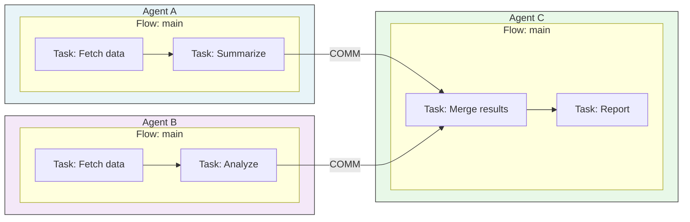

# Multi-Agent Execution -- Implementation

For the parallelism model (unified scheduler graph, structural concurrency), see [Scheduling in PXMs](../../pxm/scheduling.md).
For COMM/FLOW instruction signatures and semantics, see [Communication Operations](../ais/communication.md).

This page covers runtime-specific implementation details.

## FlowRegistry

Artifact loading reconstructs runtime agents and registers them through
`FlowRegistry::register_agent()`, which stores:

- `agents: agent_name -> Agent`
- `flows: (agent_name, flow_name) -> ExecutionDag` (legacy lookup path for `FLOW`)

## Performance

| Workload               | Sequential | A-PXM  | Speedup |
|------------------------|-----------|--------|---------|
| 3-agent research       | 12.4s     | 1.2s   | 10.37x  |
| 2-agent code review    | 8.1s      | 2.3s   | 3.52x   |
| 5-agent data pipeline  | 31.0s     | 5.8s   | 5.34x   |

Gains come from critical-path compression: wall-clock time approaches the longest
dependency chain rather than the sum of all operations.

## Topology Example

Agent A and Agent B execute fully in parallel. Agent C blocks only on the two
`COMM` edges, then proceeds immediately.

## Error Propagation

When an agent fails:

1. The runtime cancels all in-flight operations owned by that agent.
2. An `AgentError` token is propagated along every outgoing `COMM`/`FLOW` edge.
3. Receiving agents can handle the error via `BRANCH` on the error token or let
   it propagate upward.
