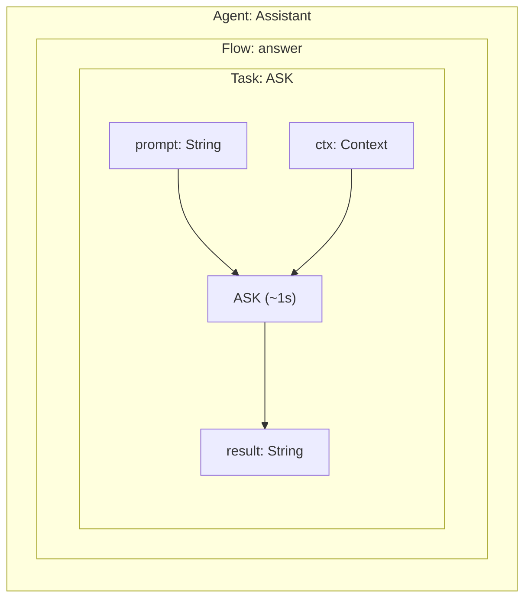
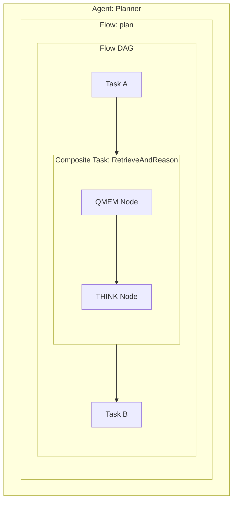
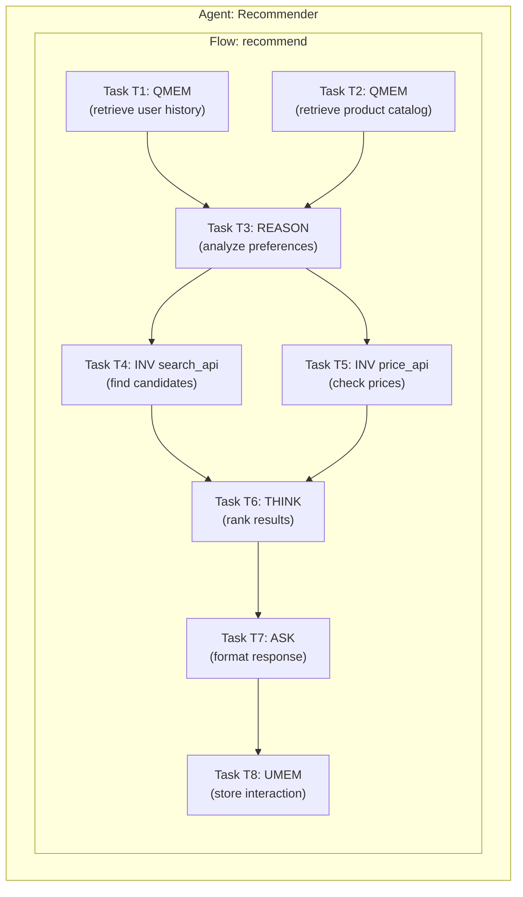
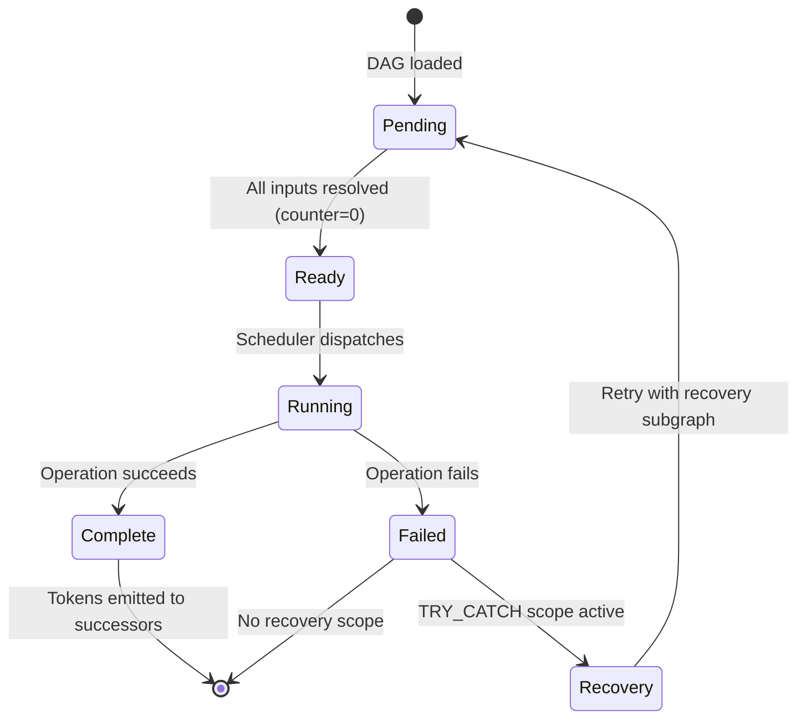

# Tasks

A **task** is the fundamental unit of work in A-PXM. It encapsulates a single atomic operation -- an LLM call, a tool invocation, a memory access, or a composition of these -- along with its typed inputs, outputs, and firing conditions.

## Runtime Hierarchy

At runtime, tasks are structurally nested:

**Agent -> Flows -> Tasks -> Nodes (AIS instructions)**

- An **Agent** owns one or more named flows.
- A **Flow** contains a `TaskDag` view (optional) and a lowered `ExecutionDag` view.
- A **Task** groups one or more execution nodes into a logical unit.
- A **Node** is the concrete executable AIS instruction scheduled by the runtime.

## Task as Compilable Unit

A task is the **minimum compilable unit of AI work**. It sits at the critical point on the compilation spectrum:

- **Below a task** (individual AIS instructions like ASK, INV, QMEM): interpreted by the runtime with no optimization opportunity. The runtime dispatches them one at a time.
- **At task level**: the compiler has enough context to analyze dependencies, estimate latencies, assign priorities, and generate an optimized execution plan.
- **Above a task** (TaskDag): more optimization surface — the compiler can reorder, parallelize, and fuse across task boundaries.

The compilation spectrum runs: **single instruction → task → TaskDag**. A task is where interpretation ends and optimization begins.

## Three Sources of Tasks

Tasks can originate from three distinct sources, all converging on the same compilation and execution pipeline:

1. **Developer-authored** — Written directly using the builder API (`Task::new(...)`) or declared in APXM graph definitions. These are static, checked at compile time, and represent the most common path.

2. **User-authored (JSON)** — Submitted as JSON payloads (e.g., from a web UI or API call) and deserialized via `TaskDag::from_json()`. This enables non-developer users to define workflows without writing code.

3. **Agent-generated (tool-use / PLAN instruction)** — Created at runtime by agents using the `create_task` and `compile_task_dag` tools. The PLAN instruction's `task_dag` field also allows agents to express multi-step plans as tasks.

Regardless of source, all tasks follow the same path inside a flow:
**TaskDag → compile → ExecutionDag → Runtime (under Agent/Flow ownership)**.

## Definition

A task consists of:

| Field | Type | Description |
|-------|------|-------------|
| `id` | `TaskId` | Unique identifier within the DAG |
| `op` | `AIS Instruction` | The operation to perform (ASK, INV, MERGE, etc.) |
| `inputs` | `List<(EdgeID, Type)>` | Typed input edges with expected token types |
| `outputs` | `List<(EdgeID, Type)>` | Typed output edges with produced token types |
| `pending` | `AtomicInt` | Counter of unresolved input tokens |
| `priority` | `Int` | Scheduling priority (higher = sooner when multiple tasks are ready) |

Runtime metadata on each task:

```rust
pub struct TaskMetadata {
    pub priority: u32,
    pub expected_output_schema: Option<String>,
}
```

## Firing Rule

A task fires when **all** its input tokens are available:

```
fire(task) ⟺ task.pending == 0
```

This is the dataflow firing rule. Independent tasks with no shared edges fire in parallel without any explicit concurrency primitives.

## Task Types

### Primitive Tasks

A primitive task wraps a single AIS instruction:



### Composite Tasks

A composite task encapsulates a sub-DAG, presenting a single-node interface to the outer graph. This enables hierarchical composition:



Composite tasks are the compilation target for reusable agent sub-routines. The compiler can inline them for optimization or keep them opaque for modularity.

## TaskDag

A **TaskDag** is a **flow-level** execution graph: a directed acyclic graph of tasks connected by typed edges. It is canonicalized into `ApxmGraph`, then compiled into an artifact DAG for runtime execution.

`TaskDag` supports JSON serialization via `to_json()` and `from_json()` for storage, transmission, and dynamic loading. Inner-plan linking now normalizes task DAGs through the graph/compiler pipeline (no direct DAG-lowering bypass).



In this DAG:
- **T1** and **T2** fire in parallel (no shared dependency)
- **T4** and **T5** fire in parallel (both depend only on T3)
- **T6** waits for both T4 and T5 (fan-in synchronization)
- The critical path is T1/T2 -> T3 -> T4/T5 -> T6 -> T7 -> T8

## Task Boundary Preservation

When a `TaskDag` is canonicalized and compiled, each generated execution node records the task it originated from in its `NodeMetadata`:

```rust
pub struct NodeMetadata {
    pub priority: u32,
    pub estimated_latency: Option<u64>,
    pub task_source_id: Option<TaskId>,  // ← source task
}
```

The `task_source_id` field is preserved through the wire format (serialization/deserialization) and survives all the way to runtime execution. This enables:

- **Task-level tracing** — aggregate execution metrics (latency, token usage) back to the original task, regardless of how many execution nodes it was expanded into.
- **Task-level error reporting** — when an execution node fails, the error can be attributed to a specific task by name and ID, giving meaningful diagnostics to developers and users.
- **Boundary-aware optimization** — the compiler can reason about task boundaries when deciding whether to fuse or split execution nodes.

## Scheduling and Priority

When multiple tasks are ready simultaneously, the scheduler uses the `priority` field to determine execution order. Priority is assigned by the compiler based on:

1. **Critical path membership**: tasks on the critical path get higher priority
2. **Latency budget**: high-latency operations (REASON) are dispatched early to maximize overlap
3. **Fan-out degree**: tasks that unblock many downstream operations are prioritized

## Intellectual Heritage

The task abstraction draws on two traditions:

### HPC Dataflow

Gao et al.'s work on dataflow architectures (the Manchester Dataflow Machine, MIT Tagged-Token Architecture) established the principle that computation should be driven by data availability, not program counters. A-PXM applies this principle to AI workloads where the "instructions" are LLM calls with seconds of latency rather than ALU operations with nanoseconds. In the original literature, these units were called "codelets" — A-PXM uses the more intuitive term "tasks" while preserving the same dataflow firing semantics.

### Cognitive Science

Baars and Franklin's **Global Workspace Theory** (GWT) models cognition as a collection of specialized processors that compete for access to a shared workspace. Winning processors broadcast their results, triggering further processing. A-PXM tasks mirror this structure: independent specialized operations that produce tokens consumed by downstream processors, with the dataflow graph serving as the global workspace.

## Task Lifecycle



---

## References

1. G. R. Gao, R. Patel, and T. St. John, "The Codelet Program Execution Model," presented at *WiA, ISCA '13*, Tel-Aviv, Israel, 2013. *(The original "codelet" concept that A-PXM tasks are derived from.)*

2. S. Zuckerman, J. Suetterlein, R. Knauerhase, and G. R. Gao, "Using a 'Codelet' Program Execution Model for Exascale Machines," in *Proc. EXADAPT Workshop, ASPLOS '11*, ACM, 2011. DOI: [10.1145/2000417.2000424](https://doi.org/10.1145/2000417.2000424)

3. J. R. Gurd, C. C. Kirkham, and I. Watson, "The Manchester Prototype Dataflow Computer," *Communications of the ACM*, vol. 28, no. 1, pp. 34–52, 1985. DOI: [10.1145/2465.2468](https://doi.org/10.1145/2465.2468)
