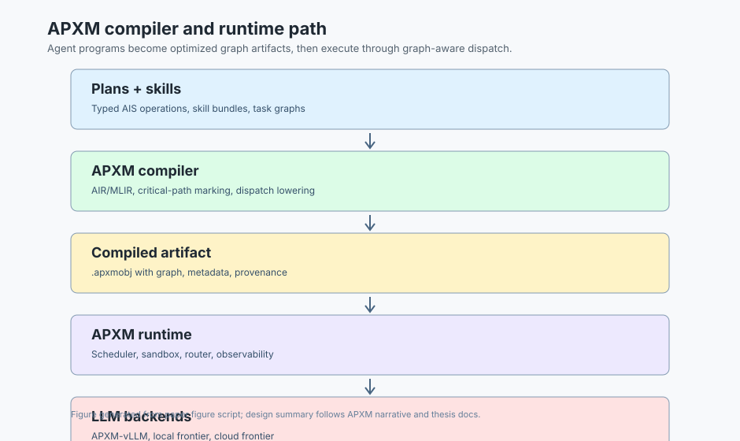
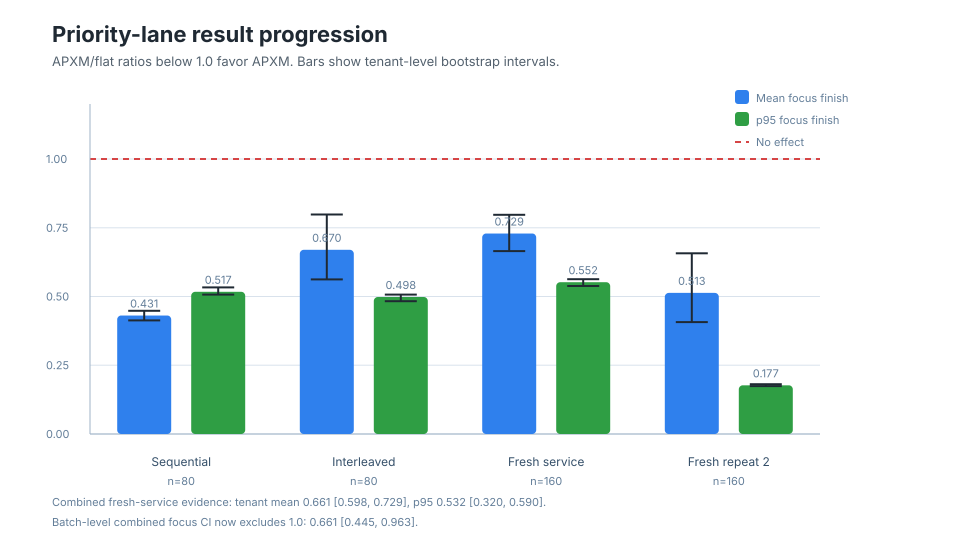
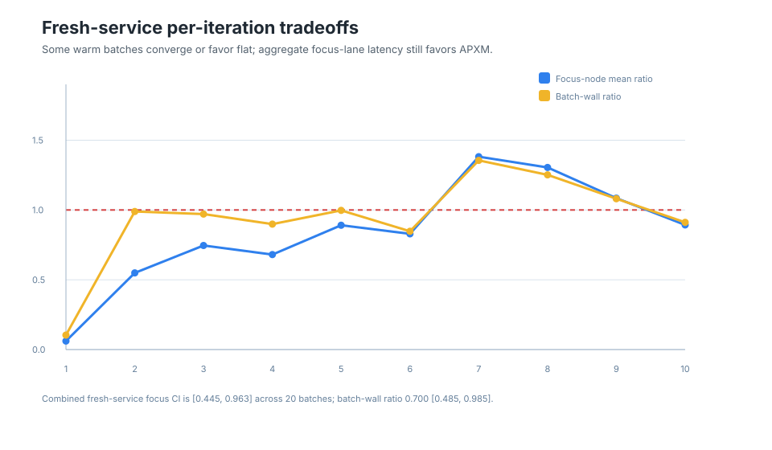
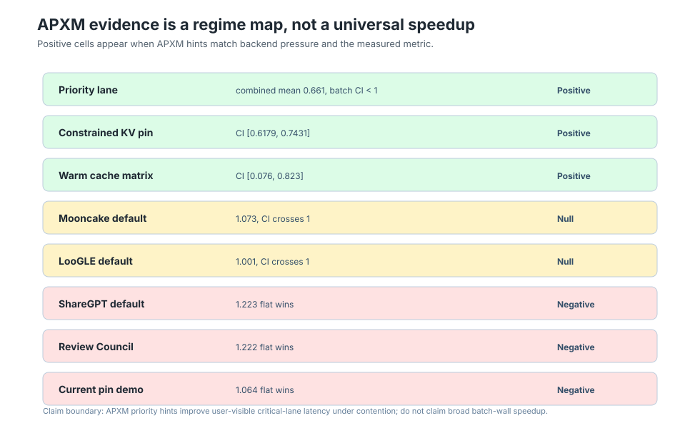

# APXM: Compiling Agentic Programs Into Graph-Aware LLM Execution

Working draft: 2026-05-21  
Status: internal paper draft, not yet submission-ready  
Primary evidence: [APXM Results, 2026-05-21](../evaluation/apxm-results-20260521.md)

## Abstract

Modern agent systems are usually executed as interpreter loops: prompts,
tool calls, and sub-agent handoffs are assembled dynamically, while the LLM
backend sees a stream of unrelated requests. That hides the structure that a
runtime needs to optimize: which calls share context, which calls are on the
critical path, which calls can be delayed, which outputs are user-visible, and
which work can run locally without escalating to a cloud frontier model.

APXM is a compiler and runtime for agentic programs. It lowers plans and
skills into typed graph artifacts, annotates those graphs with scheduling and
dispatch hints, and executes them through heterogeneous LLM backends. In the
current prototype, APXM integrates with a graph-aware vLLM fork that reports
which hints it actually honored. The strongest current result is a
pre-registered priority-lane workload on `gpt-oss-120b`: under background LLM
queue contention, APXM-on reduced user-visible focus-node latency versus
flat-HTTP on the same APXM-vLLM service. Across two fresh-service
10-iteration interleaved repeats, APXM reports mean focus-node ratio `0.661`
with 95% CI `[0.598, 0.729]` and p95 ratio `0.532` with CI `[0.320, 0.590]`,
across `320` paired tenant rows. The conservative batch-level analysis now
also excludes `1.0`: focus-node mean ratio `0.661` with CI `[0.445, 0.963]`
over `20` independent batch units.

The broader result is deliberately narrower than "APXM is faster." Cross-system
default batch-wall workloads are null or negative, and pin engagement alone
does not imply lower latency. We argue that this honesty is the contribution:
agentic programs need compiler-grade runtime structure, but graph-aware hints
only help when the measured regime matches the backend mechanism they can
influence.

## 1. Introduction

Agent systems are becoming software, but most of the stack still treats them as
prompt orchestration. A Python loop or hosted framework decides what to call
next, and the inference backend receives independent text-generation requests.
That interface discards information that ordinary compilers and runtimes would
never throw away: control-flow shape, data dependencies, critical paths,
shared prefixes, capability requirements, and provenance.

The APXM thesis is simple:

> APXM is LLVM for agents. It compiles plans and skills into optimized graphs
> that are dispatched to the right models and executed by the developer's
> preferred agent or backend.

This is not a claim that APXM replaces agent frontends. Claude Code, Codex CLI,
Cursor, Aider, and internal tools remain the user interface. APXM is the
substrate below them: a compiler, runtime, artifact format, dispatch layer, and
observability system for agentic programs.

The paper version of the claim should be narrower and measurable:

> Graph-aware dispatch hints can improve user-visible latency when the runtime
> exposes critical-path structure to an LLM backend under queue contention.

The current evaluation supports that claim on a concrete APXM-vLLM workload,
while also mapping the regimes where the same mechanism does not yet help.



## 2. Vision

APXM treats an agentic plan like a program. The author writes a plan directly,
imports one from a framework, or lets an LLM emit one. The plan is composed of
skills and typed operations such as `ASK`, `THINK`, `SPAWN`, `MERGE`,
`GUARD`, `COND`, `CHECKPOINT`, and `CLAIM`. APXM lowers the plan into AIR, an
agentic intermediate representation implemented over MLIR. It then applies
compiler passes that are natural for agent programs:

- identify parallel branches;
- mark user-visible critical paths;
- identify shared-prefix cohorts;
- lower graph metadata into Dispatch IR;
- attach request hints for the runtime and backend;
- preserve provenance in a deployable `.apxmobj` artifact.

The runtime executes the artifact over LLM backends, Python tools,
capabilities, and sub-agents. This lets APXM optimize execution without forcing
developers to abandon the agent surface they already use.

The long-term vision has three pillars:

- `OPTIMIZE`: compile plans and skills into auditable graph artifacts.
- `ACCELERATE`: expose graph-aware dispatch hints to local inference engines.
- `SAVE`: route work across local and cloud frontier models using cost,
  latency, quality, and data-residency constraints.

This draft focuses on the `ACCELERATE` evidence because it is the strongest
measured systems result today.

## 3. System Design

APXM is organized as a compiler and runtime stack rather than an agent
framework.

### 3.1 Agentic Instruction Set

AIS defines typed operations for agent programs. Unlike prompt templates,
these operations carry semantics that the compiler and runtime can inspect:
LLM calls, branching, synchronization, capability use, sub-agent spawning,
state transfer, guardrails, checkpoints, claims, and evidence records. Shared
attribute names live in the core contract so the frontend, compiler, runtime,
and backend adapters agree on meaning.

### 3.2 AIR and Compiler Passes

AIR is APXM's intermediate representation. It is designed for round-trip
inspection and compiled artifacts, not just runtime interpretation. The current
compiler pipeline includes prompt canonicalization, priority assignment,
auto-wiring, parallelism detection, graph metric annotation, dead-code
elimination, and lowering to Dispatch IR.

The priority-lane result depends on this compiler/runtime contract. APXM
marks a short user-visible node as high priority, carries that metadata through
Dispatch IR, and sends it to the APXM-vLLM fork as request hints.

### 3.3 Runtime and Honored-Fields Telemetry

The APXM runtime executes compiled graphs and dispatches LLM nodes to
backends. For the vLLM integration, APXM sends graph registration and request
hints. The fork returns an `x-apxm-fields-honored` channel so APXM can record
which fields the backend actually used. This is essential: the evaluation does
not merely claim "we sent priority"; it verifies that the backend honored
`priority` in the positive run.

### 3.4 APXM-vLLM Priority Lane

The APXM-vLLM fork supports a priority scheduling policy. In the priority-lane
workload, each tenant has one short critical LLM node that produces the
user-visible answer and many longer background LLM nodes that compete for the
same backend queue. APXM-on sends graph and priority hints; flat-HTTP uses the
same model, prompts, service, endpoint, and compiler optimization level, but
does not send APXM request hints.

## 4. Evaluation Questions

The current evaluation asks four questions.

1. Can APXM expose graph-aware hints to the backend and verify that they were
   honored?
2. Under backend queue contention, does priority information reduce
   user-visible critical-lane latency?
3. Does the result survive safer interleaving and conservative sensitivity
   checks?
4. Where does the mechanism fail or stop helping?

The fourth question is load-bearing. A systems paper that only reports the
positive APXM run would overclaim. The current evidence is stronger because it
includes null and negative cells.

## 5. Experimental Setup

The primary workload is APXM Priority Lane C16/BG16 on `vllm-gptoss` with
`gpt-oss-120b`. The paper-level analysis combines two fresh-service
10-iteration interleaved repeats.

Primary public setup:

- Run:
  `.apxm/evaluation/apxm-priority-lane/runs/20260521T140100Z-c16-bg16-interleaved-iter10/`
- Repeat run:
  `.apxm/evaluation/apxm-priority-lane/runs/20260521T233817Z-c16-bg16-interleaved-repeat2/`
- Combined analysis:
  `.apxm/evaluation/apxm-priority-lane/combined/20260522T001900Z-fresh-service-repeats/`
- Pre-registration:
  `docs/preregistrations/20260521T140100Z-apxm-priority-lane-c16-bg16-interleaved-iter10.md`
- Repeat pre-registration:
  `docs/preregistrations/20260521T233817Z-priority-lane-repeat2.md`
- Workload:
  `examples/python/benchmarks/workloads/apxm_priority_lane.py`
- Runner:
  `tools/scripts/run_apxm_priority_lane_interleaved.sh`
- Service/model:
  `vllm-gptoss`, `gpt-oss-120b`
- Shape:
  `ITER=10`, `CONC=16`, `PREFIX_TOK=1024`, `BG_FANOUT=16`,
  `CRITICAL_MAX_TOKENS=64`, `BACKGROUND_MAX_TOKENS=256`,
  `FOCUS_NODE_ID=4`
- Arm order:
  `FIRST_ARM=flat`, `ALTERNATE_ORDER=1`

The primary metric is per-tenant `focus_node_finish_ms`, paired by
`(iteration, variant)`. This measures the latency of the user-visible node,
not total background completion. The main statistical gates use paired
bootstrap confidence intervals on the APXM/flat ratio.

## 6. Results

### 6.1 Priority-Lane Latency

The combined fresh-service analysis is the primary paper result. It treats the
two fresh-service repeats as `20` independent batch units and `320` paired
tenant rows.

| Analysis | Paired tenants | Independent batches | APXM / flat | 95% bootstrap CI |
|---|---:|---:|---:|---:|
| Tenant-level focus-node mean | `320` | n/a | `0.661` | `[0.598, 0.729]` |
| Tenant-level focus-node p95 | `320` | n/a | `0.532` | `[0.320, 0.590]` |
| Batch-level focus-node mean | n/a | `20` | `0.661` | `[0.445, 0.963]` |
| Batch wall | n/a | `20` | `0.700` | `[0.485, 0.985]` |
| Sum tenant wall | n/a | `20` | `0.694` | `[0.480, 0.982]` |

APXM honored `dispatch_ir_v1_internal`, `graph_registration`, `priority`,
and `request_hints` in both fresh-service repeats. Flat-HTTP honored no APXM
fields, as intended.



The progression matters. The original sequential run was strong but had an
arm-order concern. The first interleaved run reduced that concern. The two
fresh-service 10-iteration repeats are now the best citation because they
combine interleaving, independent service allocations, and `20` batch units.

### 6.2 Robustness and Tradeoffs

Both fresh-service repeats passed all pre-registered promotion gates:

- paired rows present;
- zero failed tenants in both arms;
- zero APXM dispatch fallback tenants;
- APXM honored `priority`;
- focus-node timing present in both arms;
- mean-ratio CI upper bound below `0.95`;
- p95-ratio CI upper bound below `0.90`;
- absolute p95 win above `1000 ms`.

Combined tenant-level tradeoff:

- Focus-node win rate: `222/320`.

The second fresh-service repeat alone reported mean focus-node ratio `0.513`
with CI `[0.407, 0.657]` and p95 ratio `0.177` with CI `[0.174, 0.181]`.
Its batch-level CI was wide because several later warm batches favored flat,
but the combined batch-level result now excludes `1.0`:

| Metric | APXM / flat | 95% bootstrap CI |
|---|---:|---:|
| Focus-node mean across batches | `0.661` | `[0.445, 0.963]` |
| Batch wall | `0.700` | `[0.485, 0.985]` |
| Sum tenant wall | `0.694` | `[0.480, 0.982]` |

This is the main improvement from the new run: the paper no longer needs to
describe the batch-level focus CI as crossing `1.0` for the combined
fresh-service evidence. The claim still remains scoped to priority-lane
contention, not broad batch-wall speedup across arbitrary workloads.



### 6.3 Regime Map

The priority-lane result does not imply broad APXM speedup. The current
evaluation should be framed as a regime map.



| Regime | Result | Interpretation |
|---|---|---|
| Priority lane under queue contention | Combined mean `0.661`, p95 `0.532`, batch-level focus CI `[0.445, 0.963]` | Positive headline result. |
| Constrained-KV pin demo | APXM/flat CI `[0.6179, 0.7431]` | Pin/lifetime hints can help under KV pressure. |
| Warm-cache matrix | Cell D/B CI `[0.076, 0.823]` | Warm-cache pin path can help; cold APXM-on was slower. |
| Plan 04 Mooncake | `1.073`, CI crosses `1.0` | Null at default single-instance regime. |
| Plan 04 LooGLE | `1.001`, CI crosses `1.0` | Null at default single-instance regime. |
| Plan 04 ShareGPT | `1.223`, flat-HTTP wins | Short multi-turn workload regresses. |
| Review Council GPT-OSS | `1.222`, flat-HTTP wins | Mechanism engaged, latency negative, quality not promoted. |
| Current-service pin demo | `1.064`, flat-HTTP wins | Pin engagement alone does not imply lower latency. |

This is a useful systems result: APXM's graph hints help when the hint matches
backend pressure and the measured metric, but can add overhead or fail to
matter when that condition is absent.

## 7. Why the Result Matters

The result is interesting because it is not just another benchmark number.
It demonstrates an interface that agent frameworks normally lack: a compiler
can tell the inference backend which part of a plan is user-visible and
latency-critical.

The conventional backend API sees independent requests. APXM sees the graph:
critical node, background fanout, shared context, and provenance. The current
APXM-vLLM result shows that exposing even one piece of this graph structure,
priority, can improve the metric the user experiences under contention.

Equally important, the negative cells show why the abstraction needs a
compiler/runtime rather than a blanket toggle. APXM should not always send
the same hints. It should learn when hints help, when they are neutral, and
when they introduce overhead.

## 8. Limitations

The current draft should not overstate the evidence.

- Single primary model: `gpt-oss-120b`.
- Single primary service: `vllm-gptoss`.
- Single hardware/service regime for the headline run.
- The primary claim is user-visible priority-lane latency under contention,
  not broad batch-wall latency across workloads.
- Combined fresh-service batch-level confidence now excludes `1.0`, but it
  still covers only two service allocations and one model.
- Backend scheduler telemetry is not yet rich enough to reconstruct every
  causal enqueue/dequeue decision.
- The strongest runs used dirty APXM and vLLM trees; publication needs frozen
  diffs, image digests, and a clean artifact bundle.
- Review Council is not yet a quality-passing workflow win.
- J/req evidence proves the measurement pipeline, not inferential energy
  savings.

## 9. Reproducibility

Primary command:

```bash
dekk apxm vllm zoo-apply deploy/vllm/zoo.review-gptoss.toml --prune
dekk apxm vllm service-status vllm-gptoss --probe

SERVICE=vllm-gptoss \
APXM_ENDPOINT=http://127.0.0.1:8916 \
MODEL=gpt-oss-120b \
PRE_REG=docs/preregistrations/20260521T140100Z-apxm-priority-lane-c16-bg16-interleaved-iter10.md \
ITER=10 \
CONC=16 \
PREFIX_TOK=1024 \
BG_FANOUT=16 \
CRITICAL_MAX_TOKENS=64 \
BACKGROUND_MAX_TOKENS=256 \
FOCUS_NODE_ID=4 \
STAGGER_MS=0 \
FIRST_ARM=flat \
ALTERNATE_ORDER=1 \
tools/scripts/run_apxm_priority_lane_interleaved.sh
```

Figure generation:

```bash
python3 tools/scripts/make_apxm_paper_figures.py
```

Combined analysis:

```bash
python3 tools/scripts/analyze_apxm_priority_lane_combined.py \
  --output-dir .apxm/evaluation/apxm-priority-lane/combined/20260522T001900Z-fresh-service-repeats \
  .apxm/evaluation/apxm-priority-lane/runs/20260521T140100Z-c16-bg16-interleaved-iter10 \
  .apxm/evaluation/apxm-priority-lane/runs/20260521T233817Z-c16-bg16-interleaved-repeat2
```

Evidence manifest:

```bash
sha256sum -c .apxm/evaluation/apxm-priority-lane/priority-lane-evidence.sha256
```

Key evidence files:

- `.apxm/evaluation/apxm-priority-lane/runs/20260521T140100Z-c16-bg16-interleaved-iter10/report.json`
- `.apxm/evaluation/apxm-priority-lane/runs/20260521T140100Z-c16-bg16-interleaved-iter10/summary.csv`
- `.apxm/evaluation/apxm-priority-lane/runs/20260521T140100Z-c16-bg16-interleaved-iter10/priority-lane-enhanced-analysis.json`
- `.apxm/evaluation/apxm-priority-lane/runs/20260521T140100Z-c16-bg16-interleaved-iter10/priority-lane-batch-tradeoffs.csv`
- `.apxm/evaluation/apxm-priority-lane/runs/20260521T233817Z-c16-bg16-interleaved-repeat2/report.json`
- `.apxm/evaluation/apxm-priority-lane/runs/20260521T233817Z-c16-bg16-interleaved-repeat2/priority-lane-enhanced-analysis.json`
- `.apxm/evaluation/apxm-priority-lane/combined/20260522T001900Z-fresh-service-repeats/combined-priority-lane-analysis.json`
- `.apxm/docs/claims/apxm-priority-lane-c16-bg16.md`
- `.apxm/docs/evaluation/EVIDENCE-SYNTHESIS.md`

## 10. Future Work

Near-term paper hardening:

1. Repeat the 10-iteration interleaved priority-lane run across more fresh
   services or nodes to confirm the combined batch-level confidence on more
   than two service allocations.
2. Capture backend scheduler telemetry: enqueue time, priority, dequeue time,
   prefill/decode state, and per-request critical/background labels.
3. Freeze provenance: clean APXM commit, vLLM fork commit, image digest,
   launch recipe, and artifact manifest.
4. Add fairness accounting for background work, not only focus-lane latency.
5. Normalize stale strategy docs so the public paper story and internal claim
   ledger do not drift.

Next research steps:

1. Use the null/regression cells to learn a hint policy rather than sending
   hints unconditionally.
2. Extend APXM-vLLM from one-way hints to a bidirectional protocol where the
   backend can report pressure and APXM can adapt scheduling.
3. Evaluate multi-model routing: local frontier for bulk work, cloud frontier
   for hard nodes, with quality and data-residency constraints.
4. Convert more real agent workflows into compiled APXM graphs, including
   coding-agent workflows and tau2-bench domains.
5. Close the energy story only if it becomes central to the paper; otherwise
   keep J/req as supporting measurement infrastructure.

## 11. Draft Paper Claim

The current submission-grade claim should be:

> APXM demonstrates that compiling agentic plans into graph-aware dispatch
> artifacts can reduce user-visible LLM latency under backend queue
> contention. On a pre-registered APXM-vLLM priority-lane workload, APXM-on
> reduced mean focus-node finish time to `0.661` of flat-HTTP and p95
> focus-node finish time to `0.532` of flat-HTTP across two fresh-service
> interleaved repeats; the combined batch-level focus CI `[0.445, 0.963]`
> excludes `1.0`, while the broader evaluation exposes null and negative
> regimes that bound the claim.

Claims to avoid:

- APXM is generally faster.
- APXM reduces total batch wall time across workloads.
- Prefix pinning caused the priority-lane result.
- Pin engagement implies lower latency.
- Review Council is a quality-passing workflow win.
- Current J/req cells prove energy savings.
