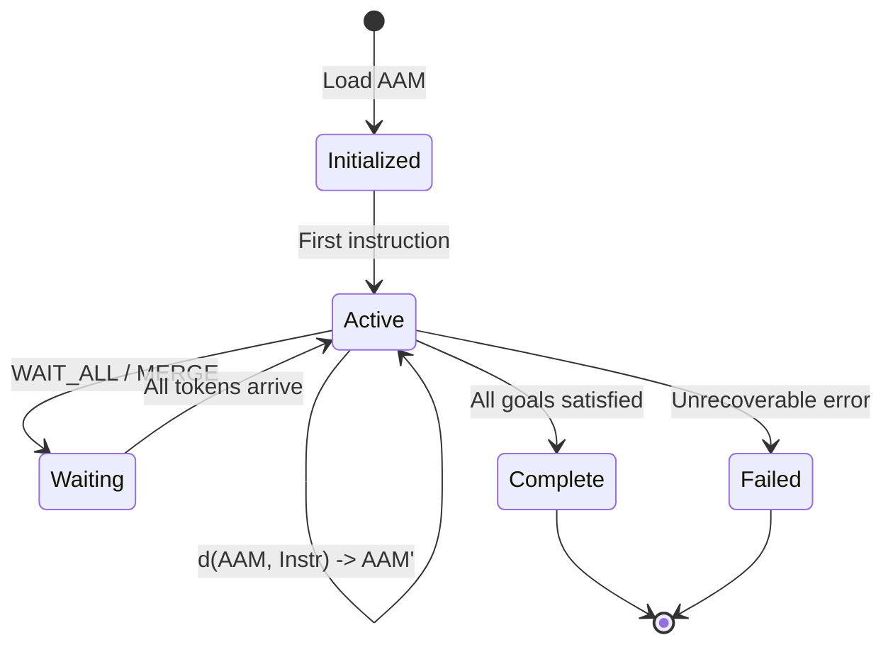
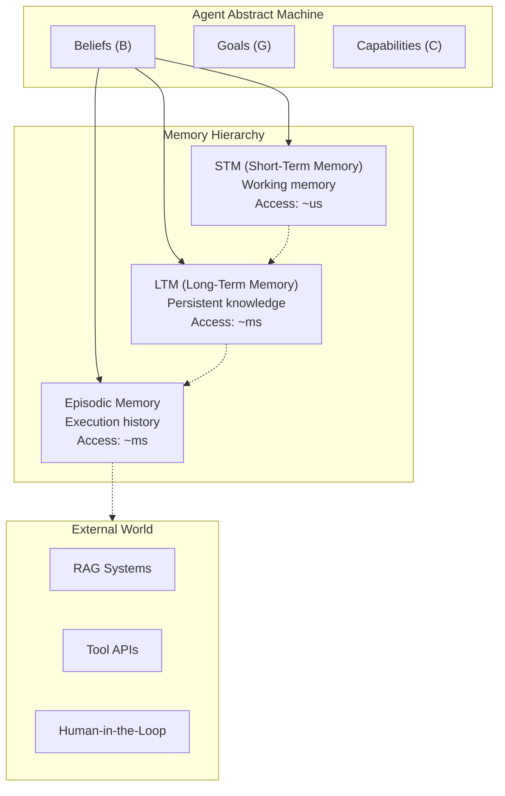

# Agent Abstract Machine (AAM)

> **Pre-canonical historical model — non-normative.** AAM beliefs/goals/
> capability state below describes the replaced prototype. Canonical v1 uses explicit Program
> Context/local values and admitted Capabilities; see the
> [canonical contract](../agents/agent-program-composition-and-air-contract.md).

The AAM defines **what an agent is** at any point in time. It is the state model that every AIS instruction reads from and writes to. Without a formal state model, agent behavior is scattered across Python closures, global variables, and implicit LLM context -- making it impossible to reason about, optimize, or verify.

## Formal Definition

An AAM is a triple:

```
AAM = (B, G, C)
```

| Component | Type | Description |
|-----------|------|-------------|
| **B** (Beliefs) | `Map<Key, TypedValue>` | What the agent currently knows -- a typed key-value store |
| **G** (Goals) | `PriorityQueue<Goal>` | What the agent is trying to achieve -- ordered by priority |
| **C** (Capabilities) | `Map<Name, Signature>` | What the agent can do -- typed function signatures for tools and sub-flows |

### Transition Function

Every AIS instruction is a state transition on the AAM:

```
d(AAM, Instr) -> AAM'
```

The transition function is **deterministic given the same inputs**: for a fixed AAM state and instruction, the resulting state is uniquely determined. Non-determinism (LLM sampling, tool failures) is captured in the typed return values, not in the transition mechanics.

## State Model



## Memory Hierarchy

The AAM's Beliefs are backed by a **three-tier memory hierarchy**, each tier optimized for different access patterns. The tiers represent a semantic partition of agent state, not merely a performance optimization.



### Tier 1: Short-Term Memory (STM)

Working memory providing microsecond access to recent context and tool output. STM holds the values most likely to be needed by the next few operations. STM is volatile; entries are evicted based on recency and relevance.

**Access pattern**: read-heavy, small values, high locality.

### Tier 2: Long-Term Memory (LTM)

Persistent store for durable knowledge. LTM survives agent restarts and holds accumulated facts, preferences, and learned associations. Updates to LTM are transactional and trigger Belief updates in the AAM.

**Access pattern**: write-occasionally, read-on-demand, medium-to-large values.

### Tier 3: Episodic Memory

Append-only execution trace recording every operation the agent has performed, its inputs, outputs, and timing. Episodic memory is the substrate for the REFL (Reflect) instruction -- the agent can review its own history to identify patterns, errors, and improvement opportunities.

**Access pattern**: append-only writes, sequential reads during reflection.

### Tier 4: External World (Conceptual)

Beyond the agent's own memory lies the external world: RAG systems, tool APIs, and human-in-the-loop interfaces. These are accessed through typed AIS instructions (INV, COMM) rather than direct memory operations. This tier is conceptual -- it frames how external data sources relate to the memory hierarchy, not an actual memory tier in the runtime.

For the full historical comparison of memory across PXMs, see
[memory.md](memory.md).

## Concurrency Model

Each memory tier has an **independent lock**, allowing concurrent access across tiers. A FENCE instruction enforces ordering when cross-tier consistency is required. This design avoids global locking while maintaining correctness for operations that span tiers.

| Tier | Lock Granularity | Consistency |
|------|-----------------|-------------|
| STM | Whole-store RwLock | Eventual (within agent) |
| LTM | Per-table | Transactional |
| Episodic | Append-only (no conflicts) | Sequential |

## Runtime Commitment

The AAM is not aspirational -- the runtime **must** implement it. Just as CPU silicon implements the von Neumann triple (PC, Registers, Memory), the A-PXM runtime implements the AAM triple (Beliefs, Goals, Capabilities). This is not metaphorical: the runtime data structures ARE the abstract machine. (This is the ISA contract described in [foundations.md](foundations.md).)

### AAM-to-File-Tree Mapping

A natural implementation of the AAM backs each component with files in a project directory, making agent state persistent, navigable, and editable by both humans and AI:

| AAM Component | File Representation | Rationale |
|---------------|-------------------|-----------|
| **Beliefs** | Data files (`.json`, `.toml`) in a workspace directory | LLMs already know how to read, diff, and edit structured data files |
| **Goals** | A structured file (`goals.toml`) or directory hierarchy | Directory nesting maps directly to goal decomposition -- a subdirectory IS a sub-goal |
| **Capabilities** | Tool definition files with typed function signatures | Each capability is a schema that the agent can discover and invoke |

A file-tree-backed AAM means the entire agent state is inspectable with `ls` and `cat`, diff-able with `git diff`, and version-controllable with ordinary commits.

### Why This Matters for Debugging

LLMs are excellent at navigating files and data structures but poor at introspecting opaque runtime state. A file-backed AAM turns debugging from "attach a debugger and inspect memory" into "read the files." Every belief mutation becomes a file write, every goal update a TOML edit, every capability registration a schema file. The entire agent history is a git log.

## Example: AAM State Snapshot

```
AAM = (
  B: {
    "user_query": String("What is the weather in Tokyo?"),
    "location":   String("Tokyo, JP"),
    "credential_ref": CredentialRef("weather/main"),
    "temperature": None  // not yet retrieved
  },
  G: [
    Goal("answer_user_query", priority=1),
    Goal("log_interaction", priority=2)
  ],
  C: {
    "weather_api": (location: String) -> WeatherData,
    "summarize":   (data: WeatherData, query: String) -> String
  }
)
```

After executing `INV weather_api(location)`, the transition function updates Beliefs:

```
B' = B + { "temperature": Float(22.5) }
```

The rest of the AAM remains unchanged. This explicit, typed state model makes every mutation visible and auditable.

---

## References

1. A. S. Rao and M. P. Georgeff, "BDI Agents: From Theory to Practice," in *Proc. ICMAS '95*, pp. 312-319, AAAI Press, 1995.

2. M. E. Bratman, *Intention, Plans, and Practical Reason*, Harvard University Press, 1987.

3. R. C. Atkinson and R. M. Shiffrin, "Human Memory: A Proposed System and Its Control Processes," in *The Psychology of Learning and Motivation*, vol. 2, pp. 89-195, Academic Press, 1968.

4. E. Tulving, "Episodic and Semantic Memory," in *Organization of Memory*, pp. 381-403, Academic Press, 1972.

5. G. R. Gao, R. Patel, and T. St. John, "The Codelet Program Execution Model," presented at *WiA, ISCA '13*, Tel-Aviv, Israel, 2013.
